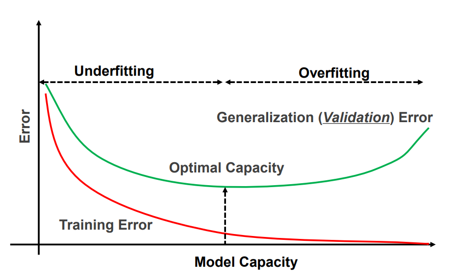
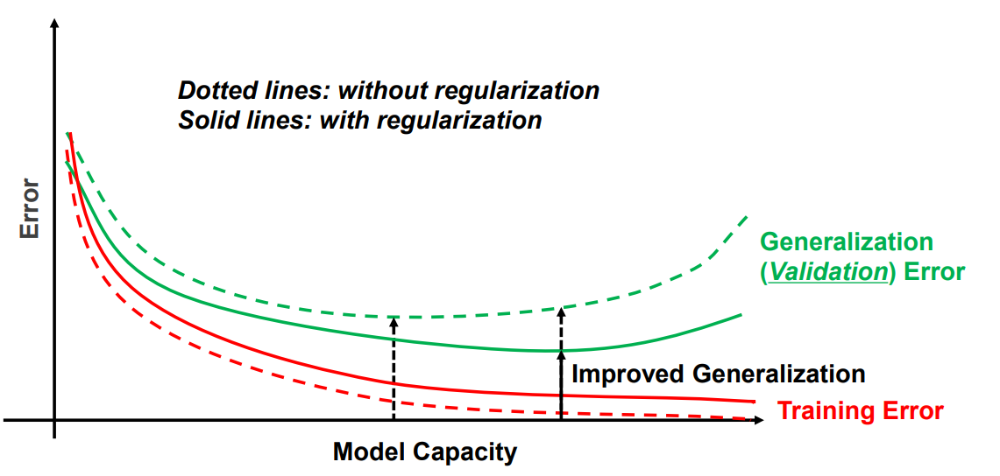
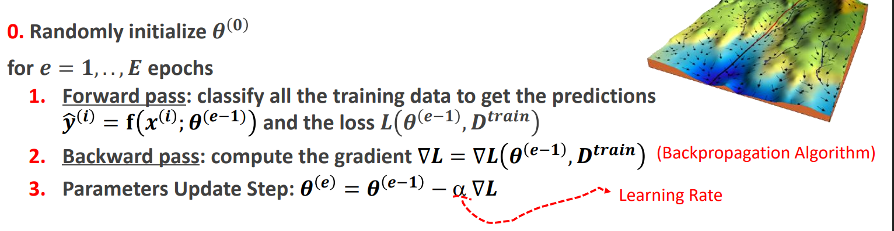

What CV problems we must use ML for (per forza)?

**Problems with a high variability**

- se c'è poca variability possiamo preparare un template e fare template matching

consideriamo image classification

Given an image (tensor), we can't handwrite the classification function

- it's too complex
- there would be no end to else blocks

**But we can learn it with examples**

how much data do we need to learn this function?

- no answer
- the more the better
  - **the more data we have the more we can capture variability**

# General concepts about machine learning

## How do we learn

The objective of a machine learning model is to make use of the samples in $D_{train}$ in order to find (learn) a (classification) function $y=f(x)$, that can output **correct predictions on unseen input data**

- i.e. those in $D_{test}$
- the test set is just a proxy for the real world to evaluate how well the model is gonna perform when deployed

In traditional (shallow) learning for CV, the inputs aren't raw (raw images) data but features that were chosen as relevant

In deep learning for CV, the inputs are the raw data, and **the relevant features are learned**

The meaning of "learning a classification function" is learning the parameters of a chosen (parametric) family of functions $f(x, \theta)$

- we don't explore the space of all functions (impossible)
- we explore the parameter space of a family of parametric functions
- **the chosen family of functions is defined by the chosen ML model and its hyperparameters**
- Learning is equivalent to finding an instance of the parameter values $\theta^*$ such that the classification function is satisfactory

To learn a good set of parameters we need to solve an optimization problem:

- **at training time we have access only to the training set** (the test set is for evaluation) so we can try to learn a set of parameters that gives us good predictions on the training data (and hope it generalizes on the test set)
- loss function measures the performance of the current configuration of parameters of the model **on the training data**
- **learning == minimizing the loss function that measures the performance on the training set**
- **NB**: usually the whole loss function can be expressed as a function of per sample (training example) losses
  - esprimo la loss totale come la somma/media delle sample losses

## Hyperparameters and overfitting

Defining a machine learning model involves making some “manual” choices before training starts

- es: number and size of layers in a neural network
- hyperparameters are hand-chosen and not learned from the training set as the parameters

Model capacity measures how powerful the model is:

- the higher the capacity, the higher the ability of the model to optimize the loss and learn the training set (approximate a function that fits the training data)
  - in polynomial regression, a regressor of degree 10 has a higher capacity than a regressor of degree 5, and thus it can better approximate any function
  - models with higher capacity can make better predictions on $D_train$, i.e. they **provide a lower training error**
- Capacity is related, among other factors, to the number of learnable parameters
  - bigger model = higher capacity
- **NB**: si potrebbe pensare che a questo punto convenga scegliere gli iperparametri in maniera tale da massimizzare la model capacity.
  - SBAGLIATO! questa strategia porta a non generalizzare sul test set
  - stiamo overfittando gli iperparametri (number and size of layers) al training set

**What we care about is the error on unseen inputs**, generalization (or test) error: how to choose the model which will work best on unseen data?

Per capire come scegliere gli iperparametri abbiamo bisogno di un segnale che ci dica quanto stiamo riuscendo a generalizzare

- **Non possiamo utilizzare la loss sul test set per scegliere gli iperparametri**
  - staremmo considerando la capacità del modello di generalizzare per una singola determinata istanza di test set, ma questo non sarebbe significativo per la generalizzazione nel mondo reale
  - overfitting degli iperparametri sul test set, magari con un altro test set facciamo schifo
    - that is, we may end up finding hyper-parameters which fit particular peculiarities of the test_data, but where the performance of the network won't generalize to other data sets.
- Dobbiamo quindi utilizzare un ulteriore set chiamato **validation set**
  - alleniamo il modello sul training set con una specifica configurazione di iperparametri
  - misuriamo l'accuracy sul validation set
  - cambio iperparametri e rifaccio
  - scelgo gli iperparametri che mi danno l'accuracy migliore sul validation set
  - Then, once we've got the hyper-parameters we want, we do a final evaluation of accuracy using the test_data
  - That gives us confidence that our results on the test_data are a true measure of how well our neural network generalizes.

As we've said the higher the model capacity, the higher is the ability of the model to fit the training data

As a consequence: **the higher the probability of overfitting**

- the model learns every little detail of the training set (including noise) and thus, may learn a classification function that can't generalize well
  - pensa all'esempio con polynomial regression: facendo il training con un grado troppo alto, si ottiene un modello che quando vede un datapoint nuovo ha un errore esorbitante
- When the training error is large, the model is underfitting the training data -> we need more capacity
- When the gap between the training error and the validation error is large the model is overfitting the training data.
  - because we're learning the training set well but we can't seem to generalize to new images
    - Generalization is about compression:
    - the model can generalize if it can capture features that all cats have
    - not features that this image of a cat has
  - if we increase the model capacity and the training error decreases but the validation error increases, we're overfitting even more and generalizing even worse -> less model capacity
- **we want just the right amount of model capacity that allows to fit the training set well enough while still generalizing to new data**



Oltre a model capacity, l'altra manopola principale con cui **ridurre overfitting è la quantità dei dati con cui fare training**

- più dati ho, minore è il rischio di apprendere peculiarità specifiche non generalizzabili dai dati
- pensa alla regressione polinomiale, se ho più datapoint la forma della funzione che il mio modello deve approssimare diventa più chiara

**NB**: overfitting è una funzione che dipende da model capacity e training data

- con la stessa model capacity, e più training data, il modello sarebbe meno suscettibile ad overfitting
- durante il training si osserverebbe più diversità nei dati, e quindi sarebbe più difficile specializzarsi (overfittare) su peculiarità di alcune istanze

Per problemi difficili, abbiamo bisogno di modelli enormi (alta model capacity)

- data la loro dimensione questi modelli sono in grado di imparare molto
- tuttavia, sempre a causa della loro dimensione, sono anche suscettibili ad overfitting
- per questo motivo modelli grandi hanno anche bisogno di training set grandi
- (questo è stato uno dei breakthrough nel deep learning: capire che si ottengono performance molto migliori utilizzando più dati e modelli più grandi)

## Regularization

Non è sempre possibile tornare indietro e ridurre la dimensione del modello (capacity) una volta che ci si è accorti che c'è dell'overfitting.

- bisognerebbe rifare il training
- magari poi si riduce troppo la dimensione, o non la si riduce abbastanza

Per questo motivo è più comune partire con un modello con una capacità più alta rispetto allo stretto necessario (prone to overfitting) e applicare delle tecniche di regularization per evitare overfitting

**Regularization is any modification we make to a learning algorithm that is intended to reduce its generalization error but not its training error**

Una roadmap è la seguente:

- parti con un modello piccolo che underfitta i dati (high training error)
- incrementa la model capacity (deeper wider networks) fino a quando non vai in overfitting (low training error, but validation error is high and starts getting worse)
- applica regularization per ridurre overfitting
  - il training error sarà leggermente peggiore (dato che non stiamo più imparando ogni singolo dettaglio)
  - il validation error migliorerà dato che stiamo generalizzando meglio

**OSS**: un modello con alta capacity regolarizzato, ha performance migliori di un modello con la giusta capacity ma non regolarizzato

- la regularization permette a modelli più grandi di imparare informazioni importanti sul training set (che un modello più piccolo non avrebbe imparato) evitando overfitting



### Loss penalty term

Con un loss penalty term (che dipende solamente dai parametri del modello) esprimiamo una preferenza sui valori dei parametri

- tipicamente preferiamo dei parametri piccoli in magnitude
  - un parametro ha il diritto di essere grande solo se riduce la loss più di quando il penalty term la peggiora
- Perchè?
  - riduce il search space dei parametri. Non devo controllare parametri grandi dato che vengono penalizzati troppo
  - non possiamo scegliere la configurazione dei parametri che fitta perfettamente il training set
  - Questo riduce overfitting

Applicare regularization, in un certo senso, riduce la model capacity dato che, nonostante abbia più parametri da configurare, non posso configurarli a piacimento

- penalty regolata da un iperparametro lambda
- più è alto lambda più riduciamo la model capacity

**NB**: Chiaramente, dobbiamo configurare lambda cercando il valore che minimizza l'errore nel validation set (come con tutti gli altri iperparametri)

### Data augmentation

Training with more data improves generalization but, in practice, the amount of data we have is limited.

We can get around this issue by **creating “fake” data** and adding them to the training set.

- rotations
- crops
- flips
- color jittering

anche queste possono essere considerate regularization techniques, dato che riducono overfitting

---

# Linear Image classifiers

Il nostro modello approssima la classification function tramite combinazione lineare tra i parametri (pesi) e la flattened image

## Naive classifier

Il modello NON può sparare fuori direttamente la class label predetta

- abbiamo una combinazione lineare tra pixel values (interi) e pesi (float)
- output è un float
- **the class values are categorical (discrete) values**

Se facessimo in questo modo, **we wouldn't be able to measure the error (and thus the loss) of the classifier well by just comparing the output of the model with the ground truth**

- cosa significa che la label è 2.5?
  - metà gatto, metà uccello?
  - e se invece un altro classifier mi predice 3.7?
- close or distant values do not imply that the corresponding classes are visually similar or dissimilar
- we would weigh the mistakes differently just because of the different numbers given to the labels
- while in reality any mistake is more or less the same
- 9 is not more wrong than 1 if the label should've been 2

**conclusione**: we CANNOT predict a categorical variable as if it were a continuous variable. We need another approach

## a better (Linear) classifier

Now our classifier doesn't output directly the categorical label.

Now it outputs a vector of scores

- one score for every possibile class
- the higher the score of a class the higher the chance of the image belonging to that class
- **we take as the prediction the class with the highest score**

I pesi adesso hanno una configurazione n*i

- dove n è il numero di label totali
- i è la dimensione del vettore (flattened) in input
- scores = W*x

Utilizzando un vettore di score possiamo misurare l'errore di predizione efficacemente e definire una loss

- confrontiamo il vettore di score prodotto dal classifier con il vettore desiderato per una determinata label (vettore one-hot encoded praticamente)
- da qui ricaviamo loss function come MSE o Crossentropy

### Linear classification as template matching

molto interessante notare che il classifier che abbiamo visto sopra è interpretabile come un'istanza di template matching in cui **i template delle varie classi (righe di pesi) vengono imparati durante il training**

- ogni riga della matrice di pesi è interpretabile come un template
- quando vado a calcolare gli score di output faccio una matmul
- posso fare il reshape di ogni riga di W per trasformare quei pesi in una forma analoga a quella dell'immagine di input
- facendo la correlazione tra questa immagine di pesi e l'immagine di input (template matching part), produciamo lo score relativo alla classe della riga di pesi
- the highest score will be associated with the class whose learned template is more similar (according to the correlation) to the input image
  - we're just finding the teplate who looks more similar to the current image (template matching)

**A linear classifier is nothing more than learned template matching**

- notiamo nuovamente, con ML non dobbiamo più definire a priori i parametri dell'algoritmo (template), come facciamo in classical, CV ma questi vengono imparati
- l'underlying computation però è la stessa

**NB**: this approach is linear (or affine, doesn't matter), and for this reason doesn't work well

- we're going to substitute linear-models with neural networks (which are just linear functions followed by a non-linear transformation organized in layers)

OSS: with non-linear functions biases are more significant (permettono di avere un'attivazione non centrata in zero -> more capacity/flexibility)

# Loss functions

Learning consist of finding the parameters that minimize the loss of all the training set

- **NB**: ricorda che usiamo sempre loss functions che sono la somma/media di per sample losses.
- We don't need to compute the whole training set to get the loss
- We can compute the loss incrementally by summing (or averaging) the per sample losses (utile per SGD)

What do we use as a loss function?

## Softmax | scores as probabilities

We prefer, for the sake of TRAINING the classifier (in inferenza non ci interessa), to **convert the unnormalized scores (logits) to probabilities with the softmax function**

Softmax dello score j-esimo: $e^{s_j}/ \sum{e^{s_k}}$

- esponenziale normalizzato con la somma di tutti gli altri esponenziali

Dopo l'applicazione di softmax agli score

- the j th output as the conditional probability of class j given the input image.
- Accordingly, the whole output vector can be interpreted as the probability mass function of the class **given the input image**
  - otteniamo una distribuzione di probabilità come output del modello
- the exp function really highlights the difference between the scores, accentuando di molto lo score maggiore
  - per questo si chiama softmax, da praticamente tutto al massimo e poco al resto
- inoltre elimina score negativi

## Crossentropy loss

Softmax and crossentropy loss are used together

```
in information theory crossentropy captures the average surprise you get by observing a random variable governed by distribution P, while believing in its model Q

- H(p, q) = sum_states(p_s * log(1/q_s))
- È UNA SORTA DI DISTANZA TRA DISTRIBUZIONI DI PROBABILITÀ
- se il modello è perfetto -> q_s = p_s per ogni stato s -> crossentropy = entropy
```

A loss function is a comparison between the prediction of the model and the ground truth and should capture the discrepancy between the two.

- the lower the loss the more the two are similar

With softmax, our prediction is a probability distribution.

The ground truth, in turn, is another probability distribution with a probability of one assigned to the correct class and zero elsewhere (one-hot vector)

We want a loss that gets lower as the probability given to the true class gets higher

- we use -log(x) as a per-sample loss; con x = probabilità della true class nel vettore di (softmaxed) scores
  - soddisfa il nostro requisito
  - loss = 0 quando x = 1
  - loss = +inf quando x = 0
    - \-log(x) = log(1/x) = log(1) -log(x)
- **per-sample loss è semplicemente un logaritmo negativo**

```Domanda che capita spesso all'esame:
dato un vettore di output di un modello, qual'è il valore della cross-entropy loss?

importante far presente che dipende dalla true class

nota la true class, basta fare -log(x) di quel softmaxed score
```

**La loss dell'intero training set è data dalla somma delle N per-sample losses**

- **questa è la cross-entropy loss**

OSS: durante il training abbiamo bisogno si un layer di output in cui applichiamo softmax in maniera tale da fare training con crossentropy.

- In inferenza non qusto softmax layer non è necessario
  - possiamo semplicemente prendere l'output più grande nel vettore
- **softmax is there to compute crossentropy loss**

### special case of binary cross-entropy loss for binary classifiers

with a multiclass classifiers

- output is a vector of s-scores
- and train with the crossentropy loss

with a binary classifier

- output is a single s-score
- and train with the binary crossentropy loss

we could also use softmax and use two scores, but it's an unneded overparameterization

# Gradient descent

The Loss captures preferences about the parameters of a machine learning model:

- we prefer those yielding a lower loss
- because the loss is a measure of how well our model has fitted the training data
  - i.e. how accurate are its predictions on the training data

To perform training, thus, we treat the Loss as a multivariate function (the variables being the parameters of the model) and try to find the parameters that yield a low (possibly the lowest) Loss

A strategy to find the parameters that minimize the loss consists in:

- starting from a random choice of parameters
- and then following the direction of the **gradient of the Loss wrt the parameters** to pick better ones (Gradient Descent).
  - **NB**: il gradiente è dato dal contributo dei gradienti delle per-sample losses del training set, il gradiente finale è il passo più efficente per diminuire la loss considerando tutto il training set



But the loss is not a convex function

- there are many local minima
- we could get stuck in a bad one by just following the gradients

The goal of training is finding a good local minima not the global one (too hard)

- empirically we have found that these loss functions have many good local minima. The situation is not too grim

How long should be the gradient step?

- this is a key-hyperparameter
- **the gradient gives us a local information** (we know that localy the function is decreasing)
- this means that we should take a small step
  - this way we're sure that we're moving to a point where the loss decreases

## Learning rate

too small of a learning rate requires too many iterations to train

too high of a learning rate and we start jumping back and forth around a minimum

- the loss gets stuck at a certaing non optimal value (wrt to the local minimum)

the learning rate is an hyperparameter that needs to be tuned for the learning to be smooth and for it to arrive at the good local minimum in a reasonable time

## Batch vs Stochastic Gradient Descent

As the total Loss is the sum of all the per-sample losses, the total gradient is the sum of all the gradients of the per-sample losses associated with the individual training samples.

- la derivata di una somma è la somma delle derivate

Thus, to perform a single (usually tiny) parameter update step one needs to process ALL the training samples. If the training set is large, this is computationally inefficient (oftentimes infeasible) in terms of run-time and/or memory occupancy

We've said that in deep learning the models are big, and so the training set is large as well

This means that processing the whole training set just to compute a single gradient step makes the training too slow

For this reason we approximate BGD with SGD

- instead of considering the whole training set to compute a gradient step
- we consider a random minibatch of B samples and compute a gradient step based on this minibatch
- we're approximating the global gradient step with the minibatch

Why can we consider a part of the training set?

- **we can compute a gradient term per sample**
- with the whole training set we compute the best average gradient step
- with a small batch we can approximate this average gradient step

minibatch size is another CRITICAL hyperparameter (di solito un numero tra 16 e 256)

with SGD we update the parameters E*U times

- whith E = number of epochs = passes of the entire training set
- U = N/B = number of updates in each epoch

## Beyond vanilla SGD

SGD is the most basic optimizer

there are many other, more complicated, optimizers that build on it

- momentum
- adaptive learning rate

## When do we stop training | Early stopping

We need to choose the number of epochs to train our model for

- this is an hyperparameter, as such it is tuned by using the validation set
- like usual we can try many different values for this hyperparameter, producing many different models, and choose the configuration with the best accuracy on the validation set

Invece di provare valori a caso, possiamo osservare l'overfitting per capire quanto continuare il training

- we'll compute the classification accuracy on the validation_data at the end of each epoch
- Once the classification accuracy on the validation_data has saturated, we stop training.
- This strategy is called **early stopping**.

It's not correct to decide when to stop training by looking at the training set

- we would go into overfitting, because by training more we're always gonna learn more details of the training set and fit the data better
- clearly, this doesn't generalize

# Limits of shallow linear classifiers

Un shallow classifiers è linear classifier che abbiamo visto prima

- ha un solo layer di pesi
  - matrice I*C
- fa template matching imparando tanti template (riga di pesi lunga I) quante sono le classi

This doesn't really work as the learned templates don't really capture the features of the class

- the most important feature seems to be the background color
- a template may hardly capture a large intra-class variability

## the importance of representation

**the main problem is that we're trying to solve classification by using only raw pixels as features**

guardiamo l'esempio nelle slide:

- if we keep the data as they come in the input space, **linear classification cannot happen**
- **NB**: but if we transform the data in a feature/representation space that better capture the differnce between the data, linear classification becomes possible

the choice of the space in which we perform classification is fundemental

## deep learning

in shallow machine learning the choice of the feature space is handcrafted

- we're the ones choosing the important features

with deep learning the machine learning model learns:

- how to transform the raw data into a better feature space (most of the work)
- AND to classify the learned features (final step)

deep learning ~= representation learning

in deep learning we don't learn the representation in a single step, **we learn a higherarchy of representations**

## The importance of non linear functions

chaining linear transformations results in another linear transformation

- we could chain 1000 linear transformations and we wouldn't be able to do anything better than a single one
- the same  result could've been achieved with a single linear transfomration


**NB**: to be able to transform the features EFFECTIVELY (in a way that makes the learned features linearly separable) we need to be able to use non-linear functions inside the transformation layers

- this enables powerful representation learning
- (passare da coordinate cartesiani a polari è stata una trasformazione non-lineare)

## Neural networks

Chiamiamo X la dimensione dell'input e Y la dimensione dell'output

Le dimensioni dei vari layer intermedi (hidded), e quindi dei vettori di attivazione, sono iperparametri

Abbiamo una matrice di pesi in mezzo ad ogni coppia di layer

- ogni riga di una matrice di pesi rappresenta i pesi per uno specifico neurono nel layer successivo
- w_0,1 -> pesso associato a neurone 1 precedente e neurone 0 successivo

### Shallow neural networks (diverse da shallow linear classifiers)

the smallest neural network

- has just one non-linear layer that does representation learning
- and one output layer that does the classification (non c'è la non-linear function)

Se il singolo hidden layer ha D neuroni allora abbiamo due matrici di pesi

- una tra input e hidden layer grande: D*X
  - una riga per ogni hidden neuron
  - la singola riga ha tanti elementi quanti l'input
- una tra hidden layer e output grande Y*D

### Activation functions

La non linearità viene introdotta applicando una activation function al vettore di somme pesate in output dopo la matmul con il layer di input

Si crea un vettore di attivazioni che corrisponde alle attivazioni dei neuroni del prossimo layer

ReLU è la miglior activation function per deep learning

### FC layers

A neural network consisting of two or more FC layers is usually referred to as a **Multi-Layer Perceptron** (MLP).

### Universal approximation theorem

it is striking to discover that a NN with just one non-linear (hidden) can approximate any function to an arbitrary degree

- facciamo solo delle matmul
- the higher the dimension of the hidden layer, the better the approximation
