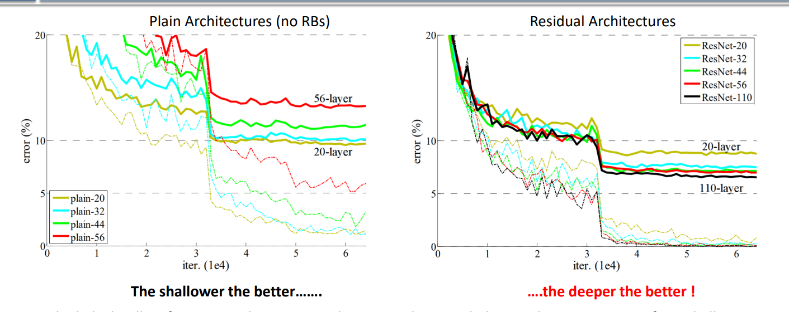
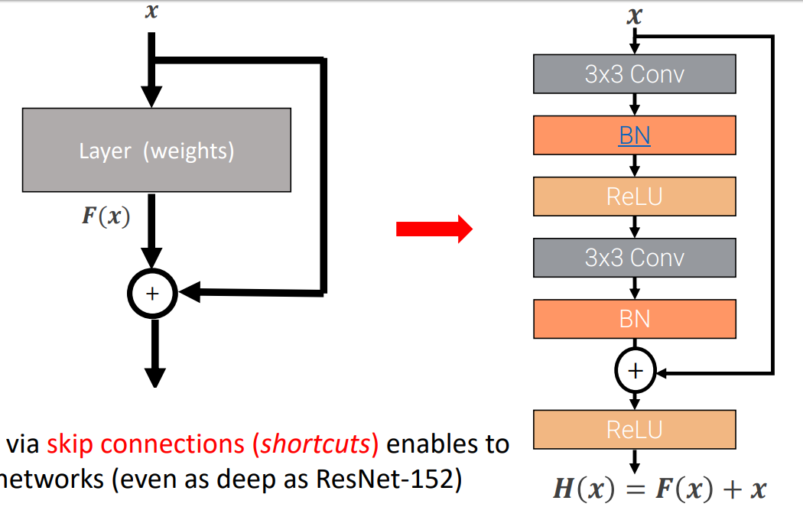

# Residual Networks

abbiamo visto che vgg19 è migliore di vgg 16, che è migliore di vgg11, ecc.; **pur mantenendo la stessa architettura!**

- abbiamo cambiato solo la profondità aggiungendo dei blocchi in più, il resto è rimasto uguale

**Going deeper suggests improved performance**, but ...

With more layers we have more parameters and more capacity for the model -> we might worry about overfitting

- indeed, in slide 31, we see that we have a worse test error

However, **the deeper network also fits the training data worse than a shallower network**

- **ma il deeper network ha più capacity, come è possibile?**
- l'instabilità del gradiente non è il motivo dato che la rete di fatto sta imparando, non è stuck
- **le training performances, for some reason, degrade with depth** -> training very deep networks turns out to be inherently hard -> **non c'è consenso sul motivo**

Notiamo che, teoricamente, le performance del deeper network dovrebbero essere almeno buone quanto le performance del shallower network

- Potremmo tenere i layer del shallow network, ed aggiungere degli identity layers che non fanno niente
  - per qualche motivo l'optimizer non riesce trovare questa soluzione
- questo ha fatto pensare (ai ricercatori nel goated paper) che una buona idea potesse essere **rendere più facile per l'optimizer imparare questi identity layers**
  - c'è qualcosa nel modo in cui stiamo allenando le nostre NN che rende difficile imparare degli identity layers
  - **forse questi identity layers sono importanti per fittare bene il training set**
  - come possiamo rendere più semplice per un optimizer to learn an identity layer? -> residual learning

## Residual learning

Modifichiamo il layer per rendere più facile imparare l'identità

- in un layer classico impariamo dei pesi che dato un input x, producono una trasformazione H(x)
- in residual learning, we construct the layer in such a way that, the layer doesn't learn the H(x) function directly
- instead, imponiamo al layer di imparare dei pesi che producono la residual function F(x)
  - x + F(x) = H(x)
  - **we task the layer to learn the parameters that produce the residual: what we need to add to x to get H(x)**

Questo facilità la creazione di identity layers (basta mantenere i pesi del layer a zero)

- questo, è la motivazione del goated paper
- oltre a questo, si è anche mostrato sperimentalmente che grazie alle skip-connections (parte che somma x) è più facile fare il training di deep networks dato che nel backwards step il gradiente non deve attraversare dei pesi (vabe, giusto per dare un'idea)

**NB**: nella pratica non è che si osserva che vengono effettivamente imparati degli identity layer. Questa idea di residual learning è stata semplicemente un'intuzione per provare un nuovo designe di reti. Questa idea ha funzionato, ma, come moltre altre cose in deep learning, non è che si sappia molto bene perchè.

Con residual learning si riescono ad allenare reti profonde producendo dei risultati migliori (cambiando solo la profondità)



### Residual blocks

How is a residual network realized in practice?

The basic building block (residual layer) is a residual block

- it's composed of a bunch of simpler layers that contain the weights of the residual layer
- and the skip connection



Residual networks are stacks of residual blocks

```Batch norms

è una tecnica di normalizzazione

il batch è formato dai vari tensori in input (?)

la normalizzazione consiste in una channel-wise standardization combinata ad uno learned scale and shift factor

il senso è di mantenere stabili i valori delle attivazioni per evitare gradient vanishing / explosion
```

# ResNet architectures

Nowadays, the standard CNN (for image classification, or even as a backbone) is ResNet50

Di nuovo abbiamo architetture regolari in cui si combinano vari stages

- in resnets, stages are formed from stacks of residual blocks (as opposed to stacks of conv-layers)
- di nuovo, a stage is basically when you don't downsample (same spacial resolution)

Downsampling is performed with strided convolutions (by the first conv layer in a stage), instead of pooling layers

- di nuovo, when we downsample, we double the number of channels

Invece di fare flattening e avere molteplici FC layers alla fine, facciamo global average pooling e usiamo un solo FC layer finale

- **these networks are parameter cheap, dato che abbiamo un solo fc layer con global average pooling**

**ResNets are a cheaper design that works much better rispetto a VGG**

### problema shape

when we move from a stage to the next, skip connections creano tensori di attivazioni di shape diverse che non possono essere sommati rispetto al tensore in input

- questo perchè al primo layer degli stage facciamo downsampling e doubling of the number of channels

una prima soluzione è fare downsampling delle attivazioni e (zero)padding

possiamo fare una projection skip connection applicando un convolution layer!

**oss**: this seems to defeat the purpose of making it easy to learn the identity

- however, it is still possible that the conv layer can learn the identity
- more importantly, the point of that intuition was to have a justification for a different kind of architecture
  - nobody has seen that some layers in ResNets do in fact learn an identity
  - empirically it just happened that ResNets perform better and can learn even in deep networks

guarda slide 38

- abbiamo conferma di quello che volevamo -> the deeper the better
- better validation error (solid) and better training error (dashed)

---

# favourite questions on CNNs

why do the activations get smaller and deeper?

- smaller because we want to recognize global (complex) features composed of more local features detected in the earlier layers
  - the filters in the deeper layers have larger receptive fields than those in the shallower ones
- this is the idea of **hierarchy of features**: as we move towards deeper layers, filters gain the ability to detect larger patterns, i.e. more global features
  - the early layers detect features like: edges, corners, blobs
    - small patterns because of small receptive field
  - the middle layers detect object parts composed of basic features
  - the late layers detect objects composed of object parts
    - ricorda che every channel records the presence of a certain kind of feature

why does it make sense that we need more features late than early in the network?

- because there are way more interesting complex features than simple features
- global features are inherently more than local features

Esempio che rende l'idea:

- consideriamo una binary image
- in un intorno 3x3 abbiamo 2^9 pattern
- in un intorno 7x7 abbiamo 2^49 pattern

---

# Mobile net

architecture that is amenable to run on mobile devices (light-weight)

they use grouped convolution

- rather than having all kernels of a conv layer process all channels of the input image, **we split the kernels into groups that process a subset of channels**
  - es: input con 12 canali e kernel divisi in 4 gruppi -> il primo gruppo processa i primi 3 canali, il secondo i secondi 3, ...
  - ogni kernel ha un quarto della profondità (un quarto dei parametri)
- why? cheaper in termini di parametri e FLOPs (amenable for mobile devices)

## Depthwise separable convolution

versione estrema di grouped covolution in cui abbiamo tanti gruppi quanti canali

- ogni kernel processa solo un canale

Standard convolutions used in CNNs combinano le attivazioni sia spazialmente (receptive window) che in profondità (kernel 3d che considerano i canali di input)

Con depthwise separable convolution spezziamo in due il processo

- facciamo prima una depthwise convolution; ovvero, una grouped convolution con un numero di gruppi pari al numero di canali di input
  - solo spaziale
- poi facciamo una pointwise convolution; una convoluzione con un kernel C\*1\*1
  - combiniamo gli output spaziali (canali processati separatamente dal layer precedente) considerando la profondità

è importante combinare sia spazialmente che across channels per non perdere expressive power

- con depthwise separable convolution lo facciamo in maniera più lightweight

mobile net v2 è una variante che non ci interessa -> skip da slide 46

# Transfer learning

Sometimes we need a large capacity network because the problem we need to solve is complex

However we may have only a small dataset

If we trained the large network with the small dataset we would surely overfit (the network will learn every detail of the small training set)

What we can do is **use our small dataset to finetune a pretrained bigger network that was already trained with a (different) big dataset**

- our hope in doing so is that with the pretraining the network learns useful knowledge for our task even though the training set is different
  - es: download a ResNet50 pretrained with imagenet, and finetune with the small dataset
- we can think of pretraining as a way to initialize the weights of the network in a favorable way that allows us to avoid overfitting

## how do we adapt the downloaded pretrained model to our purposes?

we keep everything but the last layer, in altri termini il backbone

- se il modello è pretrained per imagenet abbiamo 1000 classi, ma magari noi abbiamo bisogno di solo 10 classi
- utilizziamo le useful feature che la rete pretrained con imagenet ha imparato a riconoscere

Adesso abbiamo un pretrained backbone e un head di cui fare il training from scratch. Abbiamo due possibilità per il training (finetuning):

- possiamo fare il training del solo head mantenendo il backbone frozen
  - consideriamo tutto il backbone come un input layer
- oppure, possiamo fare il training di tutto
  - qua però dobbiamo fare attenzione all'overfitting
  - tipicamente, warm-up with a frozen feature extractor (come sopra) then fine-tune the whole model with a very small learning rate (non cambiamo troppo)
    - the initial layers may still be kept frozen as they typically learn general, low-level features
    - we may need to change only the later layers that can detect features more amenable to our task
