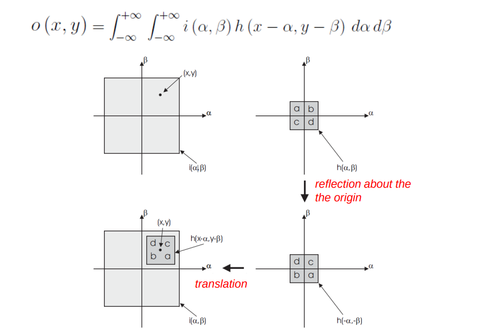

we're gonna be studying the same kind of filters that are used in CNNs

the difference between filters in image processing and in CNNs is that:

- in image processing the filters are defined by the users
- in CNNs the filters are learned by the networks
  - and are used as feature extractors

the dimension of the neighbourhood of the filter is an (hyper)parameter

---

What is a filter?

- it's an image processing operator
- these operators compute the new intensity of a pixel based on the intensities of its neighbourhood

Why do we filter an image?

- to improve its quality for a specific CV task
  - this can mean extracting features
- we'll focus on denoising
  - noise looks particularly bad on uniform areas (the area should be uniform but in the image it's not)

If the filter is LTE (Linear-Translation Equivariant), its application is a 2d convolution

- this is the subclass of filters we're going to focus on
- we're interested in covolutions

# Definizione di filtri come operatori

A two dimensional signal is just a function of two variables: i(x, y)

- we can imagine the image to be continuous

The **response of the operator** is the application of the operator to an image

- operatore T{} si applica ad un immagine e produce una nuova immagine: o(x,y) = T{i(x,y)}
- l'operatore si dice **lineare** se vale la sovrapposizione degli effetti
  - T{a*i_1(x,y) + b\*i\_2(x,y)} = a\*T{i\_1(x,y)} b\*T{i\_2(x,y)}
- l'operatore si dice **Translation-Equivariant** se traslare l'input prima della applicazione dell'operatore, è equivalente a traslare direttamente l'output
  - T{i(x-x0, y-y0)} = o(x-x0, y-y0)

The **impulse response of the operator** is the output that we get if we input to the operator la delta di dirac (anche chiamato point-spread function)

- impulse response: h(x,y) = T{d(x,y)}
- ricorda la definizione della delta di dirac: { d(0,0) != 0;  0 altrove; doppio integrale deve fare 1}
- è zero dappertuttto tranne che nell'origine
- nell'origine è tanto grande da far valere l'integrale 1

**Quello che ci interessa**:

If the filter is LTE the response of the operator (i.e. the application of the operator to the image) is the convolution with the impulse response

- a noi quindi interessa qual'è l'h() dell'operatore per poterlo applicare facendo una semplice convoluzione

## Convoluzioni 2D

**Come interpretiamo questa convoluzione?**

- the core operation in convolution is MAD (multiply and add/multiply and accumulate)
  - l'integrale somma
  - dentro all'integrale moltiplichiamo
- l'immagine è non zero solo dentro alla regione grigio chiaro
- stessa cosa vale per h()
  - qua, specifichiamo con a,b,c,d delle sottoregioni non-zero di h()
- osserviamo l'integrale
  - i è invariata
  - h è manipolata
    - -alpha e -beta mi specchiano i punti di h che prendo rispetto all'origine
    - faccio una traslazione verso x, y

**Varie proprietà delle convoluzioni**:

- la quarta è interessante
  - derivata di una convoluzione è uguale alla convoluzione in cui uno dei due membri è derivato
  - utile quando vedrai local invariant features e LOG

## Correlation

formula molto simile a convoluzione: abbiamo un + al posto di un -

correlation is NOT commutative unlike convolution

the main difference between convolution and correlation is that:

- **in convolution we flip the point spread function h()**
  - flip about the origin a, b, c, d -> d, c, b, a
- in correlation we don't

con entrambi poi facciamo le MAC

# Discrete convolution

clearly, we can't use continuous images and continuous filters (the former don't exist)

definiamo la convoluzione discreta sostituendo agli integrali delle sommatorie

nel caso discreto abbiamo una matrice che contiene i valori della point spread function che viene chiamata kernel

## Convolution in practice

siccome la convoluzione è commutativa, posso scambiare I e K; questo mi da una formula più vicina alla computazione di una convoluzione nella pratica

Per le sommatorie, è sufficente che m,n vadano da -k a +k, con 2k+1 dimensione del kernel (tutto il resto è 0)

nota (difficile dalla slide) come nell'immagine gli indice del kernel subiscono un flip di segno

- convoluzione flippa il kernel about the origin

**NB**: fare attenzione nell'implementazione a non sovrascrivere i valori dell'input matrix con quelli della convoluzione

Attenzione ai bordi:

- it's not possible to compute correctly the convolution sui bordi
- abbiamo due soluzioni
  - produciamo un output più piccolo riespetto all'input, corrispondente a dove riesco a computare la convoluzione
    - cropping
    - non desiderabile se dobbiamo applicare più filtri
  - usiamo del padding
    - we enlarge the input image with one of many rules
    - which kind of padding doesn't make that much of a difference
    - in CNNs we apply sequences of filters, there we use padding to preserve the size of the image

**NB**: la funzione di opencv per i filter di fatto computa una correlation e non una convolution

- non fa il flip del kernel
- per avere una convolution basta flippare il kernel
- se il kernel è simmetrico non c'è neanche bisogno
- btw anche nell CNNs quello che viene computato è una correlation

**NB**: il numero di MAD che devo fare è uguale alla dimensione del kernel (es 7x7 -> 49 MAD)

- il numero di MAD è o(n^2) rispetto alla dimensione del kernel

---

# Denoising filter

Come modelliamo il rumore?

siccome il rumore proviene da tante fonti, per il teorema del limite centrale **modelliamo il rumore come un variabile casuale gaussiano di media 0 e varianza sigma^2**

- Pensiamo all'intensità di un pixel come la somma tra: **intensità ideale noiseless (che non esiste) + realizzazione della gaussiana** che mi modella il rumore

- il rumore di tutti i pixel è i.i.d (Indipendent and Identically Distributed)
  - non posso indovinare il rumore di un pixel dato il rumore di un altro pixel

To remove noise we can take an **average across time** of multiple images of the same scene?

- if we can, this is the best way to remove noise
- but we need to have multiple images and for the scene to be perfectly static

Guardando la formula abbiamo che per la legge dei grandi numeri il rumore tende a zero al crescere dei samples N

- the variance decreases with N

**What if we are given a single image?**

- we can do an **average across space** instead of time
- guardando la formula
  - abbiamo di nuovo che: più è grande K (kernel), più il rumore approccia la sua media (0) e quindi si annulla
  - tuttavia, stavolta le intensità dei pixel non fanno riferimento allo stesso punto p di cui vogliamo rimuovere il rumore
    - se prendo un kernel piccolo, più o meno l'intensità sarà la stessa
    - se invece prendo un kernel grande potrei includere dei pixel associati ad altre entità nella scena con intensità diverse da p; e quindi otterrò un intensità risultate divers (blur)
- c'è un tradeoff sulla dimensione del kernel per spatial filtering
  - **più è grande il neighbourhood, più l'effetto blur sarà marcato**

## Mean filter

The Mean Filter is **an LTE operator as it can be described by a kernel, and applied as a convolution**

- tuttavia, non applichiamo un mean filter come convoluzione
- non c'è bisogno di fare tutte le divisioni, è sufficente sommare e fare una divisione alla fine (media)
- applying the mean filter as a convolution would require 9 MAD, fare la media invece necessita di 9 somme e una divisione

blurring is caused by pixels in the neighbour with different intensity, being averaged into the central one

**the mean filter is the fastest denoiser**

- even though it blurs, if the application doesn't mind, it can be very useful

**NB**: Il mean filter può essere visto da due punti di vista

- denoising
- semplificazione dell'immagine tramite **smoothing**
  - a causa del blur i dettagli piccolini vengono eliminati, questo può essere un bene
  - in altre parole il mean filter diminuisce anche il livello di dettaglio dell'immagine lasciando solo large scale objects

**NB**: a volte un livello di dettaglio troppo alto potrebbe essere fastidioso per algoritmi di image processing

## Gaussian filter

the gaussian filter is the filter such that:

- h(x,y) = G(x, y)
- il filtro che ha come impulse response function una gaussiana 2d
- proprietà interessante è la circular simmetry

### practical implementation

nel mean filter i pesi del kernel sono uniformi

nel gaussian filter i pesi del kernel sono distribuiti come la gaussiana 2d

- near 0 sui bordi
- big numbers nel centro
- immagino che anche qui la simmetria circolare si noti

**Given the same kernel size, Gaussian Filtering yields less blur than Mean Filtering**

- because of how the weights are distributed in the kernel

The discrete Gaussian kernel can be obtained by sampling the corresponding continuous function, which is however of infinite extent.

- To capture the whole function i would need to choose a kernel of infinite size
- we definetly can't do that

A finite size must therefore be properly chosen

- the bigger the filter the better the approximation of the gaussian
- the smaller the filter the less computation

We should pick as many samples notably different from zero as there are:

- questo dipende dalla deviazione standard della gaussiana
  - se la deviazione standard è alta -> la gaussiana è schiacciata -> devo prendere più samples
  - se la deviazione standard è bassa -> la gaussiana è secca -> devo prendere meno samples
- **sigma è il parametro che regola lo smoothing**
  - larger sigma = più gaussiana schiacciata = more smoothing

As the interval \[-3sigma, +3sigma] captures 99% of the area of the Gaussian function, a typical rule-of-thumb dictates taking a (2k+1)×(2k+1) kernel with: **k = lower(3\*sigma)**

**NB**: it can be proved that gaussian filtering is the only kind of filtering that doesn't introduce artifacts (something that wasn't present in the original image)

- for this reason it's the main tool for processing images at various kinds of detail level (scale)
- possiamo variare il livello di smoothing cambiando sigma, e non introduciamo comunque artifatti

# Impulse noise (salt & pepper noise)

Al contrario di gaussian noise, qua abbiamo molti pixel senza rumore

Inoltre, qua la corruzione causata dal rumore o è totale o è assente; al contrario del caso gaussiano che corrompe con un rumore piccolino

- noise has created outliars (pixels that are totally different from the others)

Il Gaussian noise modella il rumore cumulativo di tutte le sorgenti di rumore nel processo di acquisizione dell'immagine

**Quand'è che un immagine può essere corrotta da impulse noise invece?**

- quando alcuni sensori nella camera sono rotti
- quando l'immagine viene trasmessa su un canale rumoroso
- oppure anche quando l'immagine che stiamo cercando di processare non è un'immagine vera e propria ma piuttosto un risultato di una computazione intermedia
  - **vedi disparity map in stereo matching**
  - se sbaglio a matchare due pixel ottengo una disparity strana che è un outliar

Come si rimuove l'impulse noise?

**linear filters di qualsiasi tipo non funzionano**

- con mean filter **spargiamo gli outliar across an area** rendendoli meno evidenti ma blurrando l'immagine
- con gaussian piu o meno la stesssa cosa

## Median Filter

Per eliminare impulse noise l'idea è **buttar via il pixel che è outliar e sostituirlo con uno che non lo è**

con median filter scegliamo la mediana dell'intorno (dopo sort)

- outliars are never in the middle
- so we're never substituting a good pixel with an outliar

**This is NOT a linear operator**

- this means that this filter isn't applied through a convolution with a kernel (d'altronde non stiamo facendo delle MAD, stiamo facendo delle mediane)

The median preserves edges better than mean/gaussian filters as it doesn't do any blurring

The median filter however doesn't work with gaussian noise

- it just substitutes a noisy pixel with another noisy pixel

### what if i have an image with both gaussian noise and impulse noise

we first get rid of outliars with a median filter

- this way we're substituing an outliar with another pixel subject to gaussian noise

after that we eliminate gaussian noise with a gaussian/mean filter

# Gaussian denoisers that preserve edges

## Bilateral filter

Now i want a filter that denoises like a gaussian filter but without blurring (aka edge-preserving smoothing)

Osserviamo che: a gaussian filter considers bright pixels while the pixel we're computing the new value for is dark

- **when i'm close to an edge i mix together bright and dark pixels**

we would like **a weight function that adapts to the kind of neighbour we're within**

- when we're on a uniform region we would like a full gaussian
- when we're near an edge we want to consider only the pixels in the neighbourhood with a similar intensity to the one we're on

A bilateral filter weighs neighbours highly considering:

- distance from the center (spatial distance)
- intensity difference (intensity distance)

**this filter weighs highly pixels that are near the center and close in intensity to the one we're computing a new value for**

- Whereas a gaussian filter only considers distance from the center

Facciamo di nuovo una somma pesata delle intensità di un intorno

- stavolta però per i pesi non campioniamo una singola gaussiana
- Usiamo due gaussiane
  - una che decresce con spatial distance
  - l'altra che decresce con intensity distance

- abbiamo anche un termine che mi normalizza i pesi dividendo ogni peso con la somma di tutti i pesi dell'intorno
  - this way all the weights sum up to one and are all between 0 and 1
  - filters with this property are said to have **unitary gain**
  - this is means that in an area the average intensity doesn't change (in an uniform area the intensity doesn't grow or shrink)

At a pixel nearby an edge, the neighbours falling on the other side of the edge look quite different and thus cannot contribute significantly to the output value due to their weights being small

A bilateral filter is more computationally expensive than a gaussian filter because **we have to compute the (intensity distance) weights at each position in the image**

- way slower than the gaussian filter where we have to compute the weights only once and they are the same for every position in the image

## Non-local means filter

Un altro filtro che usiamo per rimuovere rumore gaussiano while preserving edges

- even more computationally expensive than the bilateral filter

Questo filtro è non-local perchè **considera tutti i pixel dell'immagine per ogni punto**

- potrebbe sembrare strano perchè, il punto di rimanere local è che i pixel dell'intorno è probabile che siano simili a quello che sto calcolando per rimuovere il rumore

The idea is that, by considering the whole image, **posso considerare molti più pixel simili a quello corrente con cui fare denoising**

- per la legge dei grandi numeri questo ci permette di avvicinarci alla media di zero della distribuzione del rumore
- riesco a rimuovere meglio il rumore

Di nuovo utilizzo una weight function, stavolta per pesare i pixel di tutta l'immagine

- **we can weigh more pixels that have a similar neighbourhood** to the one that we're trying to compute a new value for, as they more likely belong to the same object

Stavolta la distanza/similarity tra due punti dipende da quanto sono diversi gli intorni

- possiamo fare flattening dei neighbourhood per trasformarli in vettori e prenderne la euclidean distance
- più la distanza è grande più il peso deve essere piccolo e viceversa, usiamo un negative exponential a questo scopo (simile alla gaussiana)
  - abbiamo anche un parametro h a denominatore che si comporta come sigma per la gaussiana (h grande schiaccia)
- Z(p) è di nuovo un parametro di normalizzazione pari alla somma di tutti i pesi, che permette di avere unity gain

Considerare tutta l'immagine però è crazy slow

- per questo motivo aggiungiamo un ulteriore parametro che definisce la **regione dell'immagine in cui andiamo a cercare**

Abbiamo quindi 3 parametri:

- nieghbourhoods size per quando dobbiamo computare le distanze
- spatial size per capire di quali pixel considerare i neighbourhoods
- ed h che gioca il ruolo di sigma

Come con bilater filter, per ogni pixel dobbiamo calcolare i pesi

- stavolta però è ancora peggio dato che le distanze dipendono da intorni
