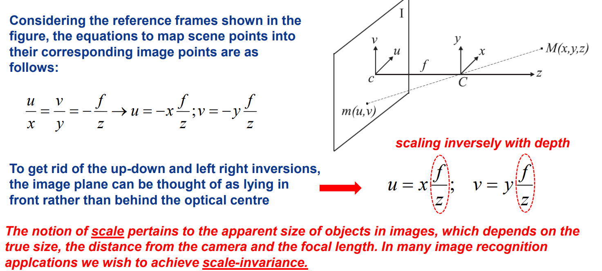
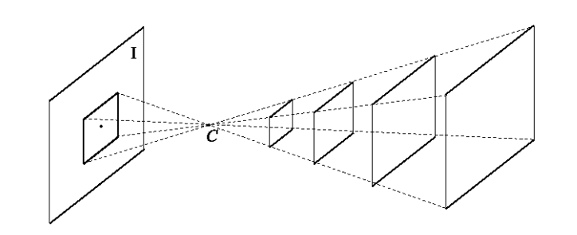
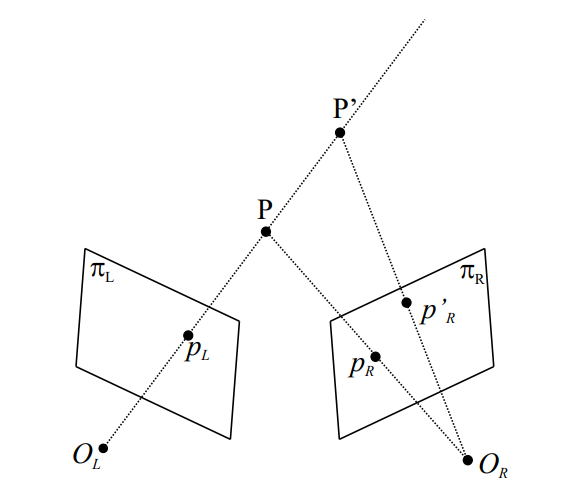
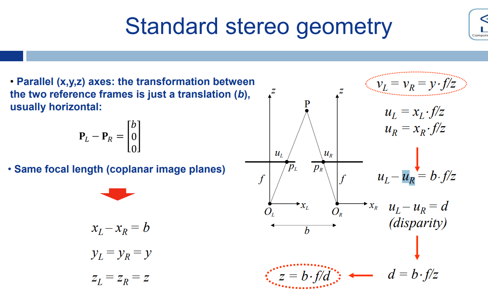
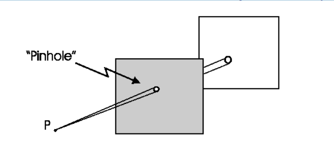
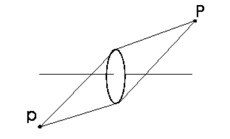
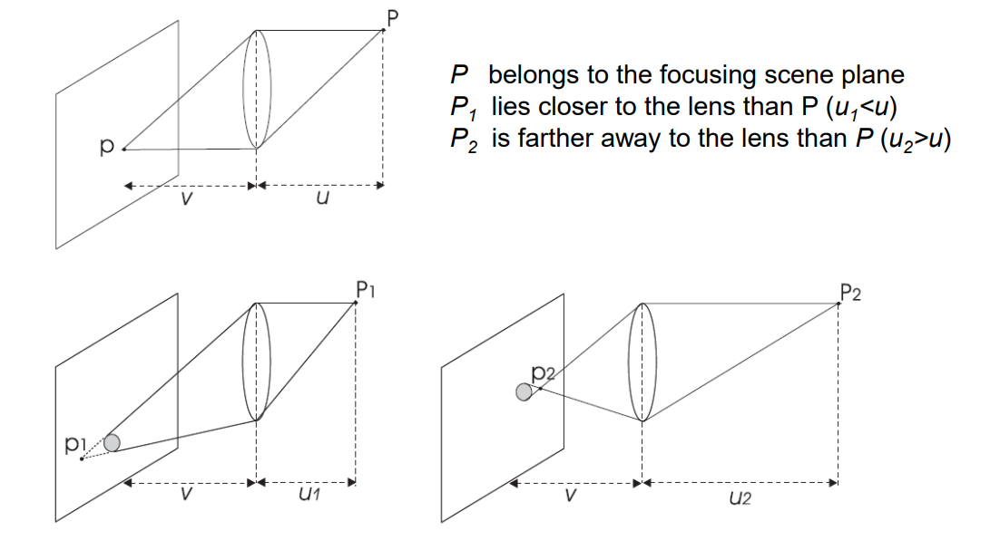

How do we get an image?

- with a camera
- A camera gathers the light reflected by 3D objects to create a 2D representation of the scene (i.e. the image).
  - The light is captured by means of a photosensitive material

In computer vision we try to invert such a process, so as to infer knowledge on the objects from one or more digital images.

- from the image (2d) we want to reconstruct information about the scene (3d)
- as an aside, in computer graphics the goal is the opposite, we already have all the information about a scene and we want to display an image

Il primo passo per capire come estrarre informazioni da immagini è capire quindi come le immagini vengono create (image formation process). Questo processo comprende due attività principali:

- capire come i punti 3d della scena si mappano nell'immagine e viceversa
  - The geometric relationship between scene points and image points.
- The image digitization process.

# Geometry of image formation

even the most complex camera can be **modeled as a pinhole camera** as far as image formation geometry is concerned

come funziona la luce?

- ogni punto riflette in tutte le direzioni la luce che riceve
- abbiamo molti raggi di luce che vengono riflessi da un punto secondo direzione radiale

come faccio a formare un immagine con una pinhole camera?\

- collect a single ray per image point and imprint on the photosensitive image plane
  - only a single ray of light can fit through the pinhole per point

## Perspective projection

the geometric model of image formation of the pinhole camera

- it applies to all kinds of cameras not only the pinhole one
- **it describes how to map a 3d point to its corresponding 2d image point**

### glossario

- M: scene point
- m: corresponding image point
- I: image plane
  - dove è presente il materiale fotosensibile
- F: focal plane
  - piano parallelo all'image plane dove è presente il pinhole
- C: optical centre (pinhole)
- f: focal length
  - distanza tra pinhole (optical centre) e image plane
- optical axis: Line through C and orthogonal to I
- c: intersection between optical axis and image plane (**image centre** or piercing point)

convenzione:

- lettere maiuscole rappresentano punti della scena
- lettere minuscole rappresentano punti dell'immagine

### how does a 3d point map to its corresponding image point

Abbiamo bisogno di due **sistemi di riferimento**

- uno per la scena 3d con **origine nel pinhole**
  - detto camera reference system (world reference system è un altro)
- e l'altro per l'immagine con origine nel piercing point (che ricorda essere il centro dell'immagine)
  - sistema di riferimento 2d

Le equazioni si ottengono considerando due dimensioni per volta e **notando che ci sono due triangoli simili**

- u/x = -f/z -> u = -x*f/z; per similitudine
- stessa cosa per la v -> v = -y*f/z



**NB**: il modello suggerisce che c'è una specchiatura e infatti c'è un segno meno.

- Tuttavia, nella pratica si preferisce eliminare il segno meno
- questo si traduce nel porre l'image plane davanti al pinhole e non dietro (sempre a distanza f dal pinhole)

**Considerazioni importanti**:

- le coordinate bidimensionali dell'immagine sono identiche a quelle 3d, moltiplicate per un **fattore di scala (f/z)** che dipende dalla distanza dal pinhole (detta anche **profondità**)
  - profondità = z = distanza dell'oggetto nella scena dal pinhole
  - più z è grande più il fattore di scaling è piccolo e viceversa
  - questo ci dice che **oggetti vicini vengono catturati come grandi e oggetti lontani vengono catturati come piccoli**

- **NB**: scale in CV pertains the APPARENT size of objects in images, which depends on:
  - the true size,
  - the distance from the camera
  - and the focal length.

- questo processo di image formation introduce quindi ambiguità sulla dimensione effettiva di un oggetto catturato
  - Oggetti piccoli vicini vengono catturati come grandi (scala grande), e oggetti grandi lontani vengono catturati come piccoli (scala piccola)
  - In many **image recognition** applications we wish to achieve **scale-invariance**.
    - vogliamo che gli algoritmi funzionino anche se l'oggetto può comparire nell'immagine con varie scale

- scala != dimensione
  - c'è una perdita di informazione.
    - Prevedibile dato che stiamo comprimendo un punto 3d in uno 2d.
  - a given scene point is mapped into a unique image point, but a given image point is mapped onto a 3D line
    - the line through the image point and the pinhole
  - la funzione che ci fa passare da 3d a 2d non è invertibile!
  - **Thus, recovering the 3D structure of a scene from a single image is an ill-posed problem (the solution is not unique)**
    - once we take an image point we can only state that its corresponding scene point lays on a line, but cannot disambiguate a specific 3D point along such a line
      - (i.e. we know nothing about the distance to the camera)
    - pensa all'equazione: u = x*f/z
      - data una u, ho infinite coppie (x, z) valide



# How do we capture depth and get a notion of size?

Aggiungiamo una camera (stereo) e triangoliamo

- abbiamo due camera reference frames
- con il secondo punto di riferimento si vede bene con un disegno che punti 3d a profondità diversa corrispondono a punti 2d distinti nella seconda immagine
  - disegna le linee che congiungono il pinhole della seconda camera con i vari punti possibili



Punti di due camere distinte che corrispondono allo stesso punto 3d, vengono detti **corrispondenti**

- per ottenere informazioni sulla profondità di un punto in un'immagine, ho bisogno di trovare il suo corrispondente nell'immagine catturata dall'altra camera

**Come faccio a capire quali coppie di punti sono corrispondenti?**

- Questo è il problema principale da risolvere in stereo imaging per recuperare informazioni sulla profondità (stereo matching problem)
- esistono algoritmi per farlo
  - particolarmente difficile su superfici piane e regolari tipo muri

L'output di una stereo camera è una depth map

- per ogni punto ottengo un valore di profondità

interessante: stereo cameras spesso includono dei proiettori che sporcano appositamente l'immagine per facilitare la ricerca di corrispondenze

## standard stereo geometry

configurazione particolare delle due camere in una camera stereo

- aggiungo una camera e quindi un reference frame
  - distinguiamo coordinate left da coordinate right sia per la scena che per l'immagine
- gli assi dei due camera reference systems sono paralleli
- stesso focal length
- le due camere sono a una distanza b
- basta traslare di b sull'asse orizzontale una delle due immagini per ottenere gli stessi punti

equazioni:

- i due punti 3d hanno la stessa altezza e profondità dato che le variabili per le due camere L/R in gioco sono uguali
- le coordinate orizzontali invece sono diverse
  - x diversi
  - ma so che sono diversi di solo una traslazione grande b



**Disparity** = differenza tra le coordinate (2d) orizzonatali di due punti **corrispondenti**

- misura quanto nell'immagine 2d i punti catturati dalle camere sono diversi orizzontalmente
- ci dà la formula per la profondità: z = b*f/d

Mentre b e f sono parametri noti/misurabili, **cio che non è noto per trovare la profondità di un punto è la disparità** (ovvero lo scostamento orizzontale del punto corrispondente)

- ma per trovare la disparità ci serve trovare il punto corrispondente nell'altra immagine
- torniamo allo stesso problema difficile menzionato sopra

Notiamo che, come con la scala, la **disparità è inversamente proporzionale alla profondità**

- **Maggiore è la disparità, più vicino è l'oggetto**

### Come si calcola la disparità?

Bisogna trovare il punto corrispondente nell'altra immagine...

Possiamo notare che, **data la nostra configurazione standard**, il punto corrispondente sarà sicuramente alla stessa altezza!

- detta in un altro modo, **il punto corrispondente si trova sulla stessa linea orizzontale nell'altra immagine**
  - lo spazio di ricerca è 1-dimensionale
- ora però dobbiamo capire quand'è che scorrendo questa linea riusciamo a trovare la corrispondenza
  - intuitivamente, possiamo costruire una finestra scorrevole attorno ai punti di questa linea.
  - Il punto con la finestra più simile a quella del punto nell'altra immagine è il punto corrsipondente
  - cosa significa "più simile"?
    - possiamo definire varie misure di similarità (SSE, ...)

## Epipolar geometry

Se le camera non rispettano la configurazione standard (assi paralleli e solo uno scostamento orizzontale) passiamo ad un caso più generale chiamato epipolar geometry

Qui i camera reference frames non sono necessariamente paralleli, ma, **the search space of the stereo correspondence problem is always 1D !**

- the search space is still a line, just not horizontal
- this is the **epipolar line**
  - il caso della standard geometry è un caso speciale in cui l'epipolar line è orizzontale.
  - In generale l'epipolar line è obliqua

All the epipolar lines in an image meet at a point called **epipole**

- è il punto d'intersezione sull'image plane di una camera della **retta che unisce i due centri ottici delle camere.**
  - L’epipolo e1 è la proiezione del centro ottico C2 sul piano immagine della prima camera.
  - L’epipolo e2 è la proiezione del centro ottico C1 sul piano immagine della seconda camera.
- può risiedere al di fuori del piano immagine

each camera has its own epipole and epipolar lines depending on which camera you're using to estimate depth

- se voglio conoscere la profondità di un pixel nell'immagine sinistra, andrò a cercare la corrispondenza nell'immagine destra
- la camera destra sarà quindi quella che sto usando per stimare la profondità, ed il pixel nell'immagine sinistra avrà associata un'epipolar line nell'immagine destra in cui risiede la corrispondenza, e un epipolo
- se avessi usato la camera sinistra per stimare la profondità, epipolo e linea sarebbero stati diversi

Un epipolar line è quindi associata ad un pixel nell'image plane dell'altra camera

- Epipolar line (associated with p_L in pi_R)

OSS: Se le camere sono parallele l'epipolo si trova ad infinito dato che la linea che unisce i due optical centre non interseca mai nessuno dei due image planes

**NB**: Chiaramente, cercare punti di corrispondenza in una geometria standard è più facile rispetto alla ricerca in una linea obliqua di una geometria epipolare.

Ma allora perchè stiamo introducendo la geometria epipolare?

- perchè è **impossibile ottenere una geometria standard mediante allineamento meccanico delle camere**
- la geometria standard è un modello impossibile da realizzare nella realtà

Dobbiamo rinunciare alla geometria standard così comoda?

- No, possiamo applicare una warping ad entrambe le immagini che ci permette di trasformarle come se fossero ottenute da una geometria standard
  - la trasformazione che applichiamo si chiama **rectification**
  - otteniamo una geometria standard virtuale
  - l'immagine destra subisce un warping diverso rispetto a quella sinistra
- una volta rettificate entrambe le immagini, siamo nel caso di una una geometria standard e possiamo cercare le corrispondenze su una epipolar line orizzontale

**rectification**: in stereo imagine **we always have this step**, again, because perfect mechanical alignment is impossible

## vanishing point definition (importante)

considerazioni preliminari:

- Perspective projection maps 3D lines into image lines.
- Ratios of lengths are not preserved (unless the scene is planar and parallel to the image plane).
- Parallelism between 3D lines is not preserved (except for lines parallel to the image plane)

**NB**: The images of parallel 3D lines (che nell'immagine non sono più parallele (except for lines parallel to the image plane)) meet at a point, which is referred to as **vanishing point**.

**DEF**: The vanishing point of a 3D line is the image of the point at the infinity of the line (i.e. the image of the point on the line which is infinitely distant from the optical centre).

- il vanishing point è un image point (non necessariamente nell'immagine)
- il vanishing point è associato ad una singola 3d line
- linee 3d infinite, non parallele all'image plane, terminano in un punto infinitamente distante

The vanishing point can be determined by the intersection between the image plane and the line parallel to the given one and passing through the optical centre.

- copia la linea 3d, falla passare per l'optical centre, e vedi dove interseca il piano dell'image plane
- (tutti gli image point si trovano vedendo dove il segmento che unisce punto 3d e optical centre interseca l'image plane, ma per un punto all'infinito questo segmento è parallelo alla linea 3d)

**Proprietà**: linee parallele nel mondo 3d, risultano nello stesso vanishing point nell'immagine

- all parallel 3D lines will share the same vanishing point, i.e. they “meet” at their vanishing point in the image
  - facilmente verificabile traslando le varie linee nell'optical centre
  - in quanto parallele, intersecheranno per forza l'image plane nello stesso punto
- tranne nel caso in cui il vanishing point is at infinity (i.e. the 3D lines are parallel to the image plane).
  - qua non c'è proprio intersezione

NB: dire che il vanishing point è il punto in cui tutto le linee parallele convergono non è una definizione, piuttosto una proprietà (utile per trovare il vanishing point velocemente), la definizione è quella sopra che necessità di solo una pinhole camera e di una singola linea.

### Perchè ci interessa il vanshing point?

è uno strumento che ci fornisce informazioni sull'orientamento della camera!

- se so che determinate linee nel mondo reale sono parallele (vedi guide in un circuito)
- posso orientare la camera in maniera tale che il vanishing point di queste linee risieda nel centro dell'immagine
- se il vanishing point si sposta so che la camera non è più orientata correttamente e posso spostare la camera automaticamente per ricentrarlo

# Lenses, focus and depth of field

Il modello della pinhole camera lascia passare un solo raggio di luce per ogni punto della scena; tuttavia questo non succede nelle camere reali

- nelle camere reali l'apertura del pinhole lascia passare una manciata di raggi
- l'apertura è un cerchio piuttosto che un punto

A scene point is **on focus** when all its light rays gathered by the camera **hit the image plane at the same point**.

- if this doesn't happen the image gets blurry because the light rays from different scene points may hit the same image point and mix together
- the rays from a scene point get spread in an area of the image plane, i.e. circle of confusion



In a pinhole device this happens to all scene points because of the very small size of the hole (che lascia passare un singolo raggio per punto)

- In other terms, the pinhole camera features an infinite **Depth of Field (DOF)**

```Depth of field
l’intervallo di distanze in cui i punti della scena appaiono nitidi nell’immagine.

- Con una pinhole camera la DOF è infinita dato che ogni punto ha sempre e solo un raggio di luce associato e quindi non ci sono mai sovrapposizioni
- Con un obiettivo reale (a lenti), solo gli oggetti posti a una certa distanza sono perfettamente a fuoco; gli altri risultano sfocati.
- La DOF misura quanto è esteso questo intervallo di distanze per cui l’immagine appare accettabilmente nitida.
```

**Tuttavia, can we use a pinhole camera in real life?**

- no, because the amount of light per unit time that we can gather through a pinhole is very small.
- To get a **bright** enough image we would then need a long **exposure** time.
- That in turn means that we could only capture static scenes otherwise we would get **motion blur**

Therefore, cameras rely on **lenses** to gather more light from a scene point and **focus it on a single image point**.

- the lense captures many light rays from a point and converges them towards a single point
- This enables much smaller exposure times, as required, e.g., to avoid motion blur in dynamic scenes.
- However, **with lenses the DOF is no longer infinite** (vedi thin lense equation)
  - only points across a limited range of distances can be simultaneously on focus in a given image.



In summary:

- a pinhole camera alone is impractical to capture dynamic scenes because it doesn't allow enough light
- its strength is that is has an infinite DOF
- usiamo le lenti per ottenere abbastanza luce e quindi per catturare anche scene dinamiche
- così facendo però, perdiamo la infinte DOF

## how do we geometrically model a lense?

we can approximate the lense system of a camera (which can be complex) as a **single thin lense** positioned in the optical centre (pinhole).

- That is, we use the **thin lense model**
- il pinhole in questo modo ha un apertura pari al diametro della lente e lascia passare più luce, la lente concentrerà la luce in un unico punto nell'image plane
- we'll see that we can still use perspective projection even with this thin lense model

Introduciamo un po' di nomenclatura:

- u : distance from P to the lens
  - object distance
- v : distance from p to the lens
  - image plane distance
    - ex focal length of the pinhole camera without lenses
    - in questo caso chiamata anche effective focal length
  - camera parameter
- f : focal length (parameter of the lens)
- F : focal point (or focus) of the lens
  - point on the optical axis at distance f from C
- C : centre of the lens (== pinhole)

La lente è tale che:

1. ALL Rays parallel to the optical axis are deflected to pass through F
2. Rays through C are undeflected

**How do we determine the on focus image point of the scene point with a thin lense?**

- we just need to see **where 2 lines coming from the same scene point intersect**
- usiamo due linee speciali:
  - quella parallela all'optical axis (che viene deviata)
  - e quella che tira dritto verso l'optical center (che non viene deviata)

Da qui, sempre osservando similitudini tra i triangoli

- h/h' = u/v
- h/h' = f/v-f

Otteniamo la **thin lense equation**: 1/u + 1/v = 1/f

Quest'equazione ci dice che:

- fissare la distanza dell'image plane dalla lente (effective focal length), fissa la distanza degli oggetti che possono essere catturati a fuoco
- e viceversa: se voglio catturare degli oggetti ad una certa distanza, dovrò impostare la effective focal length secondo la thin lense equation

### circles of confusion

**NB**: Due to the thin lens equation, **choosing the distance of the image plane v determines the distance at which scene points appear on focus in the image**:

- u = v*f/(v-f)

Notiamo quindi che con questo modello sembra che le **uniche scene che possiamo catturare in maniera non sfocata siano quella ad una distanza ben precisa.**

- Given the chosen position of the image plane, scene points **both in front and behind the focusing plane will result out-of-focus**, thereby appearing in the image as Circles of Confusion rather than points

Possiamo catturare in maniera non sfuocata solo un piano quindi?

- NO! **As long as the circle of confusion is smaller than the pixel size we don't perceive the blurring effect**
- the DOF is the range of distances where this is true
  - se i punti della scena non sono troppo avanti o indietro a questo piano ideale, allora il punto sarà focused, altrimenti no



### What if the DOF is not good enough?

we use a **diaphram**, a mechanism which makes the lense larger or smaller by covering it

- this doesn't change the effective focal length, but it makes the circles of confusion smaller, thus increasing the range of distances where it's still subpixel
- this way we capture less light, and so we need longer exposure times, and this make it harder to capture dynamic scenes without motion blur
  - to counteract this we can add more light through a flash on the camera, or more light on the scene
- by closing the diaphram we gain DOF but we lose brightness e viceversa

We can also use a **focusing mechanism** that changes the distance of the lense from the image plane v

- this way we can vary v and change the distance u at which objects appear focused
- this can be manual or automatic
- a sua volta, l'autofocus può essere passive or active
  - attivo significa che usiamo un sensore aggiuntivo (laser, sonar) per ottenere una misura della distanza dell'oggetto da mettere a fuoco con cui regolare l'image length
    - veloce
  - passiva significa che non si usa alcun sensore, piuttosto si fanno tanti tentativi e si computa qual'è quello più a fuoco

**NB**: se l'immagine è on focus, abbiamo lo stesso modello di prima.

- il pinhole diventa il centro della lente
- **possiamo continuare ad usare perspective projection per capire come 3d point vengono mappati in punti 2d**

**NB**: If the image is out of focus, perspective projection doesn't apply. But this case doesn't concern us because we must make sure that we work with focused images

---

# Riassunto

- usiamo una pinhole camera che definisce perspective projection
  - CRF ha origine nell'optical centre
  - IRF ha origine nel centro dell'immagine (piercing point)

- con una sola camera perdiamo l'informazione di profondità
  - nozione di scala, dimensione apparente di un oggetto nell'immagine

- se vogliamo la profondità di un pixel abbiamo bisogno di una stereo camera
  - standard stereo geometry definisce due CRF che rappresentano due punti 3d in maniera identica se non per una differenza pari alla baseline della coordinata x
  - P_l - P_r = \[b, 0, 0\]

- se non abbiamo standard stereo, siamo nel caso della geometria epipolare
  - una epipolar line è una linea nell'immagine target associata ad un punto nell'immagine di riferimento
  - in standard stereo, le epipolar line sono sempre orizzontali; nel caso generale sono oblique (search space sempre 1d)
  - tutte le epipolar line in un immagine target convergono in un epipolo: proiezione dell'optical centre dell'altra camera nell'image plane target

- la geometria standard è quella più comoda è quindi effetuiamo un warping per trasformare le immagini come se fossero state catturate da una geometria stereo. Rectification

- vanishing point è l'image point corrispondente all'infinito di una linea 3d
  - linee 3d parallele hanno lo stesso vanishing point
  - il vanishing point si ottiene traslando la linea 3d nell'optical centre e vedendo dove interseca l'image plane

- lenti mi permettono di catturare più luce ma definiscono una DOF in cui gli oggetti appaiono a fuoco definita dal thin lense model
  - se gli oggetti nella scena sono ad una distanza permessa dalla DOF, allora gli oggetti sono a fuoco e continua a valere perspective projection
  - per aumentare la DOF posso usare un diaframma, che mi rimpicciolisce i circles of confusion, con un tradeoff di longer exposure times; oppure posso usare dei focusing mechanisms che mi cambiano la effective focal length
