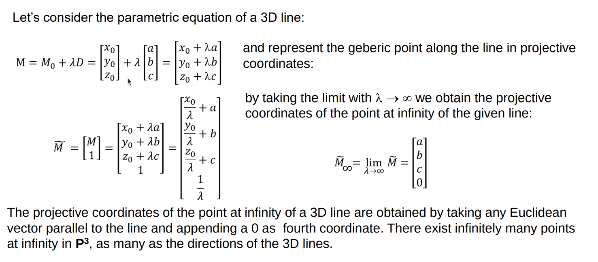
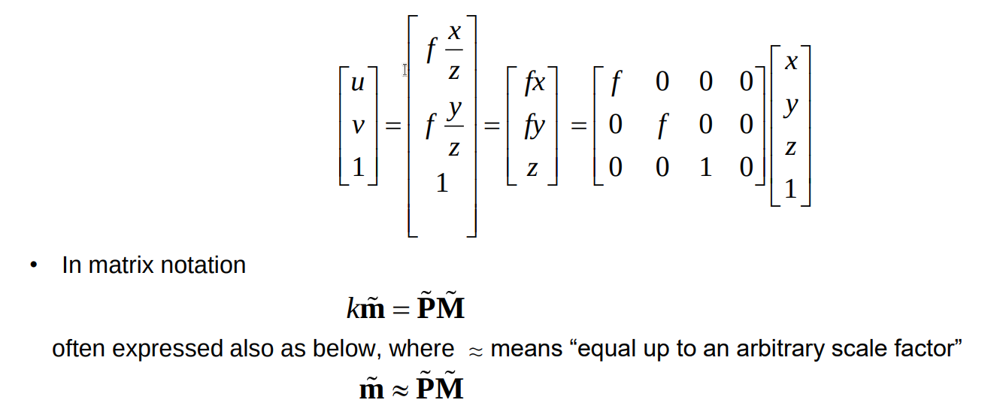
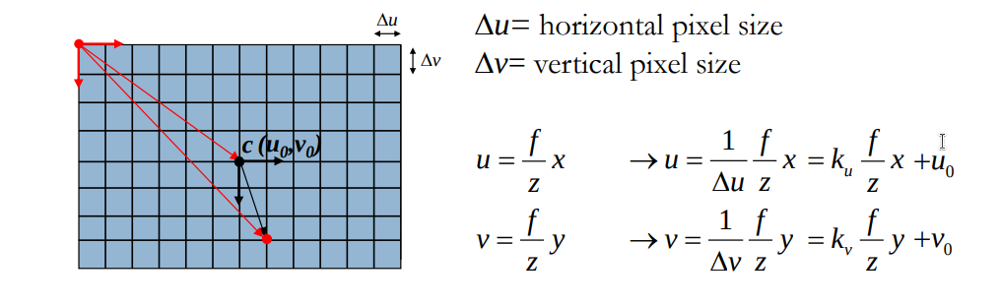
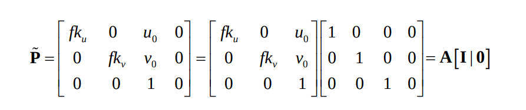
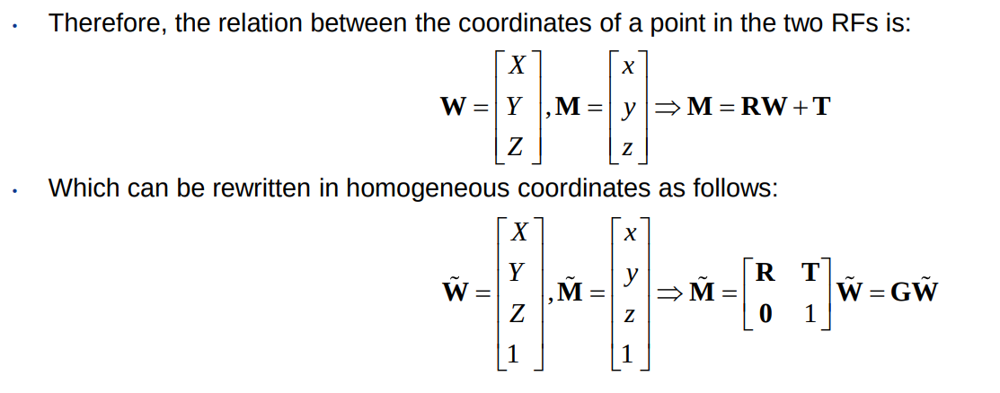
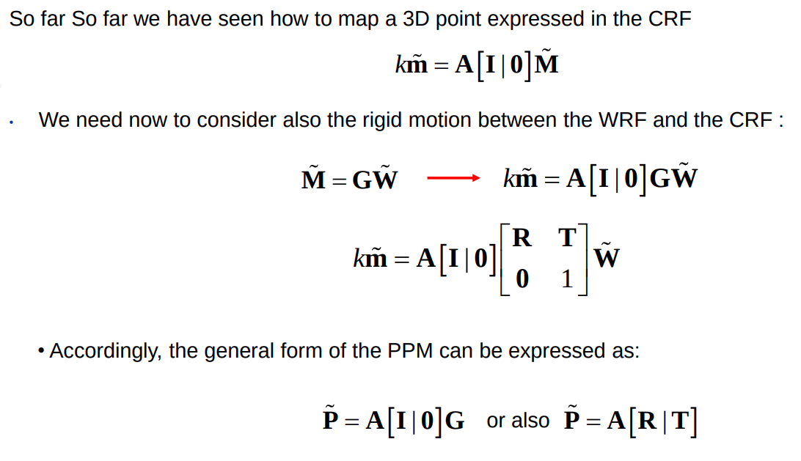
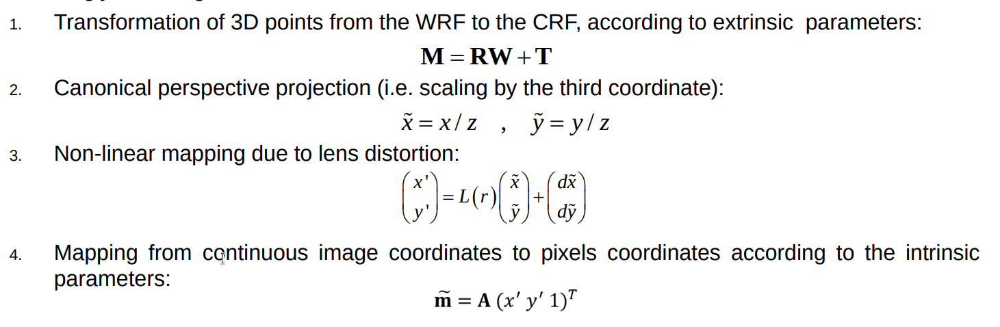

# Reminder

le coordinate del 3d point sono (x,y,z)

le coordinate 2d dell'image point sono (u, v)

queste coordinate sono sensate solo dentro a dei sistemi di riferimento

- gli assi di entrambi rf devono avere verso congruente (e assi paralleli?)
- camera reference frame is the 3d one
  - it's called camera reference frame because it's linked to the camera
- image reference frame is the 2d one
  - origine al centro dell'immagine

perspective projection ci da un modo per mappare punti 3d in 2d

- le formule sono **NON lineari**

we don't like this model too much

to have a better model ... we need to switch from eucledian spaces to projective spaces

# Projective spaces

a limitation of eucledian spaces is that there is **no way to represent and handle points at infinity**.

This is not the case with projective spaces

### Homogeneous coordinates (projective coordinates)

- le coordinate di un punto in projective space si ottengono aggiungendo rendendo la tripla (x, y, z) dello spazio euclideo, una quadrupla (x, y, z, 1)
- queste coordinate rappresentano lo stesso punto
- inoltre, moltiplicare la quadrupla di una projective coordinate per uno scalare non cambia il punto a cui sta facendo riferimento
  - un punto in projective space è rappresentato da una equivalence class di quadruple che differiscono solo per un termine moltiplicativo
- possiamo usare un vettore colonna e uno scalare per rappresentare un punto in projective space
  - il projective space associato a R^3 è P^3 (anche se utilizza una quadrupla)

Possiamo mappare qualsiasi punto in Rn in Pn, e viceversa, facilmente:

- **per passare da R^n a P^n**: basta aggiungere un 1 in fondo al vettore colonna e moltiplicare questo vettore per uno scalare k
- **per passare da P^n a R^n**: basta dividere le prime n coordinate per l'ultima (n+1-esima) coordinata e scartare l'ultima coordinata

### Point at infinity of a 3d line

Let's consider a line in 3d space with the **parametric equation of a 3d line**.

- M0: vettore, usato come base, che rappresenta un punto qualsiasi sulla linea
- M: è un punto a caso sulla linea (anche questo è un vettore)
- D: è il vettore che mi da la direzione della linea
  - pensabile come la differenza tra M e M0 (anche questo un vettore)
    - lambda*D: per ottenere M dobbiamo sommare a M0, il vettore D scalato per lambda
    - al variare di lambda otteniamo tutti i punti della linea

Passiamo a projective space e indichiamo con M~ la versione in projective space

We would like to represent the point at infinity of this line

- this is a limit with lamda -> inf

Considerando M0 e D come vettori, e dividendo tutte le coordinate per lambda, otteniamo che: **Points at infinity in projective spaces are the points with the last coordinate equal to zero**

- le altre coordinate sono quelle di D che rappresentano la linea 3D in considerazione

**Conclusione**: per ottenere il punto ad infinito di una linea 3d in projective space, basta prendere le coordinate 3d del vettore che rappresenta la direzione della linea e aggiungere 0 come quarto elemento

- questi punti NON possono essere rappresentati in Euclidean space!
- dovrei dividere per zero le altre 3 coordinate

Abbiamo quindi che punti in projective space:

- con quarta coordinata == 0 -> non hanno una rappresentazione corrispondente in Eucledian space
- con quarta coordinata != 0 -> hanno una rappresentazione corrispondente in Eucledian space

**Projective spaces allow us to handel both kinds of point homogeneously**

In projective space we have ininitely many points at inifinity

- uno per le infinite direzioni che le linee possono avere

Point (0, 0, 0, 0) is undefined.

- indeed, the above point is NOT the origin of the Euclidean Space (0, 0, 0), for such point is represented in homogeneous coordinates as (0, 0, 0, k), k≠0.

## Why do we care about projective spaces?

Because **Perspective Projection with projective coordinates becomes a linear transformation!**

if we model perspective projection as a mapping between P3 and P2, **this mapping becomes linear!!** (unlike Eucledian space)

- this is good because it is easier to solve linear systems than non-linear ones

Consideriamo:

- M: punto 3d nel CRF
  - M = \[x, y, z]
- m: punto 2d proiezione di M sull'image plane
  - m = \[u, v]

passiamo a projective coordinates aggiungendo un uno ad entrambi i vettori e riscriviamo le equazioni della perspective projection

con qualche passaggio otteniamo la forma lineare

con qualche altro passaggio otteniamo la forma matriciale in cui otteniamo le image coordinates dalle 3d coordinates

- tutti i vettori sempre in projective coordinates
- matrice 3x4 perchè vogliamo usare il vettore di coordinate 3d (4x1 in projective space)

**OSS**:

- a camera is the thing that turns 3d coordinates into 2d coordinates following the rules of perspective projection
- The matrix we get by applying perspective projection in the projective space does this as well
- **The matrix describes the camera!** (ha come parametro proprio f)

Considera sempre nell'equazione lo scalare k che moltiplica le coordinate m~

- non fa cambiare niente
- se scalo tutto di k in projective space continuo a descrivere lo stesso punto

### computing the vanishing point of a line with projective coordinates

With projective coordinates and with the matrix, now we can compute the 2d image coordinates of the vanishing point

- mi basta moltiplicare la matrice (trasformazione che mi applica perspective projection ad un punto) per il punto a infinito (che abbiamo detto essere il vettore che rappresenta la retta con uno zero in fondo come quarta coordinata) ottenendo così le coordinate 2d del vanishing point in projective space
- per ottenere le coordinata 2d del vanishing point in spazio euclideo mi basta di nuovo dividere tutto per l'ultima coordinata

Casi speciali:

- il vanishing point of the lines parallel to the optical axes is the centre of the image
  - moltiplica la matrice per il vettore dirizione \[0, 0, 1] delle linee perpendicolari all'optical axis
- if the 3d line is perpendicular to the optical axis, the vanishing point is at infinity (indescrivibile in R2)
  - come prima, ma stavolta il vettore direzione è \[a, b, 0] in quanto perpendicolare all'optical axis z

### PPM

Matrix represents the geometric camera model and is known as Perspective Projection Matrix (PPM).

- If we assume distances to be measured in focal lenght units (f = 1; fx = x), the PPM becomes una matrice identità orlata con una colonna di zeri
- questa è la standard/canonical PPM

Questa forma canonica della ppm ci dimostra l'essenza della perspective projection:

- \[x,y,z,1] moltiplicato per la PPM canonica diventa \[x,y,z], che in coordinate cartesiane equivale a \[x/z, y/z]
- this is what perspective projection does, it scales objects down the farther they are from the camera
- a specific camera introduces other parameters (focal length)

---

# a more comprhensive camera model

With projective coordinates we have gained:

- linear equations to apply perspective projection
  - we just need to change to projective space and do a matmul with the PPM
- being able to compute vanishing points
  - moltiplico la PPM con il vettore della mia linea 3d con uno zero in fondo

What are we still lacking with this model?

- As it is now, this model is useless
  - there is no way to compute 3d coordinates because the camera reference frame is an abstraction
  - **we can only measure 3d coordinats in a reference frame that is convenient to us (world reference frame)**
    - only in a rf that we choose we can take measurements, the CRF is somewhere inside the camera, more of a mathematical model than anything
  - but world reference frame coordinates are invalid for perspective projection because this model assumes CRF coordinates
  - we need a way to transform coordinates from WRF to CRF and only then apply perspective projection
    - rototranslation
- Inoltre, applicando la PPM otteniamo coordinate 2d continue (le coordinate 3d sono continue)
  - ma noi abbiamo solo pixel coordinates (discrete)
  - **dobbiamo tenere conto della digitalizzazione dell'immagine**

We need to incorporate in the PPM 2 things:

- rototranslation from the world reference frame (WRF) to the CRF
- image digitization

## image digitization

questo è facile, basta dividere le coordinate orizzontali e verticali dell'immagine per la dimensione del pixel

- basta dividere per delta_u e dalta_v (quantizzazione)

e traslare il tutto per avere come origine l'angolo in alto a sinistra dell'immagine

- sommo il vettore dall'angolo fino al centro con il vettore dal centro fino al punto (u0, v0) per ottenere il vettore delle pixel coordinates

**Intrinsic Parameter Matrix**
Modifichiamo la PPM inserendo i 4 parametri (2 di quantizzazione e 2 di traslazione) per tenere conto della digitalizzazione

- posso anche rappresentare il tutto come prodotto tra due matrici A * \[I|0]
- Matrix A, which models the characteristics of the image sensing device, is called Intrinsic Parameter Matrix (or Camera Matrix).

Otteniamo quindi che per ottenere le coordinate digitized di un punto 3d nel CRF, dobbiamo fare: k\*m~ = A\*\[I|0]M~

Possiamo pensare al processo come 2 trasformazioni separate:

- una per ottenere le image coordinates continue (con canonical PPM)
- e l'altra per digitalizzare quest'ultime (con intrinsic parameters)

L'intrinsic parameter matrix è quindi una **matrice 3x3** che contiene tutti i 5 parametri che definiscono una camera:

- focal length; horizontal and vertical scaling factors based on pixel sizes, horizontal and vertical translations
- f, k_u, k_v, u0, v0
- in realtà bastano 4 parametri perchè f e i k possono essere moltiplicati per ottenere un unico parametro alpha che rappresenta la focal length in horizontal e vertical pixel sizes

**Abbiamo quindi 4 parametri che definiscono una camera (intrinsic parameter matrix)**

## rigid motion between CRF and WRF

3D coordinates are measured in a World Reference Frame (WRF) external to the camera

The WRF will be related to the CRF by:

- A rotation around the optical centre (e,g. expressed by a 3x3 rotation matrix R)
- A translation (expressed by a 3x1 translation vector T)

Indichiamo con M le coordinate 3d nel CRF e con W le coordinate nel WRF

- **la rototranslation che dobbiamo fare ha quindi questa forma: M = RW + T**

Se esprimiamo il tutto in coordinate omogenee otteniamo M = G*W

- dove G è una **matrice 4x4** che include R e T

Matrix G, which **encodes the position and orientation of the camera with respect to the WRF**, is called **Extrinsic Parameter Matrix**

- ha **6 parametri**
  - 3 per le rotazioni nella rotation matrix
    - a rotation matrix (3x3=9 entries) has only 3 independent parameters (DOF), which correspond to the rotation angles around the axis of the RF
  - 3 per le traslazioni nel translation vector
  - (rigid motion ha 6 degrees of freedom)

## general PPM

Aggiungiamo quindi questa terza matrice a quelle già descritte arrivando ad ottenere la **forma generale per la PPM**: PPM~ = A\[I|0]G

Hence, the general form of the PPM can be thought of as encoding:

- the position of the camera WRT the world into G
  - G mi traduce le coordinate nel WRF in coordinate nel CRF
- the perspective projection carried out by a pinhole camera into the canonical PPM \[ I | 0 ] and,
- the actual characteristics of the camera into A

Arriviamo ad un totale di 10 parametri (4 per A, 6 per G)

La PPM può essere considerata come:

- un'unica matrice 3x4
- come 3 matrici rispettivamente: 3x3, 3x4, 4x4

# Conclusioni

Un camera modello non serve tanto a fare image analysis (es. classificazione)

Piuttosto serve in tutte le applicazioni che devono elaborare informazioni del mondo 3d a partire da un'immagine

- mi permette di capire come una coordinate 3d si mappa nell'immagine e, con uno stereo rig, mi permette di capire la coordinate 3d corrispondente ad una 2d
- fondamentale ad esempio in robotica

---

# Lens distorsion

the model we have derived so far doesn't explain some phenomenomes like lens distorsion

in perspective projection we lose parallelism but straight lines stay straight

Perspective projection works with the pinhole camera but in practice we've seen that we need lenses to gather enough light.

This means that we don't really use a pinhole camera. This is fine because with the thin lense model perspective projection still works, as long as the scene is on focus (the depth is acceptable for the range of distances defined by the DOF the camera)

Tuttavia, **le lenti reali non sono thin e introducono una distorsione (non lineare) che rende invalido il modello di perspective projection**

We need a model to **warp distorted images to undistorted ones**, so that we can continue using perspective projection to map between pixel coordinates and scene coordinates

Lenses itroduce **2 kinds of distortions**:

- radial distorsion depends on the 3d shape of a lense
- tangential distorsion depends on misalignment of the lense wrt the image plane

## Modeling lense distortion

We model lense distortion through a **non-linear transformation** which maps **undistorted continuous image coordinates** into **distorted continuous image coordinates**

- L(r) models radial distorsion
  - dipende dalla distanza dal centro, pixel vicino ai bordi vengono distorti di più
  - radial distorsion gets amplified the farther away we are from the center of distorsion
- dx, dy modella tangential distorsion

- **NB**: qua abbiamo detto image coordinates deliberatamente, NON pixel coordinates. **Questo modello opera prima della digitalizzazione**

L(r):

- nel distortion center non c'è distorsione radiale: L(0) = 1
- c'è un 1 dato che at the center of distorsione there's no distorsion
- we seem to miss the odd terms of the taylor series expansion, questo perchè L(r) è una funzione pari (L(r) = L(-r))
  - la distorsione è simmetrica
- di solito si arriva fino a k2/k3 come termini della serie
- anche qua i parametri k vanno stimati

dx, dy:

- c'è una formula con due parametri p1 e p2 che definisce questi termini
- anche p1 e p2 vanno stimati

**Conclusioni**: I parametri della lense distortion sono k1, k2, ..., kn (tipicamente max k3) e p1, p2. Questi parametri estendono i 10 della PPM generale per formare un camera model completa che ci permette di applicare perspective projection.

## When does lens distorsion come into play in the image formation process?

Lense distortion happens after the rototranslation and perspective projection steps

- infatti, abbiamo detto che trasforma CONTINUOUS IMAGE coordinates nella loro versione distorta

Successivamente, la matrice degli intrinseci maps the continuous (distorted) image coordinates into pixel coordinates

# Image formation flow

---

# Riassumendo

- ragionando con projective coordinates
  - perspective projection diventa una trasformazione lineare
    - usiamo la formula che già conosciamo e moltiplichiamo tutto per z
  - possiamo rappresentare punti all'infinito e come vengono proiettati nell'immagine

- oltre a projective coordinates abbiamo bisogno di definire
  - una rototranslation da WRF a CRF
    - noi riusciamo a fare misurazioni solo in un RF che ci conviene
    - ma perspective projection assume CRF coordinates
  - una digitalizzazione da coordinate 2d continue a discrete
    - le immagini continue non esistono

- intrinseci sono una matrice 3x3
  - contiene le informazioni sulla camera:
    - focal length
    - pixel size
    - offset
  - 4 parametri

- estrinseci
  - rototranslation tra WRF a CRF
  - matrice 4x4
  - 6 parametri
    - 3 rotation vectors
    - 3 translations

- perspective projection non è valido se non eliminiamo la distorsione introdotta dalle lenti
  - le lenti non sono thin e quindi introducono una distorsione non lineare
  - modelliamo lense distortion come un warping che mappa undistorted in distorted
    - le coordinate considerate sono continuous image coordinates
    - modelliamo la lense distortion in maniera tale che avvenga prima della digitalizzazione
  - le coordinate undistorted vengono moltiplicate per distorsione radiale e shiftate per distorsione tangenziale
    - aggiungiamo ai parametri della PPM i parametri per questi due tipi di distorsione che dipendono dalla lente

- con PPM e lense distortion abbiamo il nostro image formation flow finale