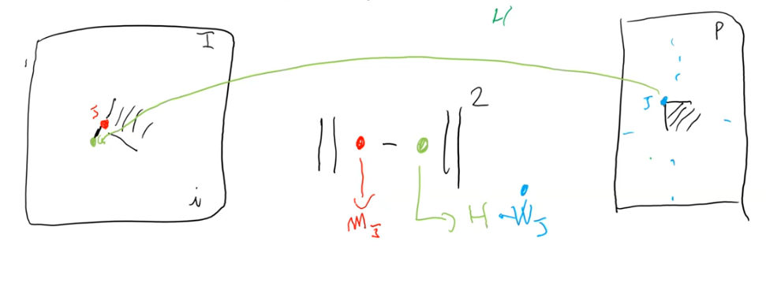
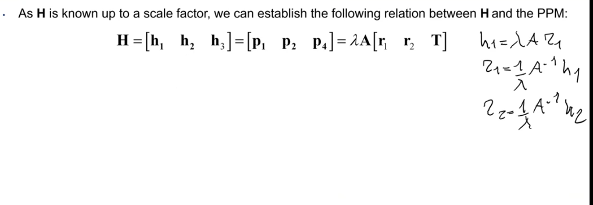
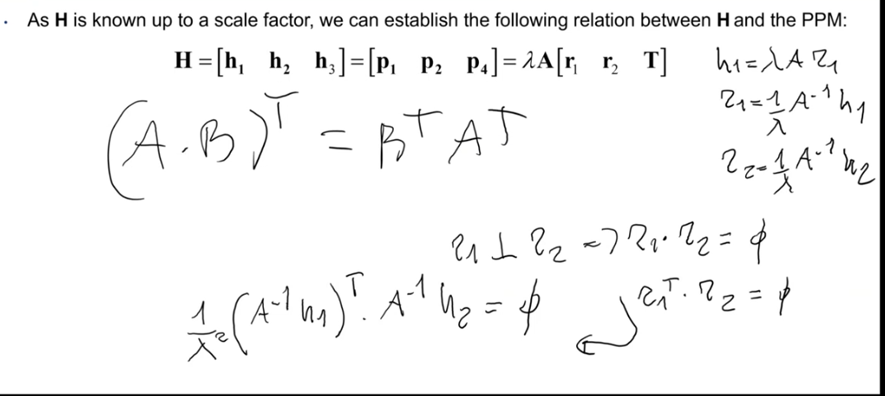
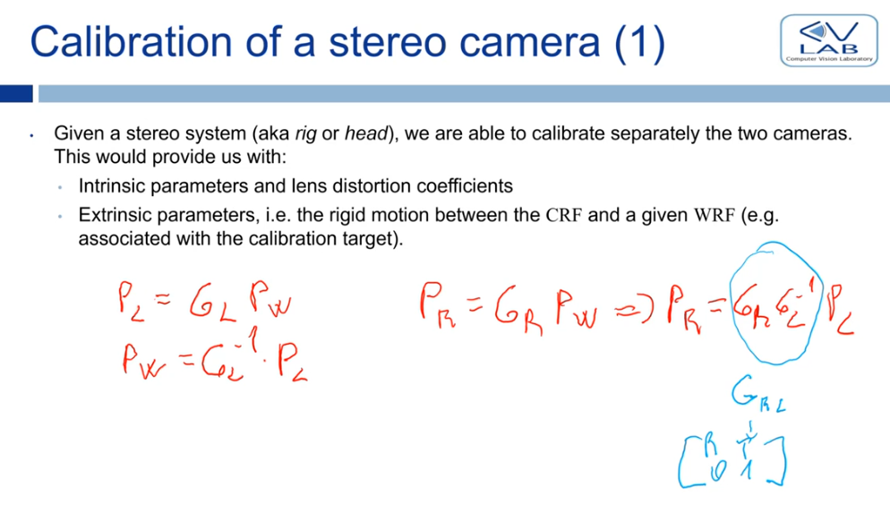

# Come funziona un processo di estimation?

at parameter estimation time:

- we're trying to develop a model that given some inputs gives us some outputs
- but we don't know the correct parameters of the model
- to estimate them we need to have the corresponding outputs of a given input
- **we need correspondences!**

once we've estimated the parameters: we can use the model to predict the output of a given input

---

Now we know how image formation works and we have a comprhensive model for perspective projection

Our model has a lot of parameters, if we don't know them we can't do anything

Camera calibration's purpose is to get to know these parameters

This is a complex process

- with opencv we call a function and camera calibration is done
- the goal of this chapter is to see what's under the hood

# Camera calibration

In camera calibration we try to estimate all the parameters of the image formation model

- intrinsic parameters
- extrinsic parameters
- lens distorsion parameters

**based on a set of 3d-2d correspondences**

What all camera calibration methodologies have in common is that:

- what is know is correspondences between 3d coordinates and pixel coordinates (M and m)
- what is not know is the parameters of the camera (P)
- we use correspondences to estimate camera parameters
  - ricorda che m~ = P~ * M~
  - le corrispondenze ci permettono di costruire un sistema di equazioni lineari la cui soluzione ci da i parametri che stiamo stimando

To obtain the required correspondences specific physical objects (referred to as **calibration targets**) providing easily detectable image features (such as, e.g., chessboard or dot patterns) are typically deployed.

**Di quante immagini abbiamo bisogno?**

- minimo 3 (per riuscire ad ottenere abbastanza equazioni per stimare i parametri intrinseci)
- tipicamente 15/20
- indichiamo con n il numero di immagini

**Di quante corrispondenze abbiamo bisogno?**

- minimo 4 per immagine
  - ogni corrispondenza ci da due equazioni, e noi vogliamo stimare gli 8 parametri delle omografie
- in pratica più ne abbiamo meglio è

**Che immagine di calibrazione usiamo?**

- una con una scacchiera
- con m (internal) corners

In Zhang's method we use a planar pattern because in this way perspective projection boils down to a simpler transformation called **homography**

Ricorda che to have an homography we need to choose carefully the WRF:

- asse z perpendicolare al piano
- origine sul piano (z deve essere sempre = 0)
- inoltre, in questo caso, in each image, the 3D WRF is taken at the top-left (internal) corner of the pattern

The control points are the internal corners (non cosideriamo gli angoli sul bordo della scacchiera)

Ulteriormente, il numero di quadrati neri sugli assi x e y della calibration image deve essere diverso per evitare ambiguità

- date immagini di calibrazioni diverse, riusciamo sempre a capire qual'è l'asse x e qual'è l'asse y perchè il numero di control point è diverso

Siccome, costruiamo noi la scacchiera:

- sappiamo la dimensione dei quadrati (i.e 1cm)
- e quindi **sappiamo la posizione dei control points nella scacchiera** (in WRF coordinates)
- For 3D points:
  - The third coordinate is always 0.
  - x and y are determined by the known size of the squares forming the chessboard.

**Ora come facciamo a sapere le relative coordinate nell'immagine dei control point?**

- esiste un semplice algoritmo di image processing che riesce a rilevare i corner nell'immagine
- e siccome, la calibration image è assimmetrica, **riusciamo ad ottenere le corrispondenze**

**NB**: Quando scattiamo le immagini di calibrazione, la camera è fissa mentre muoviamo l'immagine di calibrazione (o viceversa, ma non cambia nulla)

- abbiamo quindi un WRF per immagine dato che il WRF è solidale con l'immagine di calibrazione
- e quindi **una matrice di extrinsic parameters per immagine di calibrazione**

**NB**: A global WRF can be taken to coincide with that associated with one of the calibration images, e.g. the first.

---

## Estimating H

Per ogni internal corner ho un sistema di 3 equazioni che mi mette in relazione le coordinate 3d con quelle 2d

- Per ogni internal corner abbiamo quindi 3 equazioni (una per ogni riga)
- con 9 unknown (8 really dato che siamo in projective space)

**NB**: since we have a lot of internal corners (m=64 tipically) we have an **overconstrained linear system**  of equations

- this can be solved with linear algebra although not always exactly since overconstrained linear systems are likely to contain contradicting constraints
- we can always approximate a solution that minimizes the error with something like a least square approach and SVD (vedi dopo)

**We have a little problem**: we have a k which can be an arbitrary (non-zero) value. We would like to get rid of the k to get a simple solution to our system

How to get rid of k:

- km~ = Hw~ sono vettori 3x1 in P^2 uguali (ricorda che l'uguaglianza vale anche up to scale in projective space)
- **pensiamo a questi vettori 3x1 come se fossero in euclidean space**
- abbiamo ky = x (con y = m~ e x = Hw~) -> questi sono due **vettori paralleli**
- il loro prodotto vettoriale e quindi 0
- possiamo allora considerare m~ e Hw~ due vettori paralleli in spazio euclideo e impostare un equazione più comoda per ottenere l'omografia H: `m~ x Hw~ = 0`

A questo punto ci basta espandere il prodotto vettoriale per ottenere un sistema di equazioni per le incognite dell'omografia:

- **come si computa il prodotto vettoriale?** Usiamo la "matrix form"
  - consideriamo le righe dell'omografia come vettori colonna trasposti

La tecnica che abbiamo utilizzato che elimina la k trasformando l'equazione iniziale in quella con il prodotto vettoriale prende il nome di **DLT algorythm**

- Direct Linear Transformation
- one of the most popular methods to estimate H given correspondences

Possiamo riscrivere la nostra equazione come Ah = 0

- dove A è una matrice 3x9 di termini noti
  - (nota la trasposta che denota i vettori riga)
- h è un vettore colonna 9x1 di incognite dell'omografia
  - reshape di H che è 3x3

**Per ogni corrispondenza otteniamo un sistema di 3 equazioni in 9 unknowns**

- abbiamo m corrispondenze
- abbiamo poi la stessa cosa in ogni calibration image (un omografia per calibration image)
  - qua ci siamo concentrati su una calibration image e la sua omografia
  - nello stimare l'omografia delle altre calibration images dovremo ripetere i passaggi

Notiamo che abbiamo solamente 2 righe linearmente indipendenti

Considerando tutte gli internal corners, otteniamo un sistema di 2m equazioni in 9 incognite:

- A diventa una matrice 2m * 9
- questo sistema non ha una soluzione esatta in quanto overconstrained
  - non si riesce a trovare 9 numeri che soddisfano tutti vincoli
- utilizziamo un **least square approach**
  - troviamo un vettore h* che minimizza l'errore
  - più rigorosamente, vogliamo trovare un vettore h*: argmin || Ah* ||
    - argmin means: the argument that minimizes the function that follows
    - la soluzione perfetta h, produrrebbe un Ah = 0
    - siccome questa soluzione non esiste, ci accontentiamo di una soluzione h\* che minimizza la norma di Ah*
  - la norma di Ah* is called **algebraic error**

Trovare la soluzione che minimizza l'algebraic error è possibile tramite un procedimento noto di linear algebra chiamato **Singular Valued Decomposition (SVD)**

- SVD mi trova la soluzione esatta se possibile
- altrimenti minimizza lo square error

A questo punto abbiamo fatto, abbiamo stimato h* che è un vettore colonna 9x1 che contiene tutti i parametri dell'omografia che ci fa passare da WRF a image coordinates

Ricorda che dato che abbiamo n immagini di calibrazione, stimiamo altrettante omografie. A cosa servono? Vedi dopo

**OSS**: It would also be possible to solve the system exactly but we would need to use the least number of correspondences (4, 2 equazioni per corrispondenza per le 8 incognite di H)

- this is solution is not robust to noisy measurements
- when there is noise a better solution is to use more measurements than strictly necessary and use a least square estimation

**Where is the noise coming from?**

- our measurements are the WRF coordinates and image coordinates of the internal corners
- our printed chessboard is not perfect (some squares maybe bigger than others), this means that our WRF coordinates are noisy
- our image coordinates are subject to noise aswell since pixel intensity is noisy, di conseguenza anche il corner detection algorythm is noisy

```
Una soluzione in forma chiusa significa che:

si può esprimere la soluzione esplicitamente con un insieme finito di operazioni matematiche “note” (addizione, moltiplicazione, divisione, radici, funzioni standard, ecc.), senza bisogno di iterazioni o approssimazioni numeriche.

In altre parole, hai una formula diretta per la soluzione, non un algoritmo iterativo che la calcola approssimando.
```

## Non-linear Refinement

with the DLT algorythm we estimate one homography per calibration image

nello stimare ogni omografia minimizziamo l'errore algebrico, ovvero la norma di ||A * h||

- questo vettore non ha un'interpretazione immediata

Quello che vogliamo è ottenere una buona stima dell'omografia, ovvero:

- **dato un punto 3d, applicando l'omografia, vogliamo ottenere un punto 2d molto vicino a quello del control point corrispondente**
- Ma minimizzando ||Ah|| stiamo minimizzando qualcosa che non sembra direttamente correlato

**Minimzzando l'errore algebrico non otteniamo una buona omografia**

Quello che vogliamo minimizzare realmente è la norma della distanza tra control point e punto nell'immagine ottenuto applicando l'omografia stimata h* **per tutti i corner della calibration image**

- questo viene chiamato **reprojection error** (detto anche geometric error), ed è questo che vorremmo minimizzare
- The rationale is that the “best” homography would predict with the best accuracy the positions of the corner features actually found in the image.



Quello che facciamo minimizzando l'algebraic error è calcolare una stima iniziale dell'omografia che raffiniamo adesso minimizzando il reprojection error

**why don't we do this directly?**

- why do we do first linearly estimate the homography and only after the obtaing a first rough homography, we apply a refinement that more closely matches our intuiton of calibration?
- because this is a **non linear optimization problem**
  - the cost function (reprojection error) is not convex, we have many bad local minimums that we may end up in if we start from an unlucky starting point
  - we use techniques similar to gradient descent
- the first estimation gives us a good starting point that allows to reach a convergence close to the global optimum with the refinement

Ricorda poi che per ogni calibration image otteniamo un omografia, e quindi per ogni omografia va effettuato questo passo di raffinamento

---

## Estimating the intrinsic parameters

Now we have estimated homographies, but our goal was estimating intrinsic parameters (and extrinsic/lens distortion).

- con solo le omografia riesco solo a passare da coordinate sul piano della calibration image a coordinate 2d. Non voglio limitarmi solo ad un piano

**Putting toggether all these (refined) homographies allows use to do that.**

- Dentro alle omografie, da qualche parte, i parametri intrinseci ci sono dato che per definizione, l'omografia è il prodotto tra parametri intrinseci ed estrinseci
- **we need to disentangle the intrinsic parameters from the homography**

Ricordiamoci che una PPM può essere fattorizzata come:

- lambda A \[R | T];
- dove lambda è un fattore di scala arbitrario del projective space

Definiamo poi:

- p1, p2, p3, p4 come le colonne della PPM
- r1, r2, r3 le colonne della matrice di rotazione

Fattorizzando l'omografia ed applicando uguaglianze con la PPM, otteniamo:

- h1 = lambda A r1 (stessa cosa anche per h2 e h3)
- in questa equazione conosciamo h1, ma tutto il resto no

**Exploiting the properties of the rotation matrix, we come up with 2 equations that factor out the extrinsic parameters**

- r1, r2 e r3 sono perpendicolari
  - in particolare ci interessano r1 e r2
  - il loro prodotto scalare (espresso come prodotto tra trasposte (non so perchè)) fa quindi 0
  - un po' di passaggi che ci portano ad ottenere la prima equazione... guarda screen





- sappiamo anche che le colonne (e righe) di una matrice di rotazione hanno norma pari a 1
  - || r1 || = || r2 || = 1
  - lo stesso vale anche al quadrato || r1 ||^2 = || r2 ||^2 = 1
  - possiamo scrivere lo norma qudrata di un vettore come prodotto scalare di u vettore per se stesso: r1^T*r1
  - con passaggi simili a prima, otteniamo la seconda equazione

A questo punto abbiamo:

- **due equazioni per ogni calibration image**  in cui le incognite sono gli elementi di A
- **i parametri estrinseci sono stati tolti**
- i parametri di A sono gli stessi per ogni omografia dato che la camera è la stessa
- chiamiamo B = A^-T* A^-1
- knowing B is the same as knowing A (c'è una formula); **so its all about estimating B**
  - si ottengono delle equazioni che ci permettono di ottenere gli elementi di A (parametri intrinseci) a partire dagli elementi di B
- it can be shown that **B is symmetric so its unknowns are only 6**
- **abbiamo quindi bisogno di minimo 3 calibration images** (in Zhang)
  - 2 equazioni per calibration image (omografia stimata)
  - 6 unknowns
- nuovamente, ne usiamo molte di più (20) per essere più robusti al rumore (che si propaga dalla stima delle omografia) con un least square approach

slide 14 non richiesta

**Riassumendo**:

Quello che bisogna ricordarsi è che:

- da n calibration images (con n > 3) otteniamo altrettante omografie
- che utilizziamo per costruire un sistema di 2n equazioni in 6 incognite con cui stimare A
- questo è possibile dato che A rimane uguale da omografia a omografia dato che la camera è la stessa (cio che cambia sono solo i parametri estrinseci)
- di nuovo abbiamo un sistema di equazioni lineari overconstrained che non ammette soluzione esatta
- e quindi stimiamo B con un least square error approach e il metodo SVD
- da B riusciamo ad ottenere i parametri di A

---

## Estimating the extrinsic parameters

once we have estimated the homographies and the intrinsic parameters, we can estimate the extrinsic parameters (one for every calibration image)

- ricorda che H = lambda A \[r1 r2 T\]
- abbiamo sia A che H e quindi stavolta le equazione semplici
  - basta fare delle formule inverse
  - h1 = lambda A r1, ecc...

r1 deve essere un versore, da qui calcoliamo un lambda che lo normalizza

**attenzione però**:

- il lambda calcolato rende sicuramente r1 un unit vector (stiamo facendo v/||v||)
- non è detto però che utilizzando lo stesso lambda, il resto delle colonne siano anch'esse dei unit vector
  - per esempio: con r2 lambda dovrebbe essere || A^-1 h2 || non || A^-1 h1 ||
  - quindi, magari r2 non è proprio il vettore che mi serve

Otteniamo quindi un matrice di rotazione i cui vettori colonna sono probabilmente non esattamente ortonormali tra di loro.

Come otteniamo una matrice ortonormale a partire da una matrice leggermente non ortonormale?

- possiamo applicare SVD a R e decomporla nelle 3 matrici U sigma V^T
- siccome R non è ortonormale, si può dimostrare che sigma, che dovrebbe esssere una matrice identità, ha invece dei valori diversi da 1 sulla diagonale
- allora per ottenere the closest orthonormal matrix to R, R* basta sostituire sigma con la matrice identità I

... questa roba mi sa che posso anche non impararmela

---

## Lens distorsion

(Zhang stima solo k1 e k2; opencv stima (k1, k2, k3, p1, p2))

ricorda:

- (x', y') distorted continuous 2d image coordinates
- (x~, y~) undistorted continuous 2d image coordinates

Osservando la formula della lens distorsion abbiamo:

- due equazioni (una per x' e una per y')
- due incognite (k1 e k2)

Se per un singolo control point avessimo le sue undistorted and distored continuous image coordinates potremmo stimare di gia k1 e k2

- (con più control point potremmo ottenere una soluzione più robusta al rumore sempre con il metodo SVD che mi risolve un sistema overconstrained)

Tuttavia, given the homographies, **we only have pixel coordinates**:

- the real (distorted) coordinates of the corners found in the images (by the corner detector)
- the ideal (undistorted) coordinates of the corners predicted by applying the homography to the 3d coordinates of the internal corners
- (ricorda che continuous coordinates don't exist, they are just a mathematical abstraction of the image formation model)

Di conseguenza, dobbiamo per forza arrangiarci e costruire un sistema di equazioni con queste pixel coordinates

Come procedere?

- vogliamo sostituire nel modello della lense distortion, alle coordinate continue (sia undistorted che distorted), delle espressioni che dipendono solo dalle pixel coordinates (che abbiamo)
  - per far cio basta applicare digitalizzazione con i parametri intrinseci della A stimata
  - attenzione alla notazione: x~ = x/z; perchè x~ è la undistorted continuous IMAGE coordinate
- arriviamo a due equazioni in cui abbiamo bisogno di sapere undistorted e distorted pixel coordinates (2 unkowns)
- potremmo risolvere direttamente ma per essere robusti al rumore utilizziamo tutte le corrispondenze che abbiamo
  - (la lente è uguale per tutte le immagini e quindi questo è valido)
- A questo punto possiamo utilizzare tutte le calibration images e ottenere un sistema di 2mn equazioni in due incognite
- questo è di nuovo un overconstrained linear system che risolviamo con SVD stimando in questo modo i parametri della lens distortion

**NB**:

- in realtà abbiamo fatto una approssimazione, non è vero che conosciamo le pixel coordinates non distorte
- queste le potremmo ottenere solamente applicando corner detector ad un'immagine scattata da una camera senza distorsione (ma questa non esiste)
- **le approssimiamo quindi con le coordinate che otteniamo applicando le omografie stimate precedentemente**
  - questo funziona dato che le omografie sono un modello lineare di image formation che non tiene conto delle non linearità introdotte dalla lense distortion
- in pratica, stiamo assumendo che il reprojection error rimanente dopo il non linear refinement nella stima dell'omografia, sia causato dalle non linearità introdotte dalla lense distortion

---

## Finale refinement step

Come è stato fatto per le omografie, facciamo un ultimo passo di raffinamento finale in cui minimizziamo il reprojection error ottenuto vedendo dove viene mappato un punto nell'immagine utilizzando una PPM formata da tutti i parametri che abbiamo stimato

alla fine della calibrazione otteniamo quindi una PPM che funziona anche per scene non planari al contrario dell'omografia stimata inizialmente

### How do we know if a calibration is good or not?

we compute the mean square root of the sum of the reprojection errors across every calibration point and every calibration image (RMSE)

- if this is subpixel (0.5, 0.6) we have done a good calibration
- if it is larger than a pixel, the calibration is not good

we should always aim to have a subpixel mean reprojection error

---

# Riassumendo

1. Utilizzando una calibration image e un corner detector, otteniamo n immagini di calibrazione, ognuna con m corrispondenze
2. ogni immagine di calibrazione ci permette di stimare un'omografia
    - ogni punto ci da due equazioni e quindi risolviamo un sistema 2m*9 con SVD che ci da una soluzione h\* che minimizza lo square error del sistema
3. raffiniamo i parametri delle n omografie stimate, minimizzando il reprojection error
4. data un omografia, riusciamo a fattorizzarla e a rimuovere i parametri estrinseci, ottenendo 2 equazioni in cui le incognite sono data da A e il resto sono termini noti dell'omografia
    - abbiamo bisogno di calcolare 6 incognite e quindi utilizziamo tutte le n omografie che abbiamo calcolato per costruire un sistema 2n*6 che risolviamo di nuovo con SVD
    - da qui notiamo che abbiamo bisogno di almeno 3 immagini di calibrazione
5. data H e A, è facile calcolare R e T considerando le fattorizzazioni di H fatte prima
    - siccome abbiamo un WRF per immagine di calibrazione, ne possiamo scegliere uno qualunque come WRF globale
6. data H e A possiamo, possiamo stimare i parametri della lense distortion (radiale) k1, k2 in questo modo:
    - siccome abbiamo solo distorted e undistorted pixel coordinates, applichiamo digitalizzazione alle coordinate continue per capire come ottenere delle espressioni che dipendono solamente da pixel coordinates da inserire nel modello di lense distortion
    - le undistorted pixel coordinates sono quelle che otteniamo applicando l'omografia ai 3d coordinates, un'approssimazione
    - a questo punto, dal modello della lense distortion è immediato sostituire le espressioni trovate e applicare una formula inversa per ottenere 2 equazioni in due incognite
    - siccome la lente è sempre la stessa, otteniamo una stima più robusta utilizzando tutti i control point in tutte le immagini per ottenere un sistema 2mn*2 che risolviamo con SVD
7. Come nel punto 3d, facciamo un raffinamento finale in cui minimizziamo il reprojection error che si ottiene applicando una PPM (non un'omografia che vale solo con scene planari) costruita con tutti i parametri che abbiamo stimato
    - il raffinamento viene fatto tramite discese del gradiente e cose simili
    - non posso fare da subito discesa del gradiente, altrimenti finisco in un minimo locale pessimo. Ho bisogno delle stime iniziali per avere uno starting point buono

---

# Stereo camera calibration

to calibrate a stereo camera, a naive approach could be to calibrate the two cameras independently with zhang.

- this way we get the intrinsic, extrinsic and lens distortion parameters for the two cameras
- but, **we don't get the rototranslation between the two cameras**, or better, between the left and right CRFs!
  - this is a key piece of information that we need to get depth information from disparity of corresponding points
  - also, we need the rototranslation to find correspondences and get the disparity information (remember epipolar lines)

The rototranslation between the two cameras is what we wish to achieve in stereo calibration, since we already have everything else

Knowing the extrinsic parameters of the two cameras wrt the same WRF would allow to compute the rigid motion between the two cameras by simply **chaining the transformations: Gr (Gl)^-1**

- intuitivamente, stiamo passando da CRF_l a WRF, e poi da WRF a CRF_r
  - ricorda che, gli extrinsic parameters trasformano da WRF a CRF
- **this is the rototranslation between the two CRFs!**

With Zhang’s method this can be achieved by **showing the pattern to both cameras in at least one image** of their calibration sequences.

- in questo modo abbiamo almeno un'immagine in cui il WRF è lo stesso per entrambe le camere



Teoricamente, è sufficente mostrare una singola immagine ad entrambe le camere, however, this is not a robust solution, especially wrt noise, and can easily yield to quite inaccurate results.

Di conseguenza, analogamente a quanti si è fatto in precedenza, possiamo mostrare ad entrambe le camere tutte le immagini di calibrazione

- se mostro tutte le immagini di calibrazione (n) ottengo una rototranslation per ogni immagine
- l'idea sarebbe farne una sorta di media per essere più robusto wrt noise
- buona idea, **purtroppo non posso fare una semplice media aritmetica tra rotation matrixes ed ottenere un'altra rotation matrix**

Cio che facciamo è quindi:

- scegliere una di queste rototranslation come initial estimation
- e poi risolvere come precedentemente un problema di ottimizzazione non lineare per minimizzare il reprojection error, raffinando questa stima iniziale

Cosa scelgo come stima iniziale?

- scelgo la mediana delle rototranslation... ma che cosa significa?
  - i vettori non hanno un ordinamento come i reali, come faccio a scegliere la mediana?
- Come definiamo la mediana in un insieme di vettori (median translation vector)?
  - il vettore che ha la distanza minore rispetto a tutti gli altri
- Come definiamo la mediana in un insieme di rotation matrixes (median rotation matrix)?
  - si trasformano le matrici in vettori di rotation angles e si applica la vector median definition

Nota: in questo passaggio possiamo scegliere se ottimizzare ulteriormente le matrici intrinseche, i parametri per la distorsione della lente e le world coordinates dei calibration points, oltre che alla matrice di rototranslation tra le due camere

Oss: le image coordinates predicted by our model a quanto pare dipendono solamente dai parametri mostrati nella slide; non mi è chiaro come mia utilizziamo solamente la rototranslation tra CRF però me lo faccio andare bene

- per la seconda camera, suppongo che venga calcolata la pixel coordinate a partire dalla coordinata CRF_r che si ottiene applicando la rototranslation dal CRF_l, e non applicando gli estrinseci della seconda camera alle coordinate in WRF del calibration target

## Stereo reference frame

dopo la calibrazione possiamo incominciare ad usare la camera, tipicamente per ottenere una pointcloud di punti 3d

- bisogna però scegliere un WRF per i punti di questa pointcloud. Quale usiamo?

chiamiamo **SRF il WRF della stereo camera calibrata: tipicamente CRF della camera sinistra**

A questo punto abbiamo:

- stimato la rototranslation da left a right camera
- che il WRF è il CRF della left camera

La PPM della camera sinistra allora è: Pl = Al \[I 0\]

- non c'è rototranslation dato che la left camera è il WRF

Mentre la PPM della camera destra è: Pr = Ar \[R T\]

- la rototranslation è quella dalla camera sinistra verso la destra stimata durante la stereo calibration

**Conclusioni**:

- alla fine della calibrazione stereo abbiamo ottenuto le PPM della left and right camera
- i parametri intrinseci sono stati stimati con zhang
- i parametri estrinseci sono presenti solo nella right camera ed anch'essi vengono stimati
