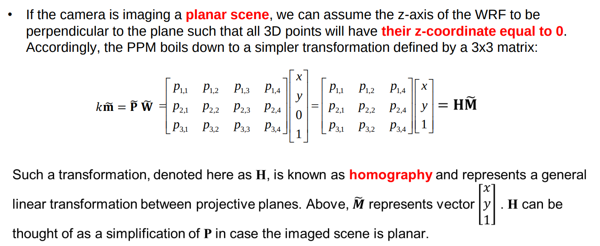

Abbiamo visto che nel nostro camera model la trasformazione da coordinate 3d a 2d avviene con una PPM

- questa può essere utilizzata come una singola 3x4 matrix
- oppure può essere fattorizzata in un prodotto tra 3 matrici

Ci sono però anche dei casi in cui la PPM può essere semplificata in una matrice 3x3, ovvero in una trasformazione chiamata Homography

Questi casi NON sono rari

Se la camera sta catturando un immagine di una scena planare (tutti i punti con stessa profondità)

- we can choose the origin of the WRF within the plane and the z axis of the WRF to be perpendicular to the plane
- **le coordinata z è sempre 0!**
- le coordinate nel WRF diventano bidimensionali! (z sempre 0)
- la terza colonna della PPM può essere eliminata dato che verrebbe sempre moltiplicata per 0!
- the resulting PPM is a 3x3 matrix called **homography**

Homographies are a **linear transformation (stiamo moltiplicando per una matrice 3x3) between projective planes**

- We are mapping all the points in the 3d scene plane, to the points in the image plane

Quindi, se stiamo catturando una scena planare:

- M~ diventa un vettore 3x1 dato che z sparisce
- la PPM diventa H, una matrice 3x3 versione semplificata di PPM quando la scena è planare

**NB**: siccome le omografie sono matrici quadrate 3x3, sono anche **invertibili**

- applicando l'omografia passiamo dalla scena planare all'immagine
- applicando l'inversa dell'omografia passiamo dall'immagine alla scena planare

**How many Parameters define an homography?**

- apparently 9 since it's a 3x3 matrix
- we have to remember that we are in projective space so the transformation are equivalent up to a scale factor
- that in turn means that we only need 8 parameters to define an homography and we can assume the 9th parameter to be 1

**NB**: an homography can be used to map the pixels of an image to the pixels of another image of the same scene but from a different viewpoint

- if i know the homography i can synthesize the same image from a different viewpoint
  - per esempio posso applicare/rimuovere perspective distortion
- mapping between planes

# Esempi di Homographies

Nelle omografie, il trucco sta sempre nel scegliere il WRF in maniera conveniente

CASO 1:

Any two images of a **planar scene** are related by a homography:

- These homographies link pixels in the first image with pixels in the second image e viceversa

CASO 2:

Any two images taken by a camera rotating about the optical center are related by a homography

- **la scena non deve essere per forza planare**
- camera rotates about the optical centre
- scegliamo il WRF coincidente con il CRF
  - non c'è la terza matrice G
- nel secondo viewpoint abbiamo ruotato la camera e quindi abbiamo una matrice di rotazione R (non abbiamo una traslazione)
  - **NB**: nella slide utilizziamo la notazione in cui non c'è la standard PPM (vedi slide 15)
- sostituisco ad M con le coordinate dell'altro e annullo con le inverse
  - se voglio passare da 2 a 1
    - tolgo la digitalizzazione (e persepctive projection) e annullo la rotazione
  - se voglio passare da 1 a 2
    - tolgo la digitalizzazioen e applico la rotazione
- di nuovo abbiamo una omografia

CASO 3:

Any two images taken by different cameras (i.e. different A) in a fixed pose (i.e. same CRF) are related by a homography

- di nuovo **scena non per forza planare**
- impostiamo WRF = CRF
- Adesso la seconda immagine è come se fosse stata fatta da un altra camera (con parametri diversi) nella stessa posizione
  - cambia solo la matrice dei parametri intrinseci A
  - impossibile fisicamente, ma possibile virtualmente. Questa possibilità è di interesse pratico
- di nuovo abbiamo una omografia

CASO 4:

Should we both rotate the camera about the optical center and change the intrinsic we still end up again with images related by a homography

- scena qualunque
- WRF = CRF
- adesso facciamo le due trasformazioni descritte nel caso 2 e 3

we'll see later why we care about homographies

### Esempi di omografie

Ricorda che due immagini della stessa scena planare sono collegate da un'omografia

Se riesco a stimare l'omografia tra queste due immagini tramite delle corrispondenze, allora posso usare un'omografia per applicare/rimuovere una deformazione prospettica

- se ho una query image che voglio spalmare sopra ad un oggetto in prospettiva su una scena
  - prende le coordinate dei bordi della query image, le associo alle coordinate dei bordi dell'oggetto nella target image, stimo l'omografia
  - applicando l'omografia alla query image applico la deformazione prospettica

- se ho un oggetto in prospettiva
  - posso stimare un omografia verso una scena parallela alla camera associando agli ancogli dell'oggetto degli angoli di un rettangolo
    - applicando l'omografia rimuovo la deformazione prospettica

- se voglio fare instance detection
  - stimo l'omografia tra template e target facendo detection e matching dei keypoints
    - uso RANSAC per stimare un omografia robusta anche in presenza di match sbagliati
  - con l'omografia stimata posso mappare qualsiasi punto del template nella target image
    - ad esempio, posso vedere dove gli angoli del template vengono rimappati per disegnare una detection window dell'istanza trovata

### Estimating homographies

Quanto descritto sopra, sembra indicare che possiamo calcolare esattamente le omografie...

In realtà le omografie **possono essere solo stimate** e non calcolate esattamente dato che non riusciamo a conoscere esattamente la rotazione e la traslazione della camera rispetto al WRF

stimare un omografia richiede ... (da completare)
