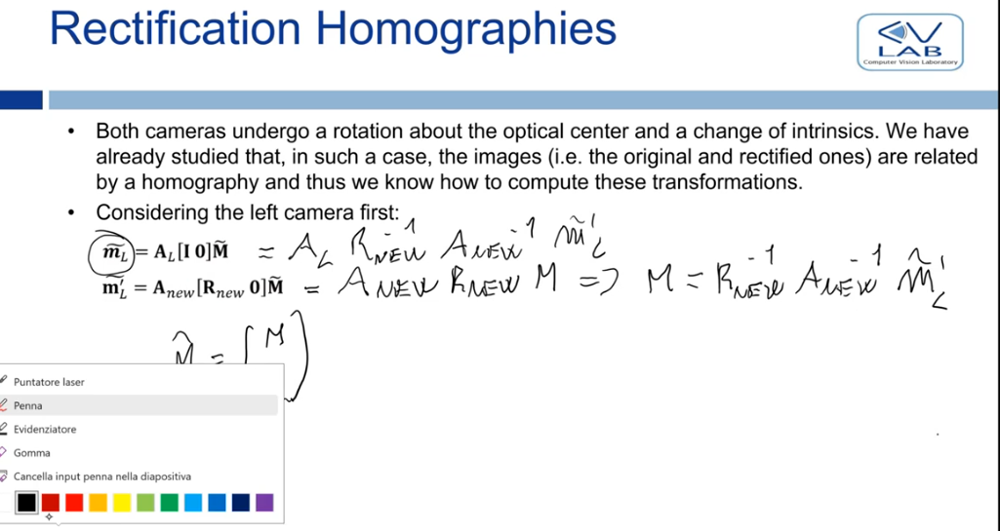

Dopo aver fatto stereo calibration abbiamo le PPM delle due camere. Tuttavia, non siamo ancora soddisfatti del setup del nostro stereo rig

In stereo vision, it's all about finding correspondences between the two images, and this is convenient only if the search space of a correspondence in the other image is a line.

This happens only if we have **standard stereo geometry**. This is achieved only when:

- between the two CRF there is no rotation.
  - Detta in un altro modo, gli assi dei due CRF devono essere paralleli
- there is only a translation between the two origings along the x axis
  - Mr = Ml + \[b 0 0\]
- the cameras have the same intrinsic parameters

Insomma, dopo la calibrazione siamo felici solo se:

- la rototranslation da l a r è pari a: R = I ; T = \[b 0 0\]
- Al = Ar

**Questo non succede mai!**

- gli intrinseci non sono mai uguali
  - nonostante le camere siano (in teoria) identiche
  - la calibrazione produce delle stime non identiche
- è impossibile ottenere allineamento perfetto meccanicamente

Ma allora come facciamo?

- we achieve this virtually the standard stereo geometry virtually
- we change a bit the two PPMs in such a way that the images captured by resulting virtual cameras are compliant to the standard stereo geometries
- **NB**: the images captured by the real cameras are not compliant. We transform these two images in two other images that are compliant. The transformation is called rectification
- **NB**: the virtual cameras don't exist, we pretend they do by changing the PPMs

L'idea è quindi questa:

- possiamo usare solo camere che non rispettano la geometria dello standard stereo setup
- catturiamo quindi le immagini con queste camere che non ci piacciono per trovare corrispondenze
- ci chiediamo:
  - "che immagine avrei ottenuto da questa camera se la configurazione fosse stata stereo standard? (se la camera fosse stata quindi quella virtuale)"
  - come posso trasformare la mia immagine reale (che non mi piace) in quella catturata dalla mia camera virtuale?
- questa è la rectification

# Rectification

Dobbiamo quindi modificare le due PPM per produrre le camere virtuali che rispettano la standard stereo geometry

- dobbiamo rendere uguali le matrici A
- dobbiamo ruotare entrambe le camere in modo tale da far coincidere l'asse x con la linea che attraversa i due optical centre, e avere gli altri assi paralleli
  - in questa maniera abbiamo solo una traslazione along the x-axis
  - questo è una rotoation about the optical centre

**NB**: Hold on, avevamo visto che la trasformazione che mi mappa un'immagine con un altra ottenuta ruotando la camera e modificando A è un **omografia!**

- l'immagine catturata dalla camera reale e quella che otterremmo dalla camera virtuale, sono in relazione tramite un'omografia
- per ottenere l'immagine rettificata devo applicare all'immagine di partenza un'omografia!
- **rettificare significa computare due omografie**

Questo è quello che succede nelle stereo camere reali

- le immagini reali vengono catturate
- del firmware le rettifica applicando l'omografia
- matching happens on the rectified images
- we never process the images as they come from both cameras. We always transform them with two homographies

**NB**: che ruolo gioca la lense distortion in questo processo?

- Rectification needs to happen after compensation of lens distortion (i.e. on undistorted images). An initial transformation to remove lens distortion is thus always applied before transforming again the images according to the rectification homographies.
- le immagini che stiamo rettificando sono già state undistorted applicando le equazioni che abbiamo visto con i parametri che abbiamo stimato durante la calibrazione
- quindi
  - catturiamo le immagini
  - eliminiamo la distorsione
  - applichiamo le omografie di rettificazione
  - processiamo le immagini rettificate

### How do we compute the two rectification homographies?

**we get the homographies by computing the transformation from the old PPMs to the new PPMs of the virtual cameras**

### The new PPMs

Per i **parametri intrinseci** posso scegliere una nuova matrice A arbitraria, basta che sia uguale per entrambe

non ha senso scegliere una Anew completamente a caso

- potrei finire in situazioni in cui le due camere non riescono a catturare neanche la stessa scena e quindi non riusciremmo a trovare nessuna corrispondenza

piuttosto scegliamo di modificare poco le immagini originali scegliendo Anew come media tra Al e Ar

Per i **parametri estrinseci** dobbiamo computare una nuova rotation matrix da utilizzare **per entrambe le camere**

- **NB**: queste rotation matrixes fanno riferimento al WRF/SRF ovvero alla vecchia camera sinistra
  - Rnew rappresenta la rotation from the old left camera to both the new left and right camera
- **Entrambe le nuove camere devono avere quindi la stessa rotation** rispetto allo SRF per avere tutti gli assi paralleli
  - ricorda che la rotation è un parametro estrinseco e quest'ultimi vengono definiti relativamente al WRF

Ricordiamo che le righe di una rotation matrix (r1, r2, r3) rappresentano gli unit vecotrs dei nuovi assi dopo la rotation

- le righe di Rnew rappresentaranno quindi i nuovi assi di entrambi i nuovi CRFs

Dobbiamo quindi scegliere 3 assi... come?

l'asse x lo conosciamo già, è la differenza tra i due vettori degli optical centre

**NB**: Cr e Cl sono vettori definiti rispetto al WRF (vecchia left camera)

- ma allora Cl è nullo, dato che è per definizione, l'origine del WRF
- B = Cr

Dobbiamo quindi trovare solamente Cr dato che mi definisce il mio nuovo asse x

A questo punto, noi abbiamo la rototranslation da l a r e vogliamo trovare il punto Cr relativamente al CRF sinistro (WRF)

- la rototranslation ci dice che per qualsiasi punto pl nella camera sinistra, questo ultimo verrà mappato nella destra in: Pr = R*Pl + T
- noi vogliamo trovare Cr relativamente alla left camera, però sabbiamo che applicando a quel punto (relativo alla left camera) la rototranslation che passa da left camera a right camera, esso verrà sicuramente mappato nell'origine della right camera
- ma allora abbiamo un'equazione per Cr, e quindi per B, e quindi per r1
  - ricorda che l'inversa di una rotation matrix è uguale alla trasposta

The direction of the y axis (r2) has a degree of freedom as long as its perpendicular to the new x axis

- a sensible choice is to choose the new y-axis to be perpendicular to both the new x-axis and the old z-axis of the left camera
- this is because it makes sense to make the new cameras point more or less towards the same scene as the old cameras
- by choosing the y-axis with the rule above, the new z-axis will be near the old one
- **the direction of the new y-axis will be given by the vector product of the old z-axis unit vectore with the new x-axis r1**
  - r2 = k ^ r1
  - k = (0,0,1)

**Lastly r3, the new z-axis, is given by the vector product of the new x and y axis**

A questo punto, abbiamo Anew e Rnew per entrambe le camere. Abbiamo quindi due camere virtuali che sono conformi alla standard stereo geometry

Le vecchie PPM erano:

- Al \[I 0\]
- Ar \[R T\]

Le nuove PPM sono:

- Anew \[Rnew 0\] per la new PPM_l
- Anew \[Rnew -Rnew*Cr\] per la new PPM_r
  - la traslazione si può dimostrare che è così ma non ci interessa troppo

### Computing the rectification homographies

Avendo le new PPM, possiamo calcolare le omografie

**NB**: le PPM vecchie e nuove sono definite relativamente allo stesso WRF (old left camera); gli M~ sono li stessi per entrambe le camere

I calcoli per trovare le omografie sono abbastanza facili (guarda dalle slide)

- ricorda che puoi togliere la ~ facendo il prodotto per le matrici con lo zero
- il trick per la omografia destra mi serve a togliere il vettore di traslazione (dai per buono che si possa fare, otterresti lo stesso risultato)

(nella seconda omografia ml' dovrebbe essere mr')

**OSS**:

- notare che le due omografie sono diverse. Ogni immagine ha la propria rectification homography
- notiamo anche che dopo aver calibrato la camera possiamo calcolare le omografie esattamente (non con una stima)
  - ci basta avere i parametri intriseci Al, Ar; e estrinseci R, T
  - tutta roba che otteniamo dalla calibrazione

**NB**: noi vogliamo andare da unrectified verso rectified;

- la formula che abbiamo ottenuto sembra però andare nel verso opposto.
- Possiamo sempre invertire tutto, ma vedremo che in realtà noi vogliamo proprio così la nostra trasformazione per poterla applicare senza problemi (vedi warping)

# From pixels to 3d coordinates

**Depth image**: una immagine in cui per ogni pixel (2d) abbiamo la sua depth (rispetto alla camera) invece dell'intensità dei suoi colori

Le depth images possono essere ricavate con uno stereo rig, ma anche con una **depth camera**: una camera che takes direct measurements of depth

- Invece di misurare l'intensità luminosa dei vari punti della scena, ne misura la distanza
- Time Of Flight Camera: misura quanto ci mette la luce a tornare indietro per stimare la distanza dell'oggetto

How do we turn a depth image into a **pointcloud**?

- una pointcloud è una struttura in cui per ogni pixel abbiamo le coordinate relative coordinate 3d x,y,z
- relativametne a quale sistema riferimento? Rispetto al CRF

Ritiriamo fuori la formula della PPM

- non ho parametri estrinseci dato che le coordinate 3d sono relative al CRF
- nella formula, stiamo eliminando l'uno in fondo al vettore delle coordinate del mio punto 3d tramite la PPM canonica (perspective projection fa proprio questo). Otteniamo il vettore (x, y, z), che è sempre il projective space, moltiplicato per la matrice degli intrinseci
- .. il resto dei passaggi è abbastanza semplice

Otteniamo una formula che mi trasforma punti 2d con una profondità z (depth image), in punti 3d (pointcloud)

We may wish to **find where a certain pixels does project into another image taken by the same camera but from a different position**

- typically a moving camera used to scan a static scene

Bisogna conoscere la rototranslation verso la nuova posizione

- sappiamo già che questa può essere stimata con stereo calibration mostrando la stessa calibration image
- nota la rototranslation, le formule sono facili
  - prima trasformo il pixel nella prima immagine in un punto 3d relativo al CRF della prima posizione con la formula appena discussa sopra
  - poi applico la rototranslation tra la due posizioni per ottenere le coordinate 3d del punto relativo alla seconda posizione
  - infine applico gli intrinseci per ritornare a pixel coordinates
    - di nuovo ho un vettore 3d senza l'uno in fondo e quindi mi basta applicare gli intrinseci (perspective projection già applicata)

**but what if the two cameras are different?**

Il procedimento è analogo a prima, tuttavia, stavolta applico gli intrinseci della seconda camera che sono diversi

Il caso più importante è quando:

- one is a depth camera
- the other is a rgb camera

**In questa maniera riusciamo ad ottenere una rgb-d image**

- un'immagine in cui ogni pixel ha sia depth information che color information

Una depth camera non ha color information, e viceversa una color camera non ha depth information

- combinandole, riusciamo ad unire entrambe le informazioni

Come prima, data la RGB-D image possiamo passare alla pointcloud, ma adesso oltre alle coordinate 3d abbiamo anche il colore del punto: **colored pointcloud**

Le rgb-d camera sono una combo tra una depth camera (e.g. time of flight camera) e una color camera che permette di ottenere una colored pointcloud
