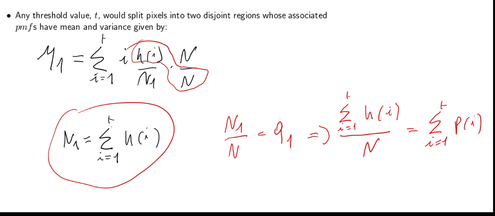
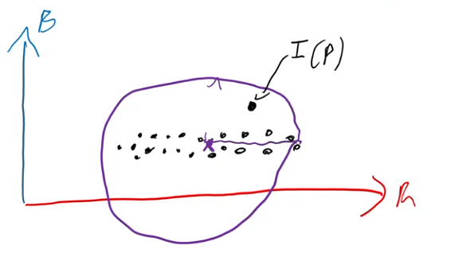

the techniques in this chapter cover problems related to the field of industrial vision (where the environment is highly controlled)

ripassiamo un po':

- the goal of CV is to get some kind of information related to a scene, out of an image of said scene
- **ci sono vari step per fare questo**
- il filtering non è obbligatorio dato che richiede del tempo (soprattutto per filtri costosi come NLM-filter)

foreground is:

- the objects that have to be analyzed
- clearly visible

segmentation assigns a label to every pixel di un determinato oggetto nell'immagine

ROI = region of interest

- which part of the image has to be analyzed

after segmentation what do we do?

- it depends on the task
- we might need to find position and orientation of the object because a robot will have to pick it up
- some other kind of measurements
- this is called blob analysis
  - blob = binay large objects = objects segmented from an image

**NB**: the advantage that CV gives to robotics is flexibility. Without CV a robot is blind so, for example, objects would always need to be layed out with the same orientation and position

**NB**: the key step is segmentation, blob analysis is just some simple math (every machine vision library like opencv, has functions that compute common desired features)

# How de we segment?

## Segmentation based on intensity (also called image binarization)

if we only a single object binarization already does the full segmentation

if we have multiple blobs we need another step to label them

### gray level histogram

this is one of the key tools to perform binarization

**OSS**: guradando slide 6 notiamo che, anche in condizioni super controllate, non abbiamo 2 colonne secche, ma piuttosto due picchi; questo a causa del **rumore**

- the dark colors will spread as will the light ones

in una binary image abbiamo tipicamente due picchi nell'istogramma che chiamiamo *modes*

given an histogram can we get back the source image?

- absolutely not

possiamo normalizzare l'istogramma per ottenere la frequenza (probabilità) di ciascun gray-level nell'immagine

- l'istogramma normalizzato mi da la funzione di massa di probabilità (distribuzione di probabilità discreta) della variabile casuale **discreta** che mi rappresenta il gray level di un randomly picked pixel

### binarization by intensity thresholding

dato un threshold possiamo effettuare binarization assegnando 0 all'oggetto e 255 al background

- **NB**: questi valori non vanno interpretati come intensità, ma piuttosto come label
  - 0 = oggetto
  - 255 = background

**dobbiamo decidere il threshold**

abbiamo un problema di stabilità

- lighting condition degrade

scegliere un threshold statico non è lungimirante

possiamo computare il threshold dinamicamente istogramma per istogramma

### Automatic  threshold selection - Otsu's algorythm

relias on a statical formulation of the problem of finding an optimal binarization

after binarization we want **both** classes to be as homogeneous as possible

- we want to minimize within-group-variance

since the search space is small (0-255) we just use a brute force approach

... c'è un po' di probabilità

```
expectation of a function of random variable == valore atteso

se la function è l'identità: valore atteso == media della variabile casuale
```

nota: per le misure intraclass dobbiamo aggiustare le probabilità (frequenze) mettendo a denominatore la numerosità del gruppo

q1 = percentuale di pixel della classe 1 = cumulazione delle probabilità fino a t (vedi screen)

per la varianza i passaggi sono simili



la within-group-variance è la somma pesata delle singole varianze dei gruppi

- è minimizzata quando entrambe le classi sono omogenee

Riassumendo:

- computiamo l'istogramma
- scegliamo un threshold e computiamo la within-group-variance
- scegliamo la threshold che minimizza la whithing-group-variance dopo averle provate tutte (?)

OSS: potrebbe sembrare che sia necessario fare molti calcoli, in realtà per ogni nuova threshold, le nuove medie e varianze possono essere calcolate incrementalmente e non da zero. **In pratica, nonostante l'apporccio a forza bruta, questo metodo è efficente**

**NB**: otsu can binarize an image only if its histogram is bimodal! If this is not the case the resulting binarization won't make sense (the problem was ill-posed in the first place)

**NB**: the assumption of binarization is that that the feature that we can use to discriminate foreground and background is intensity. If the intensities overlap we can't use segmentation based on intensity

### Adaptive thresholding

sometimes we can't help but have uneven illumination in the image, but we want to binarize the image anyways

- this is difficult because the notion of what is dark and what is bright changes based on the region (and its illumination) of the image

to do this we need to choose a threshold for each pixel (?)

- locally i can say this is bright and this is dark

## Color-based segmentation

usually, in industrial vision we don't use color

- it costs three times as much
- it has less spatial resolution because of interpolation

color is used only when it's a good idea to segment out the foreground from the background in the specific application

- es: different kinds of objects on a conveyer belt

**IDEA**: the general idea is: if we know the color of the object, or the color of the background, we can perform a segmentation by checking if the color of every pixel is different from the known color

**NB**: it is very common in color-based segmentation to use different color spaces from rgb. Here we use rgb for simplicity

Segmentation can be achieved by computing and thresholding the distance (e.g. Euclidean; ricorda che i colori possono essere pensati come punti in uno spazio tridimensionale) between each pixel’s colour and the reference background (foreground) colour mu

- we can write the distance as a dot product (or as a matmul with the transpose)

### Estimating the reference color

per fare la segmentazione è quindi necessario conoscere il colore di riferimento mu

tuttavia, come facciamo a conoscere esattamente il colore?

inoltre

- camere diverse vedono colori diversi
- condizioni di illuminazione diverse producono colori diversi

per questi motivi, **è necessario stimare il colore di riferimento** scattando molte immagini del background e, ad esempio, facendo la media dei pixel in queste immagini

scegliendo un threshold otteniamo quindi una sfera che ci dice cosa è background e cosa è foreground... **questo metodo è suboptimal**

- the sphere as a decision surface is perfectly symmetric
- however our background color in the training examples might not be symmetric
  - we might have more variance along, for example, the red axis, than the blue axis
- this leads to poor segmentation
  - il raggio della sfera (threshold) deve essere abbastanza grande per tenere conto della varianza dell'asse peggiore.
  - Ma sarà troppo largo per gli altri assi



In conclusione, utilizzare la distanza euclidea non permette di segmentare correttamente foreground da background quando i training samples non sono distribuiti isotropically (?)

Vorremmo una decision surface ellittica, più larga dove c'è maggiore varianza, più stretta dove c'è meno varianza

### Mahalonibis distance

innanzitutto, abbiamo bisogno di stimare non solo la media del colore del background ma anche la **matrice di covarianza**

- quest'ultima ci dice come variano i canali rgb within the training samples
- nel caso scalare abbiamo media e varianza; se abbiamo un vettore casuale e non una singola variabile casuale, la varianza diventa la matrice di covarianza
  - Ogni varianza (diagonale) misura quanto una singola variabile "oscilla" rispetto al suo valore medio.
  - Ogni covarianza misura quanto due variabili si muovono insieme
- la matrice è simmetrica

la Mahalonibis distance è molto simile alla distanza euclidea; In mezzo al dot product però ci mettiamo l'inversa della matrice di covarianza

L'idea è che:

- se un canale ha un'alta varianza, allora differenze in quel canale dovrebbero essere pesate di meno nella distanza totale
  - l'alta varianza non ci fa stupire se troviamo un colore lontano dalla media
- se un canale invece ha una bassa varianza, allora differences in quel canale dovrebbero essere pesate di più
  - a training time questo canale non ha avuto una grande varianza, trovare una differenza ci stupisce quindi ed è un campanello che ci avvisa che quel pixel probabilmente non è background

... vari passaggi ...

partiamo con un caso semplificato in cui la matrice di covarianza è diagonale (non c'è perdita di generalità)

nota come con la mahalonibis distance abbiamo i fattori di scaling a denominatore ma apparte questo è uguale alla distanza euclidea

se la matrice di covarianza non è diagonale, la possiamo sempre diagonalizzare dato che è simmetrica e (?). Abbiamo degli altri termini che possiamo però eliminare tramite una rotazione che non causa problemi dati che le rotazioni non modificano le distanze

slide dovrebbero essere chiare a questo punto
