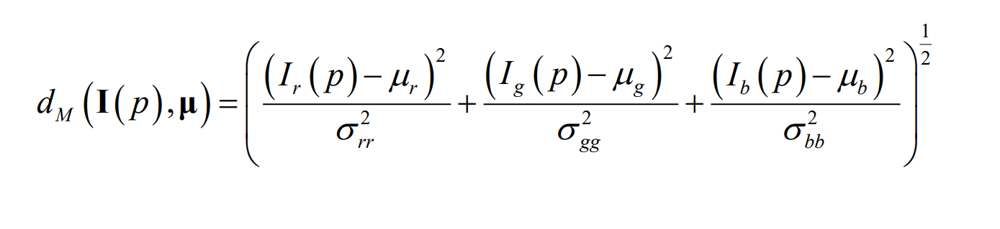

the techniques in this chapter cover problems related to the field of industrial vision (where the environment is highly controlled)

ripassiamo un po':

- the goal of CV is to get some kind of information related to a scene, out of an image of said scene. Consideriamo il caso particolare di industrial vision
- **ci sono vari step per fare questo**
  - filtering
  - segmentation
  - blob analysis
- il filtering non è obbligatorio dato che richiede del tempo (soprattutto per filtri costosi come NLM-filter)

Foreground is:

- the objects that have to be analyzed
- clearly visible

**Segmentation assigns a label to every pixel nell'immagine** in modo da ricondurre quest'ultimi a determinati oggetti

- in binarization si distingue solo tra foreground pixels a background pixels

ROI = region of interest

- which part of the image has to be analyzed

After segmentation what do we do?

- it depends on the task
- we might need to find **position and orientation of the object because a robot will have to pick it up**
- some other kind of **measurements**

This is called blob analysis

- blob = binay large objects = objects segmented from an image

**NB**: the advantage that CV gives to robotics is flexibility.

- Without CV a robot is blind so, for example, **objects would always need to be layed out with the same orientation and position**

**NB**: the key step is segmentation, blob analysis is just some simple math (every machine vision library like opencv, has functions that compute common desired features)

# How de we segment?

## Segmentation based on intensity (also called image binarization)

In a variety of industrial applications the objects of interest (foreground) are **neatly darker/brighter than the irrelevant areas of the scene (background)**

- backlighting
- these are so called inherently binary images
- la binarization allora consiste solo nel distinguere solo pixel chiari/scuri del foreground da quelli del background

if we only a single object, binarization already does the full segmentation

if we have multiple blobs we need another step to label them

- connected components labelling

### Gray level histogram

this is one of the key tools to perform binarization

**OSS**: guradando slide 6 notiamo che, anche in condizioni super controllate, non abbiamo 2 colonne secche, ma piuttosto due picchi; questo a causa del **rumore**

- the dark colors will spread as will the light ones

In una binary image abbiamo tipicamente due picchi nell'istogramma che chiamiamo *modes*

Given an histogram can we get back the source image?

- absolutely not
- the histograme gives us counts, but it doesn't tell us where the gray levels where positioned in the image

Possiamo normalizzare l'istogramma per ottenere la frequenza (probabilità) di ciascun gray-level nell'immagine

- l'istogramma normalizzato mi da la funzione di massa di probabilità (distribuzione di probabilità discreta) della variabile casuale **discreta** che mi rappresenta il gray level di un randomly picked pixel

### Binarization by intensity thresholding

in machine vision images are often inherently binary because the conditions are controlled

thus the gray-level histogram avrà due **picchi bene separati**

Ma allora posso dato un threshold possiamo effettuare binarization assegnando 0 all'oggetto e 255 al background

- pixel che sono sotto soglia sono foreground
- pixel che sono sopra la soglia sono background
- **NB**: questi valori non vanno interpretati come intensità, ma piuttosto come label
  - 0 = oggetto
  - 255 = background

**dobbiamo decidere il threshold**

abbiamo un problema di stabilità

- lighting condition do degrade

scegliere un threshold statico non è lungimirante

Un'idea migliore è computare il threshold dinamicamente per ogni immagine

- istogramma per istogramma

### Automatic threshold selection - Otsu's algorythm

relias on a statical formulation of the problem of finding an optimal binarization

**after binarization we want both classes to be as homogeneous as possible**

- wantig a class to be homogeneous means wanting to minimize within-group-variance

since the search space is small (0-255) we just use a brute force approach

nota: per le misure intraclass dobbiamo aggiustare le probabilità (frequenze) mettendo a denominatore la numerosità del gruppo

h(i) / N1 = probabilità di i nel gruppo 1

q1 = **percentuale di pixel della classe 1** = cumulazione delle probabilità fino a t (vedi screen)

per la varianza i passaggi sono simili

**La within-group-variance è la somma pesata dalle probabilità cumulate delle varianze dei gruppi**

- è minimizzata quando entrambe le classi sono omogenee (varianze minime)

**Riassumendo**:

- computiamo l'istogramma
- scegliamo un threshold e computiamo la within-group-variance che necessità di:
  - varianze dei singoli gruppi
  - probabilità cumulate dei singoli gruppi
- scegliamo la threshold che minimizza la whithing-group-variance dopo averle provate tutte
  - (approccio a forza bruta dato che abbiamo max 255 iterazioni)

OSS: potrebbe sembrare che sia necessario fare molti calcoli, in realtà per ogni nuova threshold, le nuove medie e varianze possono essere calcolate incrementalmente e non da zero. **In pratica, nonostante l'apporccio a forza bruta, questo metodo è efficente**

**NB**: otsu can binarize an image only if its histogram is bimodal!

- If this is not the case the resulting binarization won't make sense (the problem was ill-posed in the first place)

**NB**: the assumption of binarization is that that the feature that we can use to discriminate foreground and background is intensity.

- If the intensities overlap we can't use segmentation based on intensity

### Adaptive thresholding

Sometimes we can't help but have **uneven illumination in the image**, but we want to binarize the image anyways

- this is difficult because the notion of what is dark and what is bright changes based on the region (and its illumination) of the image
- maybe a pixel should be classified as bright but in the image is similar to a dark one due to a shadow

To do this we need to **choose a threshold for each pixel** based on the neighbourhood

- i can choose locally if this pixel is dark or bright by looking at the neighbourhood

## Color-based segmentation

Instead of using intensity to discriminate foreground and background, we can also use color

- in several applications, the sought-for objects exhibit a known colour quite different from that of background structures (e.g. “blue screen”). Hence, it is reasonable to try segmenting-out foreground from background based on colour information

Usually, in industrial vision we don't use color:

- it costs three times as much
- it has less spatial resolution because of bayer filters and interpolation

Color is used only when it's a good idea to segment out the foreground from the background in the specific application

- techniques like backlighting might not be feasible
- es: objects on a conveyer belt

**IDEA**: if we know the color of the object, or the color of the background, we can perform a segmentation by checking if the color of every pixel is different from the known color

**Segmentation can be achieved by computing and thresholding the distance (e.g. Euclidean) between each pixel’s colour and the reference background colour mu**

- ricorda che i colori possono essere pensati come punti in uno spazio tridimensionale (rgb)

**OSS**: it is very common in color-based segmentation to use different color spaces from rgb. Here we use rgb for simplicity

### Estimating the reference color

Per fare la segmentazione è quindi necessario conoscere il colore di riferimento mu dato che mi serve a calcolare le distanze

Tuttavia, come facciamo a conoscere esattamente il colore?

Inoltre:

- camere diverse vedono colori diversi
- condizioni di illuminazione diverse producono colori diversi

Per questi motivi, **è necessario stimare il colore di riferimento** scattando molte immagini del background e, ad esempio, facendo la media dei background pixel in queste immagini

Scegliendo un threshold otteniamo quindi una sfera che ci dice cosa è background e cosa è foreground... **questo metodo è suboptimal**

- the sphere as a decision surface is perfectly symmetric
- however our distribution of background color in the training examples might not be symmetric
  - we might have more variance along, for example, the red axis, than the blue axis
- this leads to poor segmentation
  - il raggio della sfera (threshold) deve essere **abbastanza grande per tenere conto della varianza dell'asse peggiore.**
  - ma sarà **troppo largo per gli altri assi**

In conclusione, **utilizzare la distanza euclidea non permette di segmentare correttamente foreground da background quando i training samples non sono distribuiti isotropically (?)**

Vorremmo una decision surface ellittica, più larga dove c'è maggiore varianza, più stretta dove c'è meno varianza

### Mahalonibis distance

Innanzitutto, abbiamo bisogno di stimare non solo la media del colore del background ma anche la **matrice di covarianza**

- quest'ultima ci dice come variano i canali rgb within the training samples
  - nel caso scalare abbiamo media e varianza
  - se abbiamo un vettore casuale e non una singola variabile casuale, la varianza diventa la matrice di covarianza
    - Ogni varianza (diagonale) misura quanto una singola variabile "oscilla" rispetto al suo valore medio.
    - Ogni covarianza misura quanto due variabili si muovono insieme
- la matrice è simmetrica

La Mahalonibis distance è molto simile alla distanza euclidea; In mezzo al dot product però ci mettiamo l'inversa della matrice di covarianza

L'idea è che:

- se un canale ha un'alta varianza, allora differenze in quel canale dovrebbero essere pesate di meno nella distanza totale
  - l'alta varianza non ci fa stupire se troviamo un colore lontano dalla media
- se un canale invece ha una bassa varianza, allora differenze in quel canale dovrebbero essere pesate di più
  - a training time questo canale non ha avuto una grande varianza, trovare una differenza ci stupisce quindi ed è un campanello che ci avvisa che quel pixel probabilmente non è background

... vari passaggi ...

partiamo con un caso semplificato in cui la matrice di covarianza è diagonale (non c'è perdita di generalità)

**La distanza di mahalanobis è uguale alla distanza euclidea, l'unica differenza è che scala ogni dimensione per la sua varianza**

- nota come una dimensione con varianza grande ha un denominatore grande che attenua il contributo alla distanza di una grande differenza in quella dimensione
- e viceversa

La decision surface è diventata un ellissoide centrato in mu, con gli assi lunghi proporzionalmente alla varianza di quella dimension

Se la matrice di covarianza non è diagonale, la possiamo sempre diagonalizzare dato che è simmetrica e (?). Abbiamo degli altri termini che possiamo però eliminare tramite una rotazione che non causa problemi dati che le rotazioni non modificano le distanze

---

# Riassunto

siamo nel contesto di industrial vision e come sempre vogliamo recuperare informazioni sulla scena da delle immagini

ci sono vari step per fare questo

- filtering
  - non obbligatorio se non serve incrementare la qualità dell'immagine
- segmentation
  - assegna una label corrispondente ad un oggetto ad ogni pixel
  - in binarization distinguiamo solo tra foreground (oggetti utili) e background
- blob analysis
  - data l'immagine segmentata computiamo informazioni sugli oggetti presenti al suo interno (orientamento, lunghezza, ecc...)

**NB**: the advantage that CV gives to robotics is flexibility.

- Without CV a robot is blind so, for example, **objects would always need to be layed out with the same orientation and position**

**NB**: the key step is segmentation, blob analysis is just some simple math (every machine vision library like opencv, has functions that compute common desired features)

Per la segmentazione abbiamo due approcci:

1. Segmentation based on intensity
    - le immagini catturate sono inherently binary (backlighting)
    - possiamo quindi fare una binarization considerando il gray-level histogram e decidendo un threshold
    - il threshold è bene deciderlo dinamicamente dato che le condizioni di illuminazione possono cambiare da una foto all'altra
    - otsu algorythm consente di scegliere il threshold che minimizza la varianza all'interno dei due gruppi
        - vogliamo che i punti classificati come foreground/background siano il più possibile simili
    - **La within-group-variance è la somma pesata dalle probabilità cumulate delle varianze dei gruppi**
        - è minimizzata quando entrambe le classi sono omogenee (varianze minime)
    - il procedimento è quindi il seguente:
        - computiamo l'istogramma
        - scegliamo un threshold e computiamo la within-group-variance che necessità di:
            - varianze dei singoli gruppi
            - probabilità cumulate dei singoli gruppi
        - scegliamo la threshold che minimizza la whithing-group-variance dopo averle provate tutte
            - (approccio a forza bruta fattibile dato che abbiamo max 255 iterazioni)

2. Segmentation based on color
    - **Segmentation can be achieved by computing and thresholding the distance (e.g. Euclidean) between each pixel’s colour and the reference background colour mu**
    - abbiamo bisogno di capire qual'è il background color, ma questo potrebbe essere diverso a causa di camere diverse/illuminazione diversa
    - il background color viene stimato quindi come media di tanti sample ottenuti da varie immagini
    - tutti questi sample vanno a formare una pointcloud con una certa varianza sugli assi RGB
    - usare la distanza euclidea non funziona bene dato che significa usare una sfera come decision surface ma questo significa anche dover scegliere un threshold in base alla dimensione con più varianza, che è troppo larga per la dimensione con meno varianza
    - la distanza di mahalanobis divide ogni differenza di una dimensione per la varianza di quella dimensione
        - in questa maniera le differenze nelle dimensioni con tanta varianza pesano di meno nella distanza finale e viceversa
        - la decision surface diventa un ellissoide con assi proporzionali alle varianze delle dimensioni
