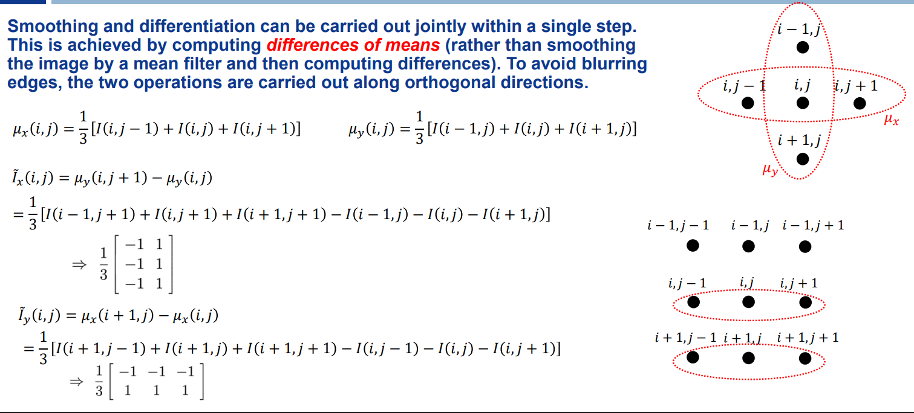
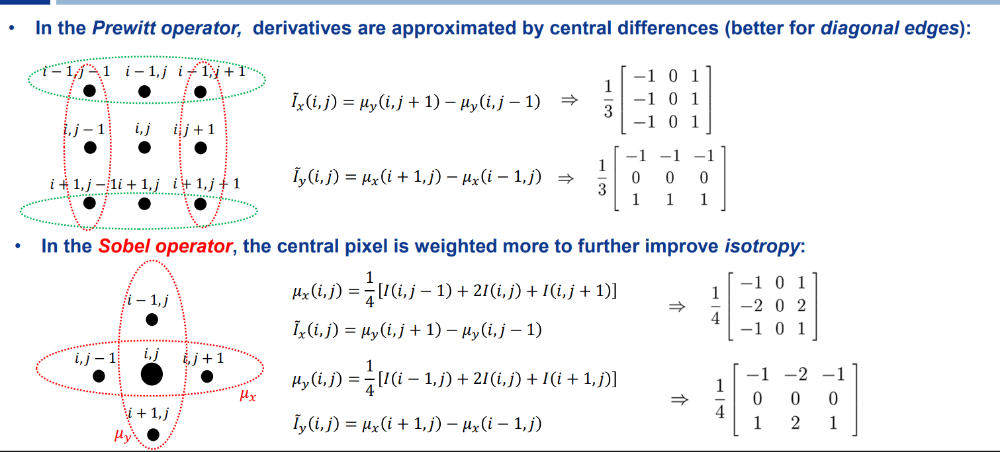
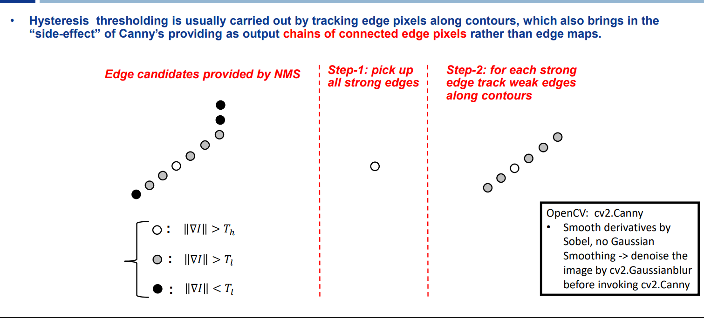
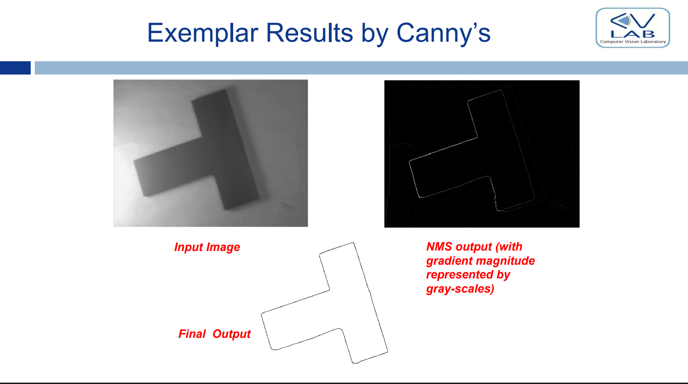

**Segmentation can be applied when object of interest and background are clearly diverse!**

But in many applications this is not true! What do we do then?

- rely on local features directly extracted from the input gray-scale/colour image!
- local features are special **points in the image that convey some information**
  - i'm guessing they're called local because the features are computed looking at the neighbourhood

# Edges

The simplest local feature are edges

Edges don't have a rigorous definition

- **Intuitive definition: edges are pixels that are localized between regions of different intensities**
- they separate differently colored uniform regions of the image

A lot of CV tasks can be solved by relying on edges

- es: misurazioni

An edge map is a binary image

## A model of an edge

When we detect edges we typically want one pixel for our edge (no thick edges)

- for this reason we put the edge at the (absolute value) of the peak of the derivative
  - absolute value dato che non importa se stiamo andando da scuro a chiaro o viceversa

**Finding edges in an image is equivalent to finding extrema of the derivative of the image**

- **an edge is a STRONG change**
- for a change to be considered an edge its derivative must surpassa a threshold
- for this reason we threshold what peaks are high enough to be considered edges

## detecting edges in images (2d signals)

In un contesto 2d, vogliamo considerare tutti i pixel che hanno un change significativo **in qualsiasi direzione**

Usiamo il **gradiente** per considerare la direzione di maximum change per ogni pixel

- the magnitude of the gradient is the absolute derivative along the direction of maximum image change
- (btw: knowing the gradient is equivalent to knowing the derivative along any direction (basta fare il dot product tra gradiente e unit vector della direzione))

**Finding edges in images is then equivalent to Detecting (strong) maxima of gradient magnitude**

- computando il gradiente per ogni pixel, possiamo vedere se considerarlo come edge o meno considerando the magnitude of change nella sua direzione di massima variazione
- this is the basic edge detector

### How do we compute the discrete gradient of an image?

**we approximate the partial derivates with differences**

- (solo il delta, stiamo considerando una distanza in pixel-size unitaria)

this is also equivalent to computing a correlation with a specific kernel. **This means that we can compute the derivative of an image by using a filter!**

- finding the gradient means computing two correlations (one for each partial derivative)
- (nelle slide le frecce specificano le anchor del filtro)

## Dealing with noise

if we try to find edges by computing derivatives without thinking about noise first, there isn't any chance that our edge detector is gonna work

- provare per credere
- the edge map will look like noise itself since the edge pixels will be spread randomly throughout the image
  - the spurious variations in pixel intensities caused by noise will be detected as edge pixels

**we MUST get rid of noise before computing the derivatives**

- we can filter out noise before computing the derivatives

we can do this (filtering noise and computing the derivatives) in one pass with a single kernel -> this operators are called **smooth derivatives**

**NB**: we have to be careful with the smoothing as we don't want to blur the edges away

### Smooth derivatives

the key idea for a joint smoothing and differentiation, is to compute a **difference** (per fare la derivata) **of means** (per rimuovere il rumore)

however not naive means but **orthogonal to the direction of differentiation**

- this way we're not smoothing across the edge

Prewitt an Sobel filters use this same idea but they compute the derivatives with central differences (better for diagonal edges)

- sobel weighs more the central pixel per migliorare l'isotropy (rende meno rilevante la direzione dell'edge)

## non-maxima suppression

(non ci siamo soffermati sui dettagli)

After computing the gradient we need to find the peaks of this function, the local maxima

- this step is called NMS because it suppresses points that are not local maxima

Dopo il calcolo del gradiente dell'immagine i "bordi" che si ottengono risultano "spessi"

Il compito della Non-Maxima Suppression (NMS) è sottigliare i bordi, mantenendo solo i pixel che sono veri massimi locali lungo la direzione del gradiente.

**NMS happens along the gradient direction**

- altrimenti elimineremmo pixel appartenenti ad un vertical/horizontal edge adiacenti ad un edge pixel
- è una funzione 1d; non guarda il 2d neighbourhood

**NB**: NMS mi assottiglia semplicemente i bordi, NON applica thresholding. Dopo NMS potrei comunque avere dei weak edges (sottili) che vanno eliminati con thersholding

## Thresholding

After NMS we threshold the survivors because we want strong edges

- weak edges are unwanted due to them either being noise or less important details

---

# Canny's edge detector

OSS: Sobel filtering is just a way to compute smooth derivatives (possiamo usarlo per computare il gradiente di un'immagine), it's **NOT a full edge-detector**

by far the most used edge detector is Canny

three properties we want:

1. good detection
    - basically we want to be robust to noise
    - we want to find true edges and not edges that appear due to noise
2. good localization
    - good precision on the edge position
3. One response to one edge
    - thin edges

It can be shown (through some heavy math) that the optimal function that Canny find is the first derivative of a Gaussian... but this is in 1d

- the gaussian's purpose is handling noise
- **the most common 2d canny implementation is basically a gaussian filter that removes noise and then computing the gradient of the image**
- one response to an edge is obtained through NMS
- and finally we remove weak edges with thresholding

## smart thresholding

One more ingredient to canny's filter is a smart threshold

After NMS we threshold to eliminate weak edges. However, edge streaking may occur when gradient magnitude varies along object contours.

- `edge streaking is when the contour of an object becomes dashed`
- edge streaking is more prone to happen when the lighting isn't uniform, in altre parole abbiamo regioni ad alto contrasto (edge forti) e regioni a basso contrasto (edge deboli)

What canny says is that **choosing only one threshold leads to edge streaking**... So let's choose 2 thresholds

A pixel selected by NMS is taken as an edge:

- if either the gradient magnitude is higher than Th
- OR it is higher than Tl AND the pixel is a neighbour (according to 8-way connectivity) of an already detected edge (> Tl also count)

- nota come i weak edges vengano comunque considerati nel contour final in quanto connessi a quelli strong

But now we have to tune 2 parameters...

- the rule of thumb is taking the high threshold to be twice as much as the low one

## How is canny implemented in ocv?

it's not implemented well

manca un gaussian filter iniziale per rimuovere il rumore

- ricorda che sobel serve solo a computare le derivate
