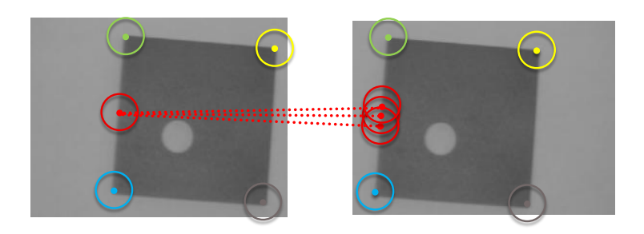
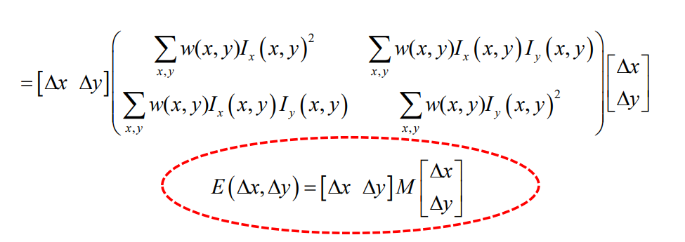

Finding correspondences between two or more images is a key problem in CV

- there are many CV tasks in which finding correspondences is the main problem
- stereo correspondence problem
- instance detection di una template image in una scena
  - date sufficienti corrispondenze possiamo costruire l'omografia che mappa gli angoli del template da template a scena
- image mosaicing
  - ho bisogno di trovare almeno 4 corrispondenze tra due immagini in modo tra computare un omografia che mi fa passare dall'una all'altra
  - ottenuta l'omografia posso costruire un'immagine più grande contenente
    - la prima immagine per intero, i pixel della seconda immagine mappati grazie all'omografia

Establishing correspondences may be difficult as **homologous points may look different in the different images**

- e.g. due to viewpoint variations and/or light changes

**DEFINIZIONE IMPORTANTE**: Correspondences are pixels in multiple images that are the projection of the same 3d point

```
Interessante:

per fare panoramiche utilizziamo omografie... però non sembra la trasformazione giusta!

le omografie mappano immagini quando

- la scena è planare
- la camera ruota attorno al suo optical centre

qua queste condizioni non sono verificate

stiamo approssimando:

- scene con uno sfondo lontano possono essere approssimante come planari
- ruotare la camera senza traslare troppo è circa come ruotare rispetto all'optical centre

```

# Come troviamo corrispondenze

Abbiamo 3 step:

1. **Bisogna trovare (detection) salient points**
    - punti particolarmente informativi (non regioni uniformi)
        - fingerprint of an image
    - we disregard all other non-salient points
    - **cerchiamo le corrispondenze tra i salient points delle immagini**
    - come si trovano salient ponts? Adesso vediamo

2. **Compute a local “description” to recognize salient points across images**
    - ricorda che lo stesso salient point può essere diverso in immagini diverse
        - this is because the two images might have been taken in different lighting, or whatever else conditions
        - comparing neighbourhoods wrt to color intensities wouldn't be a good idea since the colors of the same neighbourhoods would be different if the lighting conditions were different
    - we compare neighbourhoods through a **Descriptor (vectors of real numbers)** that allows us to match the same salient point even if it looks different in different images

3. **Matching descriptors between images**
    - we find the correspondences by matching descriptors of salient points in different images

This is the local invariant feature paradigm:

- we want to esablish correspondences between images despite images being quite different
- to do so we try to compute pixels that exhibit features that are invariant across different images
- in particular we want to be invariant to scale
  - ricorda che scale è la perceived dimension di un oggetto nell'immagine, non la vera dimensione
  - la scale dipende dalla distanza, dalla focal length e dalla true dimension

Desirable properties of Detectors

- Repeatability: it should **find the same keypoints in different images** of the scene despite the tranformations undergone by the images.
  - se non riusciamo a produrre gli stessi salient point, sicuramente non riusciamo a trovare le corrispondenze
- Interestingness/Saliency: it should find keypoints surrounded by an informative neighbourhood, which would be transformed in a very distinct descriptor that can easily be told apart from the descriptors of the other salient points during the matching process

Desirable properties of Descriptor

- Distinctiveness vs. Robustness Trade-off: the description algorithm should capture the salient information around a keypoint, so to capture the distinctive pattern and **disregard changes due to nuisances (e,g. light changes) and noise**
  - the same salient point, although different in different images, should compute more or less the same descriptor. This way we can do the matching

# Come troviamo/scegliamo i keypoints?

Una local feature che conosciamo già sono gli edges

**A good salient point is one where its neighbourhood is a good description that allows us to find the coorrespondence**

an edge is NOT a good keypoint

- along the gradient direction there is a strong change
- **along the orthogonal direction there is little change**
  - un edge pixel di un'immagine potrebbe combaciare con molti edge pixel dell'altra immagine (tutti quelli appartenenti allo stesso edge)



Per lo stesso motivo i punti appartenenti a uniform regions non sono good keypoints (anche peggio rispetto a edges)

Thus, **a good salient point would be a point where there is a strong change in both the direction along the gradient and the direction perpendicular to the gradient**

- es: corners

# Corner detectors

## Moravec corner detector

Per capire se un punto è un corner confrontiamo, il neighbourhood del punto con il neighbourhood dei suoi 8 punti adiacenti ottenendo un'errore/distanza tra neighbourhoods


Why is this a good cornerness function?

- if p is in a uniform area the distances are all very small
- if p is an edge, moving along the edge produces small distances, moving across the edge produces big distances, but we take the minimum
- se in qualunque direzione ci spostiamo la distanza tra neighbourhood è comunque significativa, allora siamo in un corner
  - the only way this function can be high is when p is a corner

## Harris corner detector

Improves moravec

- continuous formulation of moravec
- better because detects corners more reliably since it doesn't check only 8 directions (rotation invariance of the corner)

(used by opencv for finding calibration points)

Instead of comparing only to 8 neighbourhoods, we compare to the infinite neighbourhoods along all directions

**L'errore di harris è lo square error tra l'intorno del punto considerato, e l'intorno shiftato infinitesamente in una direzione**

- ogni punto di cui vogliamo calcolare la cornerness ha la sua weight function che considera gli intorni giusti
  - la weight function sets to zero the points that are not the local neighbourhoods
- **like Moravec but the shift is infinitesimal and the shift can be along any direction**
- siccome lo shift è infinitesimale, possiamo esprimere con un'approssimazione di taylor **l'errore come la mia derivata in una direzione (che ha quel valore solo in quel punto) per quanto mi sono spostato in quella direzione**
  - dot product tra gradiente del punto e direzione dello shift => derivata rispesso alla direzione dello shift


Con un po' di passaggi raggiungiamo una **forma matriciale dell'errore in cui solo la matrice M dipende dall'immagine**

- M riassume la struttura dell'immagine attorno al punto di cui si vuole considerare la cornerness
  - M viene chiamata structure matrix perchè **cattura come l'intorno del pixel varia**
  - contiene infatti somme di derivate parziali nell'intorno
- l'errore rispetto ad ogni shift viene parametrizzato dalla direzione dello shift e dipende dalla M del punto di cui si sta calcolando la cornerness (da come l'intorno varia)



Ipotizziamo che M è diagonale (non c'è perdita di generalità (real and symmetric matrixes can always be diagonalized))

- i lambda sono eigenvalues
  - lambda1 is the larger one
  - lambda2 is the smaller one
- il larger eigenvector (eigenvector associato al larger eigenvalue) rappresenta la direzione di maximal change
  - l'altro eigenvector è una direzione perpendicolare che può avere del change o meno (dipende se siamo in un edge/corner o qualche altra regione)

**importante per l'esame!**

- se entrambi i lambda sono piccoli
  - l'errore è piccolo **per ogni shift!**
  - siamo in una regione uniforme! gli intorni sono smili
- se lambda1 >> lambda2 (ricorda che lambda1 è sempre maggiore)
  - il contributo all'errore è grande per lo shift verso deltax
  - il contributo all'errore è piccolo per lo shift nella direzione perpendicolare
- se sono entrambi grandi
  - il contributo all'errore è significativo in entrambe le direzioni
  - siamo in un corner

Ricorda che il larger eigenvector (eigenvector associato al larger eigenvalue) rappresenta la direzione di maximal change

- se anche la direzione di maximal change varia poco, siamo in un area uniforme
- se variamo tanto nella direzione di maximal change, ma non nella direzione di minimal change -> siamo su un edge
- altrimenti siamo in un corner

### Implementing harris

Una implementazione naive potrebbe essere:

- calcolare le derivate
- costruire M con quest'ultime
- calcolare gli autovalori lambda da M
- analizzare gli autovalori per vedere se siamo in un corner o meno

Tuttavia calcolare gli autovalori di una matrice è computazionalmente costoso (e noi dovremmo farlo per ogni pixel dell'immagine)

Harris offre una soluzione più efficente che richiede di calcolare solo determinante e traccia di M

- cornerness function C (descriptor)
  - C > 0 su un corner
  - C ~= 0 in un area uniforme
  - C < 0 su un edge
- (Esiste anche la cornerness function di shi-tomasi che è più assimilabile all'idea naive che abbiamo visto sopra e consiste solamente nel prendere il min dei lambda)

The Harris corner detection algorithm can thus be summarized as follows:

1. Compute C at each pixel
    - richiede costruire M e quindi richiede calcolare le derivate parziali di ogni punto
    - si noti anche che the w(x,y) used Harris inside M is Gaussian rather than Box-shaped, so to assign more weight to closer pixels and less weight to those farther away
        - non ho ben capito perchè
2. Select all pixels where C is higher than a chosen positive threshold (T).
    - vogliamo corner forti
3. Within the previous set, detect as corners only those pixels that are local maxima of C (NMS).
    - vogliamo corner e non punti vicini ai corner

# Riassumendo

Finding correspondences between two or more images is a key problem in CV

Correspondences are pixels in multiple images that are the projection of the same 3d point

Establishing correspondences may be difficult as **homologous points may look different in the different images**

The process for finding correspondences includes three steps:

1. **Bisogna detectare salient points**
    - in maniera repetable: in modo che gli stessi salient points spuntino anche nelle altre immagini se presenti
    - detectare salient points informativi, il cui intorno può produrre un descriptor distinto per il matching
2. **Compute a local “description” to recognize salient points across images**
3. **Matching descriptors between images**

**A good salient point is one where its neighbourhood is a good description that allows us to find the coorrespondence**

an edge is NOT a good keypoint

- along the gradient direction there is a strong change
- **along the orthogonal direction there is little change**
  - along an edge multiple pixels could be a match

Corners invece sono dei buon keypoint

L'idea di base per trovare i corner è quella di moravec

- consideriamo la differenza che c'è tra l'intorno di un punto e l'intorno dei suoi 8 punti adiacenti
- se la differenza è sempre alta, vuol dire che un significant change in all directions -> corner

Harris corner detector improves Moravec with a continuous formulation that is more robust (detects corners better)

- it uses infinitesimal shifts in all directions
- harris error is the difference between the neighbourhoods
- since the shift is infinitesimal, the error of a single pixel can be represented with the dot product between the gradient of that position with the shfit
  - quanto cambio spostandomi * quanto mi sono spostato
- Da questa osservazione si raggiunge una formulazione dell'harris error in cui è presente la structure matrix M
  - nella formula solo M dipende dall'immagine, il resto sono shift
  - riassume la struttura dell’immagine attorno al punto di cui si vuole considerare la cornerness
    - contiene le sue derivate parziali
- studiando gli autovalori di M si capisce se siamo in un corner, edge o in una zona uniforme
  - entrambi piccoli = zona uniforme
  - se solo il primo è grande = edge
  - se entrambi grandi = corner
- il larger eigenvector rappresenta la direzione di maximal change, l'altro una direzione perpendicolare
  - se anche la direzione di maximal change varia poco, siamo in un area uniforme
  - se variamo tanto nella direzione di maximal change, ma non nella direzione di minimal change -> siamo su un edge
  - altrimenti siamo in un corner

The Harris corner detection algorithm can thus be summarized as follows:

- Compute C=corner_function() at each pixel
  - richiede costruire M e quindi richiede calcolare le derivate parziali di ogni punto
  - non calcoliamo gli autovalori che è costoso, piuttosto usiamo la cornerness function di harris
- Select all pixels where C is higher than a chosen positive threshold (T).
  - vogliamo corner forti
- Within the previous set, detect as corners only those pixels that are local maxima of C (NMS).
  - vogliamo corner e non punti vicini ai corner
