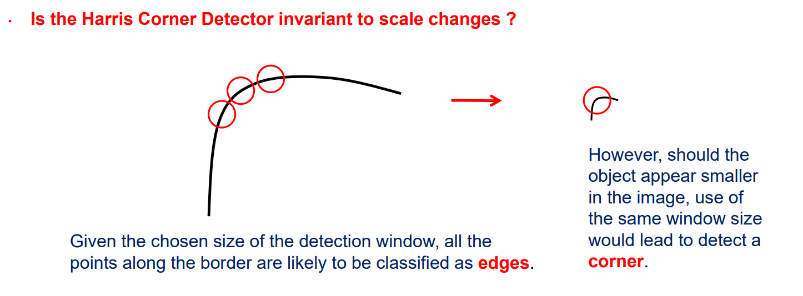
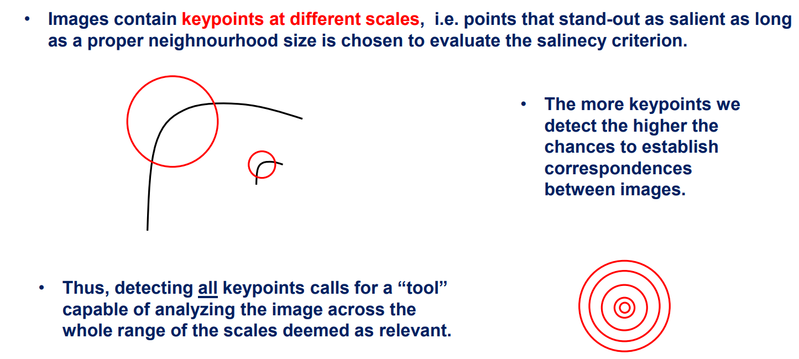
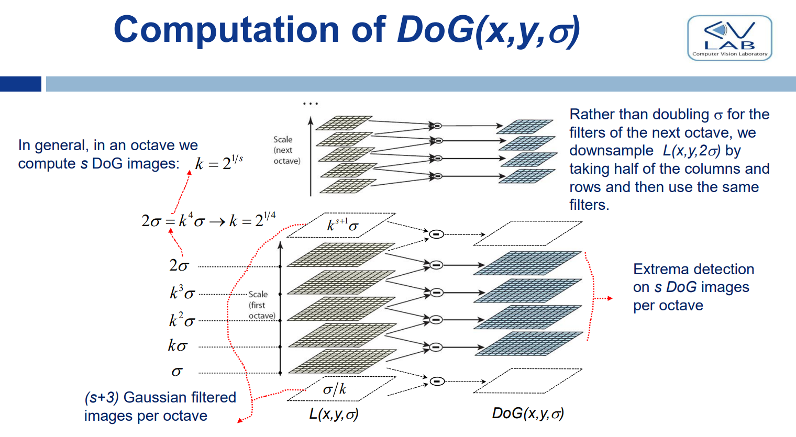

# Scale-invariance

Una feature è scale-invariant quando, la medesima istanza si riesce a trovare in immagini diverse nonostante appaia in quest'ultime con scale diverse

**harris corner detector is not scale invariant**

- this is because of the use of a **fixed-size detection window**

**NB**: being a corner or not depends not only on the structure of the image, but also on its scale!

- different images may have the same corner present at different scales, using the same size window for all images, sometimes this point could be classified as a corner and sometimes not

**The use of a fixed-size detection window makes it impossible to repeatably detect homologous keypoints when they appear at different scales in images.**

Also, **in an image features are present at different scales**

- with harris we would need to decide the scale at which we want to detect the corners
- but we want to find corners (every feature really) at every scale
  - **we want scale invariance**
- why?
  - **because the more features we can detect the more points we have at our disposal for matching**
- Also in different images, some features might disappear (vedi cima taj mahal che scompare nella foto lontana)
  - **Features exist within a certain range of scales**
  - **With more features we're more robust to features disappearing if we want to match them**
- with scale invariance, the same feature would simply be detected at different scales within a multi-scale detection process.
  - we do not lose useful features for matching

All this is to say that we need a **dynamic-size detection window**

- in different images, features appear at different scales
- if we used fixes-size windows it would be impossible to detect them all
- and that would make finding correspondences difficult
- **large scale features should use large detection windows, small scale features should use small ones**

We have an issue: to match features at different scales we need to have similar descriptors

- but at different scales different details show up inside the detection window
- and so the resulting descriptor would be different for the same feature in different images
  - pensa all'esempio della collina con i fiori: le feature è la cima della collina, ma in scala grande dentro al descriptor ci sono dei fiori, in scala piccola no
- we can solve this issue by applying a **smoothing filter that eliminates the unwanted small details present when the scales is big**
  - **smoothing makes features at different scales comparable**

## How do we detect multiscale features

Do we really need a dynamic-size detection window? This could get computationally expensive quando i neighbourhoods diventano grandi

Abbiamo due opzioni in realtà:

1. we can increase the size of the neighbourhood
2. **we can change the size of the image (by downsampling) while keeping the neighbourhood size fixed**
    - the more shrinkage the larger the scale of the features we look for

Option 2 is way more computationally efficient because we work with less pixels (both considering the neighbourhood and the whole image)

We're introduced to a new concept:

- **receptive field of an operator**: its the size region of the image that determines the output of an operator

**NB**: we combine downsampling (larger detection window) and smoothing (same detail level) to detect features at every scale inside an image

# Feature detection and Scale selection

As features exist across a range of scales, **we need criteria for both feature detection and optimal (aka characteristic) scale selection.**

- characteristic scale: the scale at which the feature is maximally salient

A **Scale-Space** is a one-parameter (i.e. scale) family of images created from the original one so that **the structures at smaller scales are successively suppressed by smoothing operations**

- the more smoothing is applied -> less details are present -> only large scale features remain and can be detected
- A scale-space is a stack of images each at different levels of smoothing (scale)
- we construct a scale-space so we can compare features at

The only way to simplify an image correctly (smoothly and without introducing artifacts) increasing the scale is the gaussian filter

- sigma è lo scale parameter
- maggiore è lo smoothing e maggiore è la scala delle features che rileviamo

**Thus, a Scale-Space is created by repeatedly smoothing the original image with larger and larger Gaussian kernels**

- applichiamo tante convoluzioni con un kernel gaussiano, ogni convoluzione con un parametro sigma diverso, e otteniamo il nostro stack che forma il scale space
- nota: another way to realize the gaussian scale space is by thinking of the image as an heat-map and solving the heat equation through time
  - the more time passes the more smoothing (relazione con sigma)
  - k è un parametro che rappresenta la conduttività termica

## how do we detect features?

The Gaussian Scale-Space is the right tool to smooth an image in order to progressively simplify its content. However, it neither includes any **criterion to detect features nor to select their characteristic scale**

- ricorda che: features exist across a range of scales **within the Gussian Scale-Space**
- the notion of characteristic scale deals with establishing at which scale a feature turns out maximally interesting and at which should therefore be described.

**Key finding**: we can detect features across scales by finding extrema of (scale-normalized) derivatives (derivative-like family really) of the Gaussian Scale-Space

- we compute the gaussian scale space by applying many times a gaussian filter
- we compute some sort of derivative-like operation on the resulting images of the gaussian scale space
- we detect features as extrema of these derivatives in the resuliting 3d-space (x,y, scale/sigma)
- scale normalized (multiplication by sigma^2) because derivatives computed at larger scales hanno derivate per forza più piccole dato che sono più blurred dal gaussian smoothing
  - se non facessimo niente, farebbero fatica a diventare extrema anche se quella è la loro characteristic scale

**we check for features by looking for extrema across space and scale of the derivative of the gaussian scale space**

### LOG (Laplacian of Gaussian)

Between Lindberg’s proposed combination of derivatives is the scale-normalized Laplacian of Gaussian (LOG)

We're going to be finding extrema of the scale-normalized Laplacian of Gaussian and choosing them as salient points

Now a property of convolution becomes convenient: convolution commutes with differentiation

- this way we can just **filter with the laplacian of the gaussian** instead of computing the gaussian-scale-space and then the derivative
  - this is just a filter
- a circularly simmetric filter; this means that **it can find features with invariance to rotation**
  - the same pixels rotated are going to be weighted exactly the same by the filter

This detector finds blob-like features

- ricordiamo che non ci interessa necessariamente che feature vengono trovate
- l'importante è che il nostro detector trovi le stesse features in immagini diverse in modo tale da fare matching (repeatability)

- leggi attentamente i commenti nella slide
- la stessa feature viene trovata a scala piccola quando la feature è piccola nell'immagine, e a scala grande quando è grande
- il loro rapporto è simile al rapporto delle scale

**LOG exactly captures the concept of scale**

- by computing LOG of a gaussian scale space **we have the criterion for feature detection and scale selection we were looking for**
- un'estremo in (x,y, sigma) nello scale space, identifica una feature in (x,y) nell'immagine originale con scala caratteristica pari a sigma
  - in un'altra immagine la stessa feature probilmente verrebbe trovata in un'altra posizione e con una scala diversa
  - le abbiamo trovate però entrambe automaticamente, senza fare cose come cambiare la detection window size! This is multi-scale feature detection
  - computando un descrittore opportuno possiamo fare il matching

### DOG (Difference of Gaussians)

Lowe proposes to detect keypoints by seeking for the extrema of the DoG (Difference of Gaussian) function across the (x,y,sigma) domain

- facciamo una convoluzione con un filtro che è la differenza tra due gaussiane (hence the name)
- di nuovo le proprietà della convoluzione ci fanno comodo: stavolta utilizziamo la proprietà distributiva

The DoG approximates the LOG function

- the only difference is a scale factor
- since we care only about finding extrema (and not absolute values) DOG is useful for our purposes

Anche questo è circularly simmetric, e quindi **invariant to rotation**, e fa detection di **blob-like features**

**Way more computationally efficient than the LOG**

With LoG the more scales, the more LoG filtered (the filter being the laplacian of Gaussian) images we need to compute

- the larger the scale becomes, the larger the kernel size, the more computationally expensive it becomes to compute a single layer

With DoG, a single filtered image is computed by the difference of two gaussian filtered images with different sigmas

- già questo mi toglie un laplaciano che mi sembra costoso

Per produrre uno stack di DoG filtered images (in cui andiamo a cercare gli estremi) seguiamo quindi il seguente procedimento:

- computiamo uno stack di Gaussian filtered images con vari sigma che useremo per fare le differenze
- **computiamo solo una ottava**, ovvero i layer che vanno da sigma a 2sigma escluso
  - If we want more octaves we don't compute more gaussians, that would become computationally expensive because the larger the sigma the larger the window of the kernel becomes
- questo perchè la seconda ottava, che ha scala doppia, può essere ottenuta **riutilizzando le stesse guassian filtered images della prima ottava ma downsampled di un fattore 2**
- questo significa che per computare lo Stack di DoG-filtered images per qualsiasi scala, **abbiamo bisogno solo di un'ottava di gaussian filtered images**
  - questo risparmia un sacco di calcoli

Nota: To probe 4 scales we need to compute 7 gaussian filtered images, because we need to find extrema across the stack

- so we need one more filtered image at the top and at the bottom to compare with
- anche qua, we use downsampling and keep using the same filters

### Extrema detection with DoG

A point (x,y,sigma) is detected as a keypoint iff its DoG is higher than that of the 26 neighbours (8 at the same scale and 18=9+9 at the two nearby scales) in the (x,y,sigma) space.

Gli extrema trovati sono tutti i massimi locali

- come nel caso degli edges, noi desideriamo che questi locali siano sufficientemente forti
- altrimenti queste features potrebbero essere dovute a rumore e/o non essere presenti nelle altre immagini (weak repeatability)
- Extrema featuring weak DoG response turn out scarcely repeatable.

**Weak Extrema can be pruned by thresholding the absolute value of the DoG**.

- Lowe also notices that **unstable keypoints are found may be found along edges**, even though they feature a sufficiently strong DoG, and devises a further pruning step aimed at dealing with them

---

# Riassumendo multi-scale feature detection

Our objective is to find correspondences of keypoints, pixels that can be easily matched in different images

We've started with corners as our local feature to detect keypoints, but we've noticed that the Harris Corner Detector we use is not scale-invariant

This is bad for two reasons:

- we want to detect as many features as possibile in an image because this maximizes the number of points that we can try to find matches with
- also, features remain present only at a certain range of scales
  - if we detect features only at a certain scale, we have no guarantee that they will all be present in the other images aswell
  - this means that we want to detect the features of an image at all possible scales because this maximizes our probability to find matches with all kinds of images

Thus, corners are not a good feature to detect if we want to find as many matches as possible

We want to be able to detect both large-scale and small-scale features. Consequently, as features exist across a range of scales, **we need criteria for both feature detection and optimal (aka characteristic) scale selection.**

Detecting the same feature at different scales requires an additional step. Since large scale features have more details, their descriptor would be different from the descriptor of the matching smaller-scale feature in another image. To allow for the computation of a similar descriptor, large scale features need to be smoothed with a gaussian to filter out the unnecessary details

The Gaussian Scale-Space is the right tool to smooth an image in order to progressively simplify its content.

- think of it as a stack of the same image filtered by a gaussian with varying sigma (scale parameter)

However, it neither includes any criterion to detect features nor to select their characteristic scale.

- features exist across a range of scales within the Gussian Scale-Space
- but where are they in this 3d-space? and what height (sigma/scale) should we choose?

The LoG and DoG filters (detectors) answer the previous question

- they produce a stack of filtered images at different scales (once again a 3d space)
- the features are the extrema in this stack (answer to feature detection)
- it was shown that corresponding features in different images (which are typically found at different coordinates in this 3d space) have a sigma proportional to the scale of the feature in the image, and their ratio is also similar to the ration of the scales of the features. Thus sigma can truly be thought as the cahracteristic scale of the feature (answer to scale selection)

After finding these extrema, we prune the weak ones with a threshold beacause they aren't repeatable (they can't be found in other images)

---

# Scale and rotation invariance

Per adesso ci siamo concentrati sui detector, consideriamo ora i descriptor

Once each keypoint has been extracted, **the surrounding patch is considered to compute its descriptor**

**We need both the detector and the descriptor scale and rotation invariant**

- vogliamo che la stessa feature ruotata e/o ad una scala diversa possa essere comunque matchata
- Notiamo che LoG e DoG sono scale invariant e rotation invariant
  - le feature vengono trovate nella loro scala caratteristica
  - le feature vengono trovate anche ruotate
    - i filtri sono circularly simmetric

**To compute a descriptor that is scale invariant we need to compute it on the gaussian filtered image at the scale at which the feature was detected**

- this is another reason why DoG is more practical than LoG, **we already have the gaussian filtered images to compute the descriptors with**
- **we compute the descriptor at its scale**, in this way the same feature in different images will have a similar descriptor (**scale invariant descriptor**)
  - the patch is taken from the stack image (L(x,y,sigma)) that correspond to its characteristic scale.
  - **NB**: siccome con DoG ogni ottava subisce un downsampling, questo implementa anche la dynamic-window size necessaria affinchè il descriptor della stessa feature in immagini diverse veda più o meno gli stessi pixel
- this is because we need the right amount of smoothing to make features similar in different images at different scales

What about rotation invariance?

- we need to take into account the reference frame
- to achieve rotation invariance **we need to make the descriptors reason with a reference frame that is oriented with the keypoint**
- we can't use a global reference frame

To attain rotation invariance, a canonical (aka characteristic) patch orientation is computed, so that the descriptor can then be computed on a canonically-oriented patch (that is equal in different images).

An intuitive way to define a local reference frame is to **define the x-axis of the objects as the direction of maximal change**

- considerando però non il gradiente di un singolo punto ma l'informazione di tutto il neighbourhood

Each keypoint is going to have canonical orientation associated with it computed as follows:

- Given the keypoint, **the magnitude and orientation of the gradient are computed at each pixel within a surrounding patch of the associated Gaussian-smoothed image**
- Then, an orientation histogram (with bin size equal to 10° -> 36 bins) is created by accumulating the contributions of the neighborhood
– The contribution of each such pixel to its designated orientation bin is given by the **gradient magnitude**
  - the contributions are also weighted by a (spatial) Gaussian with sigma=1.5\*sigma_s
  - sigma_s denoting the scale of the keypoint

## Orientation Histogram

We need to choose a bin size to quantize the gradient directions into bins for the histogram

- Lowe chose 36

Let's increment the bins proportionally to the magnitude of the gradients

- this way uniform regions, that have weak gradients with kind of random directions, dont' count much
- we accumulate into the bins gradient magnitude

**The canonical orientation of the keypoint is given by the highest peak of the orientation histogram**

After this each keypoint has (x, y, sigma, and canonical orientation information)

slide 39 skip

# Sift descriptor

DoG and Sift are a good combo (best known and best working)

- DoG is the detector
- Sift the descriptor

The Sift descriptor is computed as follows for each keypoint:

- A 16x16 **oriented (along with the canonical orientation of the keypoint)** pixel grid is considered **at the level in the stack in associated with scale the keypoint was found in**
  - scale invariant descriptor because we're considering the grid at the right scale
  - rotation invariant beacause the grid is oriented with the canonical orientation of the keypoint
    - nella slide è una griglia upright per leggibilità, ma è un quadrato sbilenco nella realtà
- This is further divided into 4x4 regions (each of size 4x4 pixels) and a gradient orientation histogram is created for each region
- Each histogram has 8 bins (i.e. bin size 45°)
- **Il Descrittore è quindi un vettore di real values formato dal valore che hanno i bin di tutti i 16 (4x4) orientation histograms**
  - la lunghezza di questo vettore è data da the number of regions times the number of histogram bins per region, i.e. 4x4x8 = 128.
  - il vettore è composto da reali dato che accumuliamo nei bin gradient magnitudes che sono real values

Gradients are rotated according to the canonical orientation of the keypoint.

**NB**: The descriptor is rotation and scale invariant because:

- we consider the pixel grid at the scale at which the feature was found in the gaussian scale space
- we orient the neighbourhood with the canonnical orientation found in the orientation histogram of the keypoint

**NB**:

- per calcolare l'orientamento del keypoint calcoliamo un orientation histogram con 36 bins
- per calcolare gli orientation histograms dei blocchi 4x4 di sift descriptor utilizziamo 8 bins

---

# How do we establish correspondences given the descriptor vectors?

It's a nearest neighbour problem with datapoints being the sift descriptors (128 element long vectors)

- for each keypoint in I1 we find the keypoint in I2 such that the distance between their SIFT descriptors is the smallest (Nearest Neighbour Search).

Attenzione:

If we consider only the nearest neighbour **we're gonna be matching every feature in the source image to a feature in the target image**

- but this is not correct, we might even have a larger amount of features in the source image than in the target image
- some keypoints in source may not have a corresponding one in target

For this reason **we threshold the maximum distance that a match can have for the keypoint to not be rejected**

But what threshold do we choose?

- it's not easy
- notiamo che the ratio of the 2 NN is bounded by one
  - il secondo è lontano minimo tanto quanto il primo o più
- it's easier to threshold this ratio since it's a value \[0, 1]
  - Lowe's ratio
  - **we would like for the ratio to be low**
    - nn should be close, and 2-nn should be somewhat far-away
    - this means that the nn and the 2-nn are noticably different and it's not ambiguous which would be a better match
  - Lowe shows that T=0.8 may allow for rejecting 90% of wrong matches while missing only 5% of correct ones
    - d_nn/d_2nn <= 0.8

## Efficient NN-search

Per trovare il nearest-neighbour di una feature, la maniera ingenua è calcolare le distanze rispetto a tutti gli altri punti nell'altra immagine in cui vogliamo trovare la corrispondenza

- this has linear complexity in the size of S (number of features in the other image)
- oftentimes, turns out exceedingly slow

Thus, efficient indexing techniques borrowed from database theory are deployed to speed-up the NN-search process

- in particular a k-d tree that is o(log n)
  - this doesn't work with sift because the dimensionality is too high
- variant of k-d tree called BestBinFirst is an indexing technique that deals with high dimensional space
- however, unlike the k-d tree (that is equivalent to the exhaustive search), BBF is an approximate search, **it might find wrong correspondences!**

Tipically fast means approximate (no free lunch D:)

Finding some wrong correspondences isn't much of a problem thanks to algorythms like RANSAC that allow us to ignore the wrong matches and use the rest

- for example we can have some wrong matches and still compute an accurate homography with the correct ones

---

# Riassumendo sift description and matching

Abbiamo che le feature individuate con DoG sono scale-invariant e rotation invariant

Vogliamo anche che i descriptor siano scale-invariant e feature invariant

- vogliamo che la stessa feature ruotata e/o ad una scala diversa possa essere comunque matchata

Per avere un descriptor scale invariant

- computiamo il descriptor considerando l'intorno del salient point alla scala caratteristica in cui il salient point è stato trovato (nello stack di gaussian filtered images)

Per avere un descriptor rotation invariant, la patch che si considera deve essere orientata secondo la canonical orientation del keypoint

- questa canonical orientation viene calcolata considerando un ulteriore intorno del keypoint
- per ogni punto di questo intorno si calcola il gradiente e si computa un orientation histogram sommando le varie gradient magnitudes
- la canonical orientation del keypoint è data dal picco dell'orientation histogram

Il Sift descriptor a questo punto si calcola prendendo una griglia 16x16 orientata con la canonical orientation

- si calcolano 4x4 orientation histograms con 8 bin
- si ottiene un vettore di reali lungo 128

A questo punto il matching diventa un NN-problem

- il match di un salient point, viene cercato tra gli m salient point di un'altra immagine; il punto con un descrittore che risulta il nearest-neighbour sarà il match
- aggiungiamo una threshold alla distanza massima che un match può avere, altrimenti tutti i punti avrebber un match anche quando nell'altra immagine quel salient point non esiste
- non consideriamo una threshold assoluta ma piuttosto una relativa tra d_nn e d_2nn
- vogliamo che d_nn / d_2nn sia sufficentemente piccolo dato che vogliamo che il nn sia nettamente migliore del secondo, in questo modo non si ha ambiguità
